# Практическая работа №1
## Основы командной строки Linux
---

## 1. Создание виртуальной машины

Для выполнения работы была создана виртуальная машина в **VMware Workstation Player**  
На неё установлена **Ubuntu 22.04**  
Имя виртуальной машины, имя пользователя и hostname заданы по фамилии в транслите

**Имя ВМ:** [belyaev]  
**Пользователь:** [belyaev]  
**Hostname:** [belyaev]

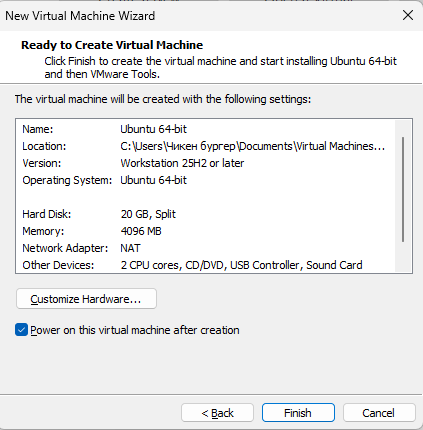

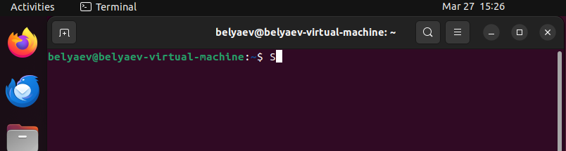

---

## 2. Информация о системе

В этом пункте была собрана основная информация о системе: версия ОС, ядро, процессор, память и диски  
Для этого использовались команды `uname -a`, `cat /etc/os-release`, `lscpu`, `free -h`, `df -h`  
Результат сохранён в файл `01-system.txt`

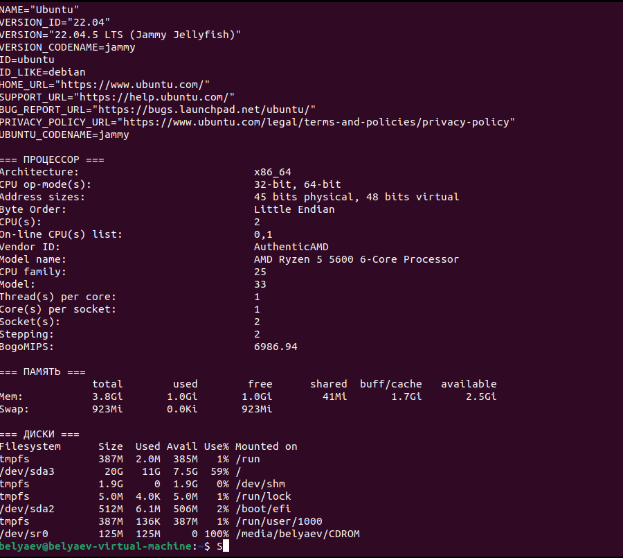

---

## 3. IP-адрес и открытые порты

В этом пункте были просмотрены сетевые интерфейсы и открытые порты 
Использовались команды `ip addr show` и `ss -tlnp` 
Результат сохранён в файл `02-network.txt`

**Вывод:**  
Был определён IP-адрес машины и найден список сервисов, которые прослушивают порты

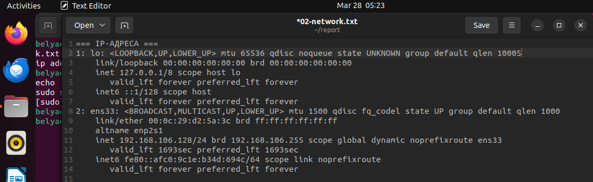

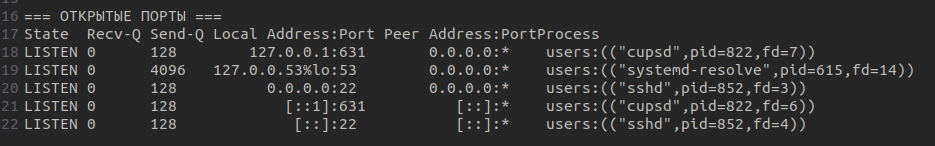

---

## 4. Проверка SSH

Здесь была проверена работа службы SSH  
Использовались команды `systemctl status ssh` и `ss -tlnp | grep ssh`  
Результат сохранён в файл `03-ssh.txt`

**Вывод:**  
SSH нужен для удалённого подключения к системе.  
В ходе работы было проверено, что служба SSH [работает / установлена и запущена]

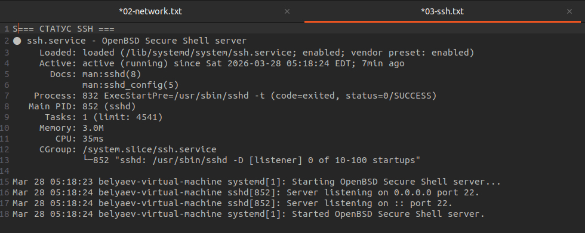

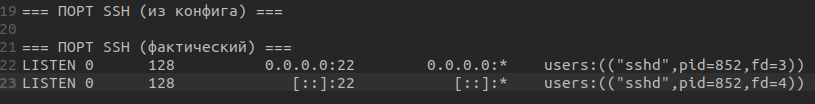

---

## 5. Пользователи и группы

В этом пункте была получена информация о пользователях и группах 
Также был создан новый пользователь `boardy` и добавлен в группу `sudo`
Результат сохранён в файл `04-users.txt`

**Вывод:**  
В Linux у каждого пользователя есть свой UID, домашняя папка и группы  
Группы нужны для распределения прав доступа

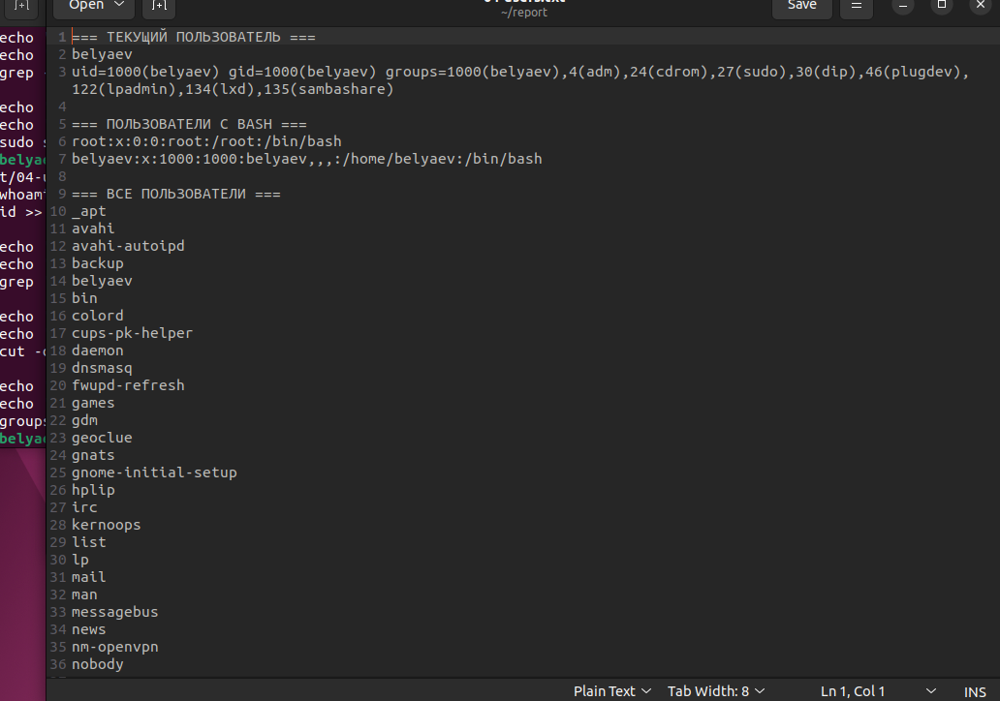

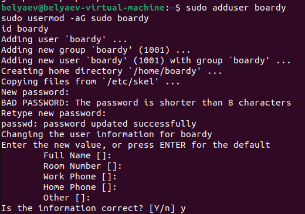

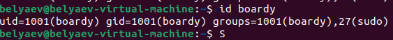

---

## 6. Дерево каталогов Linux

В этом пункте были просмотрены основные каталоги Linux: `/`, `/home` и домашний каталог пользователя  
Результат сохранён в файл `05-tree.txt`

**Основные каталоги:**
- `/` — корень файловой системы
- `/home` — домашние папки пользователей
- `/etc` — конфигурационные файлы
- `/var` — логи, кэш и изменяемые данные
- `/tmp` — временные файлы

**Вывод:**  
Файловая система Linux имеет чёткую структуру, где каждый каталог выполняет свою задачу

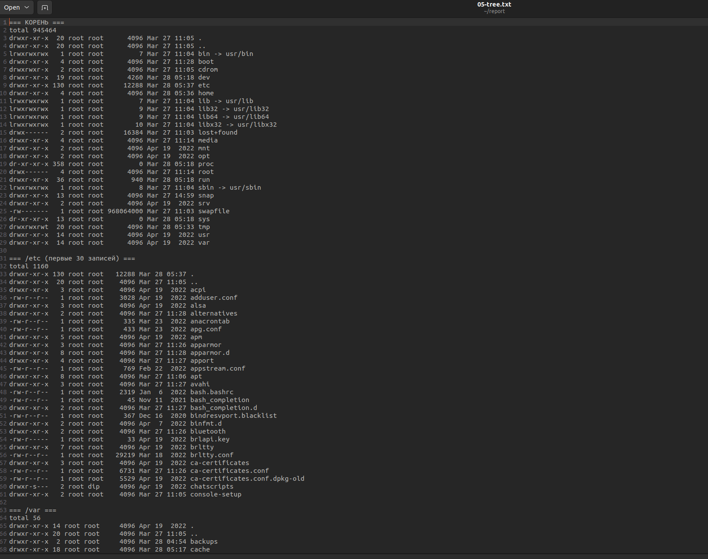

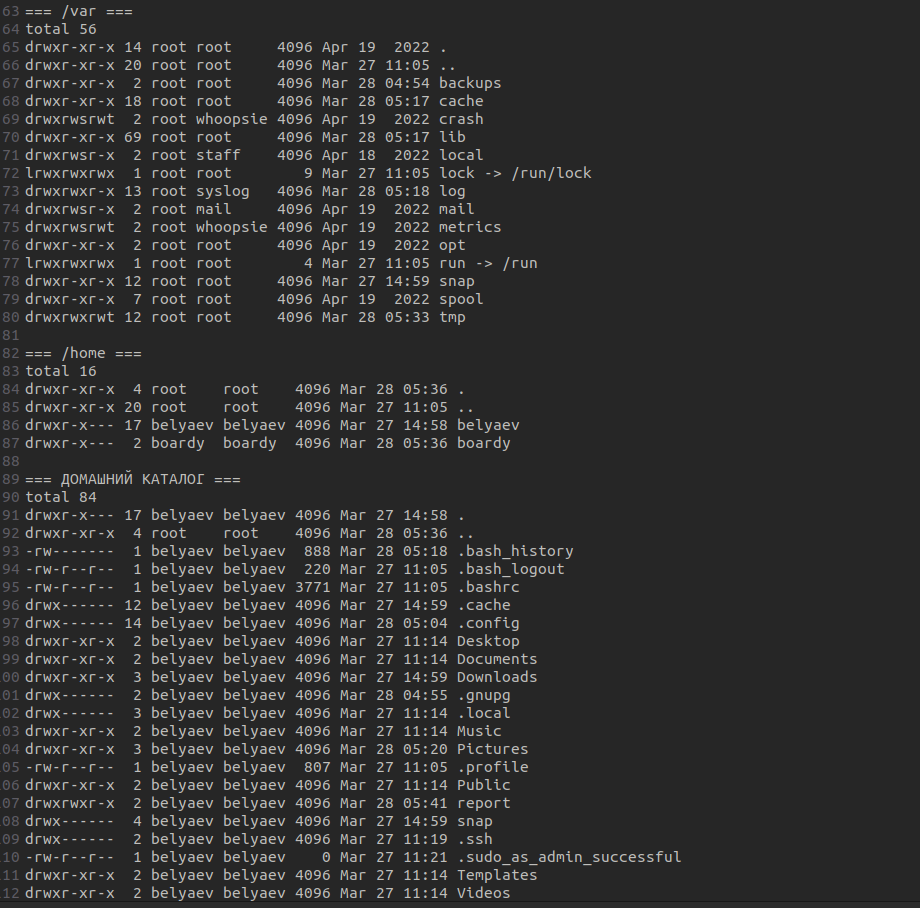

---

## 7. Права доступа

В этом пункте были изучены права доступа к каталогам и файлам 
Также были изменены права у тестового файла через `chmod`  
Результат сохранён в файл `06-permissions.txt`

**Что было проверено:**
- права на `/`, `/etc`, `/var`, `/tmp`, `/home`
- права на `/etc/ssh/sshd_config`
- права на `/etc/shadow`
- изменение прав у `testfile.txt`

**Примеры прав:**
- `755` = `rwxr-xr-x`
- `600` = `rw-------`

**Вывод:**  
Права доступа в Linux нужны для защиты файлов и каталогов.  
С помощью `chmod` можно менять доступ для владельца, группы и остальных пользователей

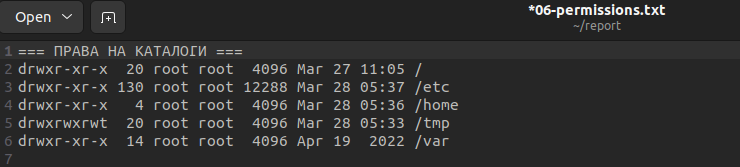

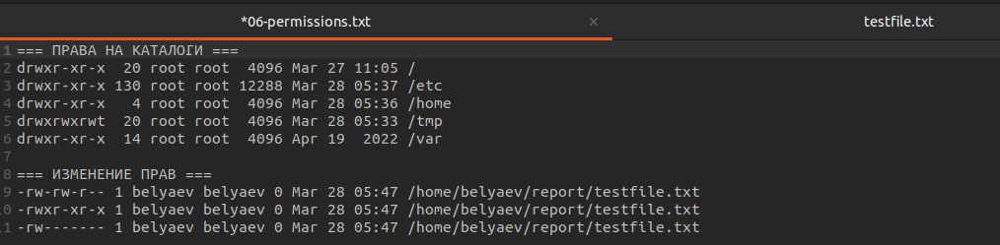

---

## 8. Пакеты и сервисы

В этом пункте были просмотрены установленные пакеты и запущенные службы 
Использовались команды `dpkg -l` и `systemctl list-units --type=service --state=running`  
Результат сохранён в файл `07-packages.txt`

**Примеры найденных пакетов:**
- `openssh`
- `openssl`
- `python`
- `perl`
- `git`
- `curl`
- `wget`
- `nano`
- `sudo`

**Количество установленных пакетов:** 1654

**Вывод:**  
Были просмотрены установленные программы и активные фоновые службы системы

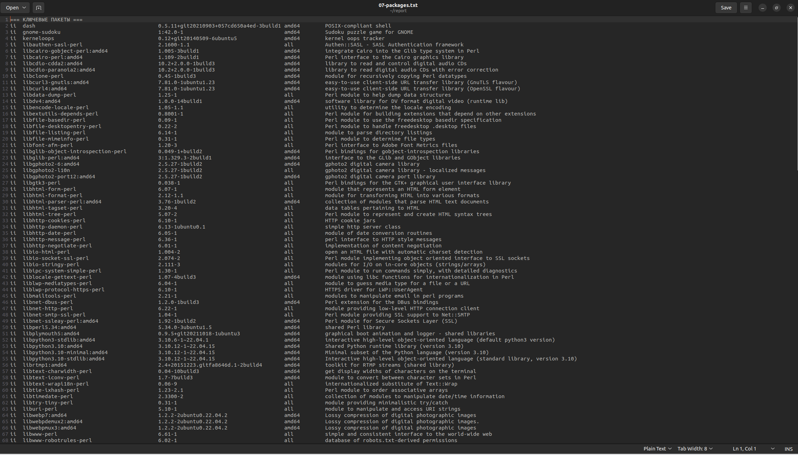

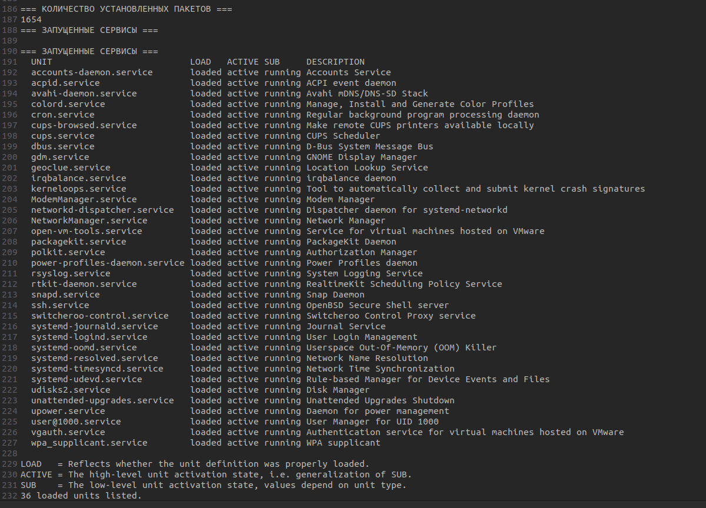

---

## 9. Конвейеры и перенаправление

В этом пункте были выполнены команды с использованием конвейеров и перенаправления вывода  
Результат сохранён в файл `08-pipes.txt`.

### Пример 1
Команда:

`ps aux --sort=-%mem | head -11`

Показывает процессы, которые больше всего используют память

### Пример 2
Команда:

`ps aux | tail -n +2 | awk '{print $1}' | sort | uniq -c | sort -rn`

Показывает, сколько процессов запущено у каждого пользователя

### Пример 3
Команда:

`du -ah /var 2>/dev/null | sort -rh | head -10`

Показывает самые большие файлы и каталоги в `/var`

### Пример 4
Команда:

`find /etc -type f 2>/dev/null | awk -F. '{print $NF}' | sort | uniq -c | sort -rn | head -10`

Показывает самые частые расширения файлов в `/etc`

**Вывод:**  
Конвейеры позволяют объединять несколько команд в одну цепочку и быстро обрабатывать данные прямо в терминале

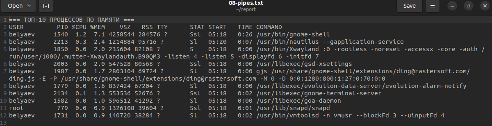

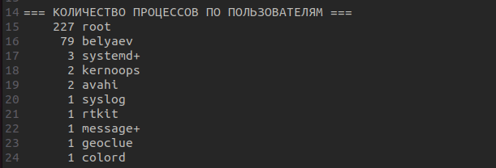

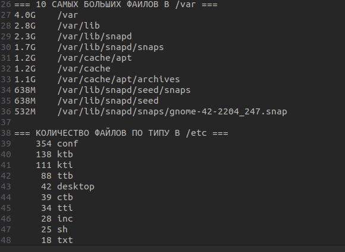

---

## 10. Итоговый файл

После выполнения всех пунктов результаты были объединены в файл `FULL-REPORT.txt`
Также была проверена папка `~/report`

**В папке находятся файлы:**
- `01-system.txt`
- `02-network.txt`
- `03-ssh.txt`
- `04-users.txt`
- `05-tree.txt`
- `06-permissions.txt`
- `07-packages.txt`
- `08-pipes.txt`
- `FULL-REPORT.txt`
- `testfile.txt`

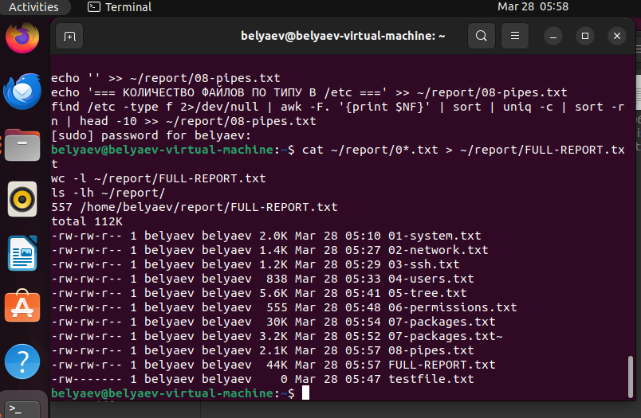

---

## 11. Ответы на вопросы

**1. Что показывает команда `uname -a`?**  
Она показывает информацию о ядре Linux, hostname и архитектуре системы

**2. Для чего нужен файл `/etc/os-release`?**  
Он содержит информацию об установленной операционной системе

**3. Что показывает команда `free -h`?**  
Она показывает объём оперативной памяти и swap

**4. Для чего используется `ip addr show`?**  
Для просмотра сетевых интерфейсов и IP-адресов

**5. Что показывает `ss -tlnp`?**  
Список открытых TCP-портов и процессов, которые их используют

**6. Для чего нужен SSH?**  
Для безопасного удалённого подключения к системе

**7. Что показывает `systemctl status ssh`?**  
Состояние службы SSH, её PID и включён ли автозапуск

**8. Для чего нужен файл `/etc/passwd`?**  
В нём хранится информация о пользователях системы

**9. Для чего нужны группы в Linux?**  
Для управления правами доступа пользователей

**10. Что означают права `755`?**  
Владелец может читать, писать и выполнять, остальные — читать и выполнять

**11. Что означают права `600`?**  
Только владелец может читать и писать файл

**12. Почему `/etc/shadow` защищён?** 
Потому что там хранятся данные, связанные с паролями пользователей

**13. Для чего нужен каталог `/home`?**  
Для хранения домашних каталогов пользователей

**14. Для чего нужен каталог `/etc`?**  
Для хранения конфигурационных файлов системы

**15. Для чего нужен каталог `/var`?**  
Для логов, кэша и других изменяемых данных

**16. Для чего нужен символ `|`?**  
Он передаёт вывод одной команды на вход другой

**17. Что делает `>`?**  
Записывает вывод команды в файл

**18. Что делает `2>/dev/null`?**  
Скрывает сообщения об ошибках

---

## Заключение

В ходе практической работы были изучены основные команды Linux, работа с пользователями, правами доступа, сетевыми настройками, SSH, пакетами и сервисами
Также были отработаны навыки работы с конвейерами и перенаправлением вывода в терминале

В целом работа помогла лучше понять основы работы в Linux и закрепить практические навыки в командной строке