# Практика 10 — Авторизация: куки и сессии

## Цель работы

Реализовать для проекта Boardy авторизацию на PHP с использованием куки и сессий.

В ходе работы нужно было:

- добавить в таблицу `users` столбец `password_hash`
- создать формы регистрации и входа
- реализовать регистрацию с автологином
- реализовать вход через `password_verify()`
- сделать единое верхнее меню через `partials/nav.php`
- защитить `submit.php` от доступа гостей
- отвязать создание постов от хардкода `author_id = 1`
- выводить авторов постов через `JOIN users`
- реализовать `logout.php`
- проверить работу куки `PHPSESSID` и серверного файла сессии

---

## Исходные данные

- Облачная платформа: `Yandex Cloud`
- Сервер: `belyaev`
- Пользователь: `student`
- Домен: `belyaevubuntu.ru`
- Репозиторий: `Ubuntu-lab`
- База данных: `boardy`

До начала Практики 10 уже были готовы:

- `messages.php` как основная SSR-страница
- `submit.php` из прошлых практик
- `comments.html` / `comments.jsx` из Практики 9
- таблицы `users`, `posts`, `comments`

---

## 1. Подготовка таблицы users

Для хранения паролей в безопасном виде в таблицу `users` был добавлен столбец:

```sql
ALTER TABLE users ADD COLUMN password_hash VARCHAR(255) DEFAULT NULL;
```

После этого структура таблицы `users` стала включать поле `password_hash`.

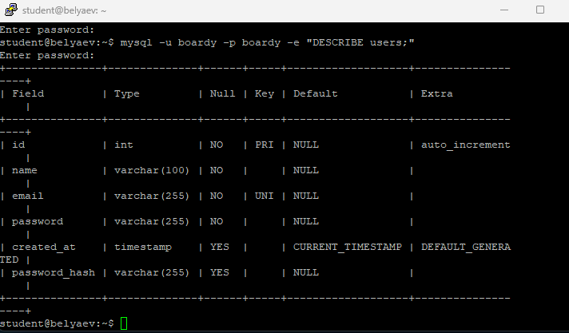

### Почему `VARCHAR(255)`, а не `VARCHAR(60)`?

Текущий bcrypt-хеш обычно занимает около 60 символов, но `VARCHAR(255)` берётся с запасом. Это даёт совместимость на будущее, если алгоритм хеширования или формат строки изменится.

### Что было бы, если сделать `VARCHAR(50)`?

Хеш не поместился бы целиком в поле. Значение либо обрезалось бы, либо `INSERT` завершался бы ошибкой. В любом случае `password_verify()` потом не смог бы корректно проверить пароль.

---

## 2. Единое меню через partials

Для сайта были созданы partials:

- `partials/head.php`
- `partials/nav.php`
- `partials/foot.php`

Теперь все страницы используют одно и то же меню, которое меняется в зависимости от `$_SESSION`.

### Гостевой режим

Если пользователь не залогинен, в меню отображаются:

- `Все посты`
- `Вход`
- `Регистрация`

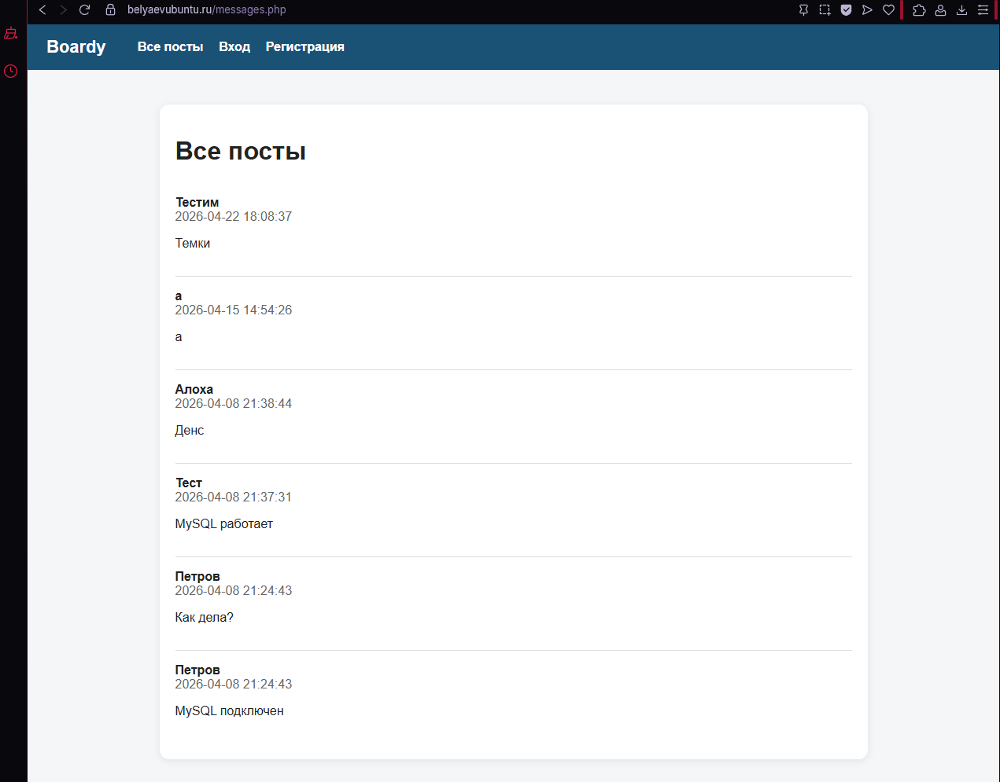

### Режим залогиненного пользователя

Если в `$_SESSION` есть `user_id`, меню показывает:

- `Все посты`
- `Добавить пост`
- имя пользователя
- `Выйти`

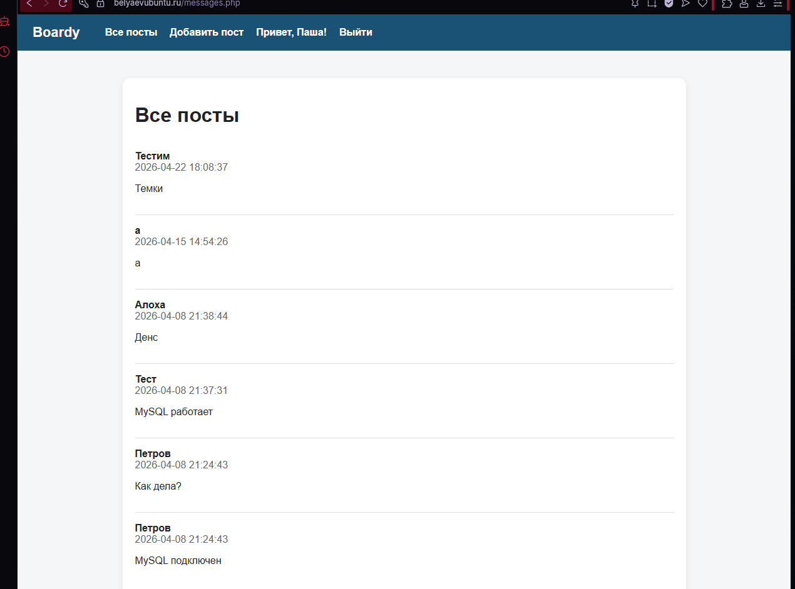

### Почему меню вынесено в отдельный файл?

Это избавляет от дублирования. Меню описывается один раз в `nav.php` и подключается на всех страницах через `include`.

### Что изменится, если добавить новую ссылку, например «Избранное»?

Нужно будет изменить только один файл — `partials/nav.php`. После этого новая ссылка автоматически появится на всех страницах, где подключается меню.

---

## 3. Вёрстка форм регистрации и входа

Были свёрстаны две отдельные страницы:

- `register.php`
- `login.php`

На этом этапе использовались общие стили из `head.php`, а сами страницы подключали `nav.php` и `foot.php`.

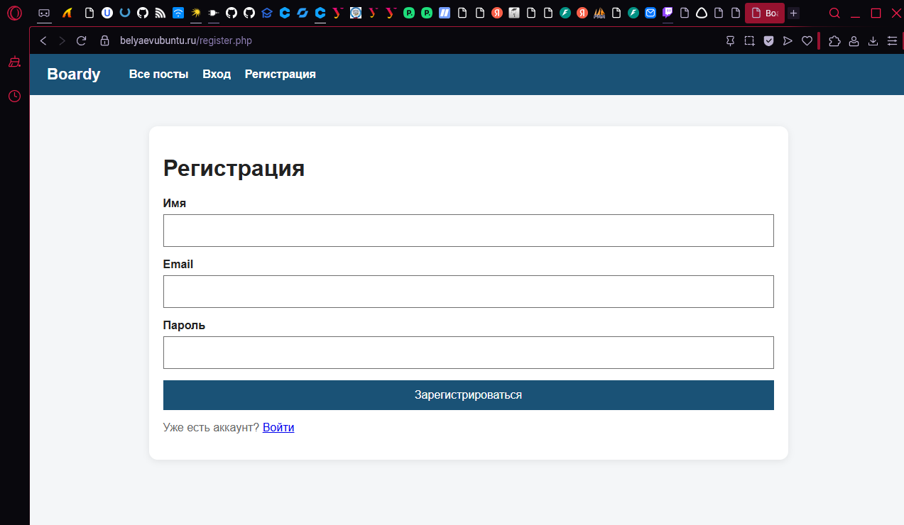

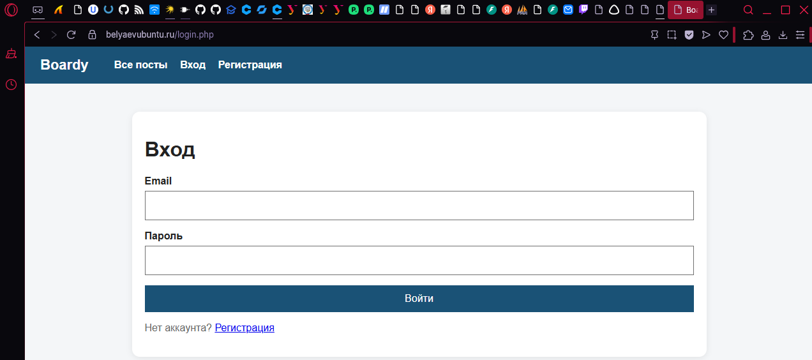

---

## 4. Регистрация пользователя

В `register.php` была реализована логика:

1. `session_set_cookie_params(...)`
2. `session_start()`
3. проверка заполненности полей
4. проверка длины пароля
5. проверка уникальности email
6. хеширование пароля через `password_hash()`
7. `INSERT` нового пользователя
8. автологин через `$_SESSION`
9. редирект на `messages.php`

После успешной регистрации пользователь сразу считается вошедшим в систему.

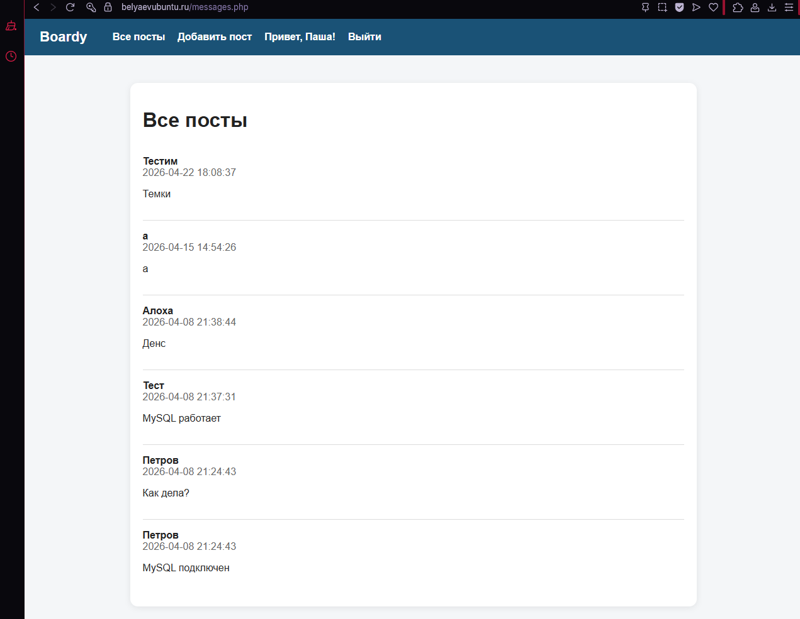

---

## 5. Хранение хеша в базе

После регистрации в таблице `users` в столбце `password_hash` появился bcrypt-хеш вида:

```text
$2y$10$...
```

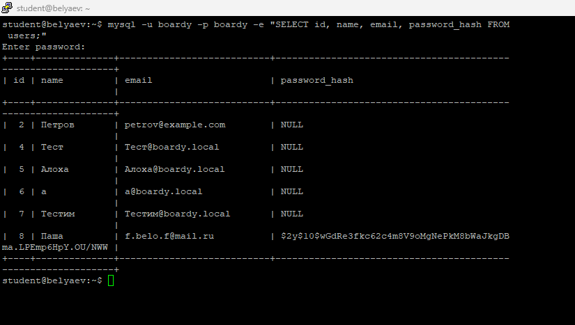

### Что означает структура хеша `$2y$10$Kx8QnZq...`

- `$2y$` — алгоритм bcrypt
- `10` — cost factor
- дальше идёт соль и результат хеширования

### Что произойдёт, если увеличить cost factor с 10 до 15?

Пароль будет хешироваться и проверяться заметно дольше. Это повышает стойкость к перебору, но увеличивает нагрузку на сервер и замедляет регистрацию/логин.

---

## 6. Защита от повторной регистрации

Перед вставкой нового пользователя в `register.php` выполнялась проверка:

```php
$stmt = $pdo->prepare('SELECT id FROM users WHERE email = ?');
$stmt->execute([$email]);
```

Если такой email уже существует, пользователю показывается ошибка:

```text
Email уже занят
```

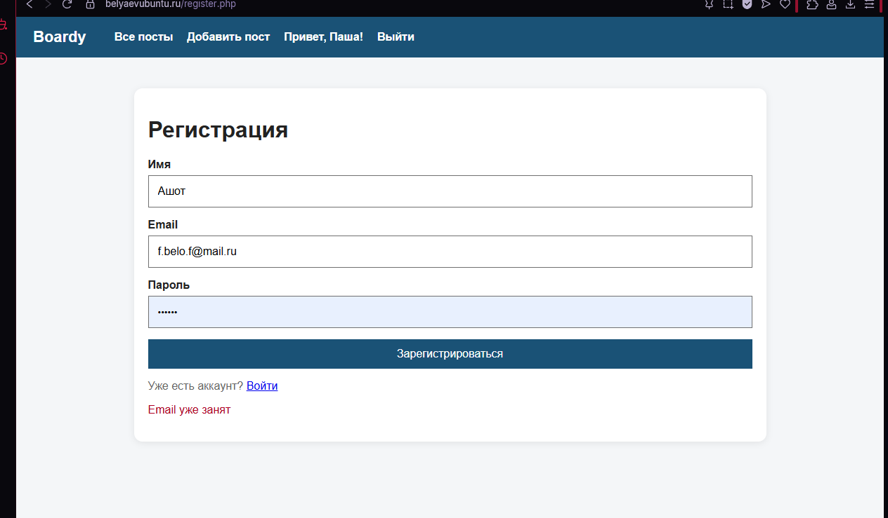

### Зачем проверять email перед `INSERT`?

Это позволяет дать понятную ошибку пользователю до попытки записи в базу.

### Что произойдёт без этой проверки?

Если в БД есть ограничение `UNIQUE`, то `INSERT` упадёт с SQL-ошибкой. Если ограничения нет, в базе появятся дубликаты пользователей с одинаковым email, что сломает авторизацию.

---

## 7. Логин

В `login.php` была реализована логика:

1. запуск сессии
2. поиск пользователя по email
3. проверка введённого пароля через `password_verify()`
4. запись `user_id` и `user_name` в `$_SESSION`
5. редирект на `messages.php`

После успешного входа меню переключается в режим залогиненного пользователя.

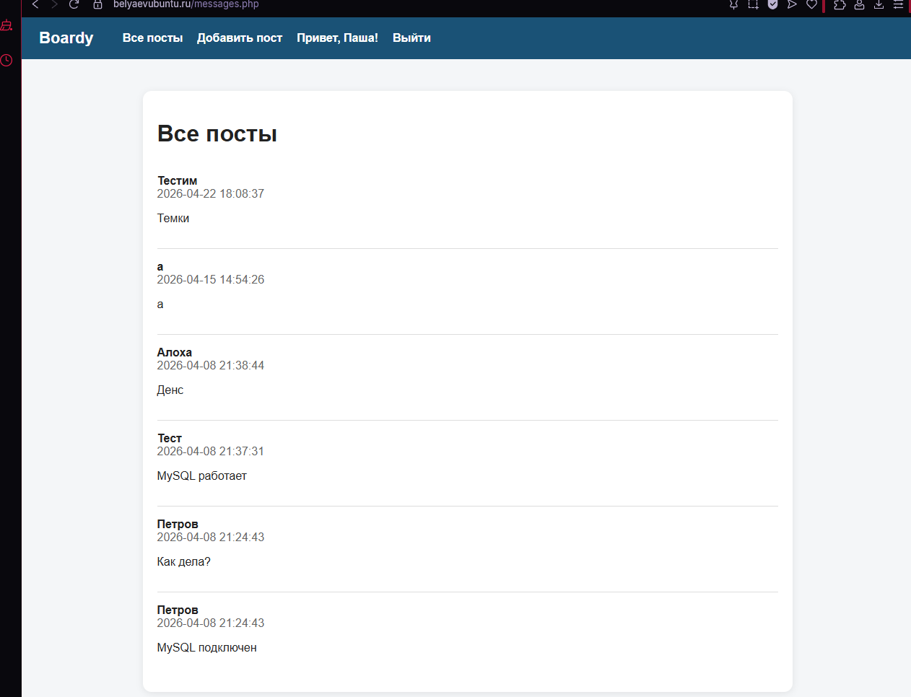

---

## 8. Неверный пароль

При вводе неправильного пароля пользователь видит сообщение:

```text
Неверный email или пароль
```

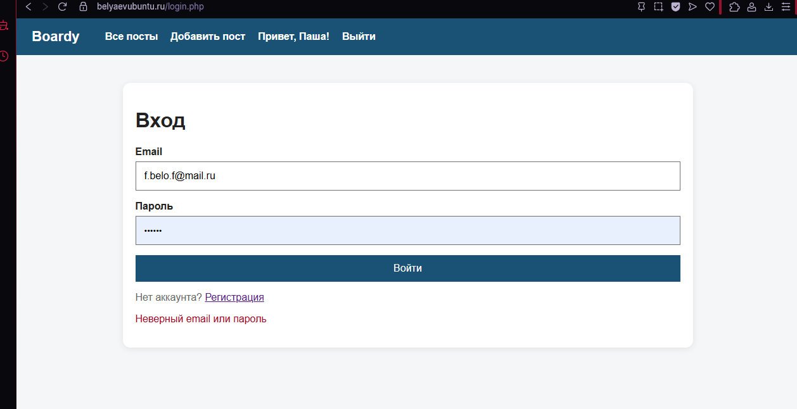

### Почему сообщение одинаковое и для «email не найден», и для «неверный пароль»?

Это защита от перебора пользователей. Если бы система отвечала по-разному, злоумышленник мог бы понять, какие email уже зарегистрированы в системе.

---

## 9. Кука PHPSESSID

После успешного логина в браузере появляется кука `PHPSESSID`.

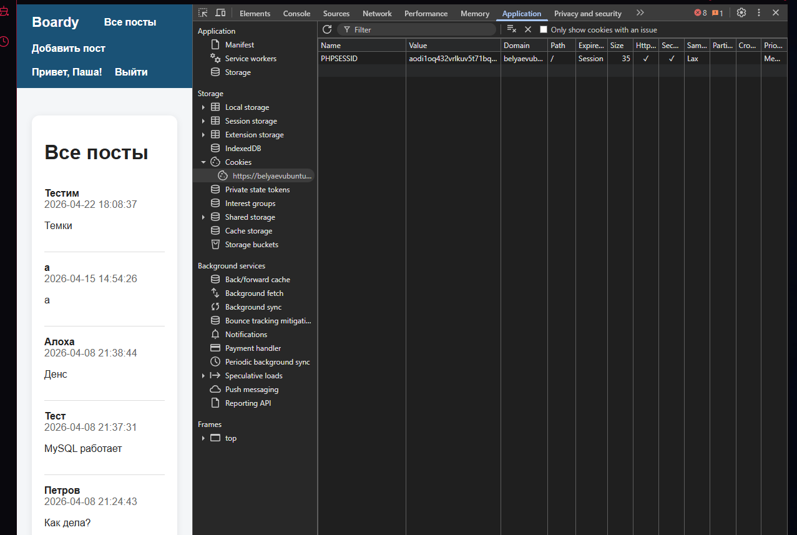

### Что хранится в значении куки?

В значении куки хранится **не пароль** и **не имя пользователя**, а случайный идентификатор сессии. Например:

```text
aodi1oq432vrlkuv5t71bqtm34
```

### Откуда берётся это значение?

Этот идентификатор создаёт PHP при запуске сессии. Браузер хранит его в куке, а сервер по нему находит соответствующий файл сессии.

---

## 10. Атрибуты куки

Для `PHPSESSID` были настроены атрибуты:

- `HttpOnly`
- `Secure`
- `SameSite=Lax`

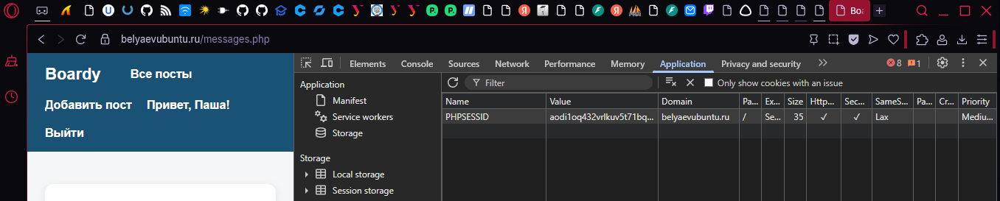

### Что изменится, если убрать `HttpOnly`?

Тогда JavaScript сможет читать `PHPSESSID` через `document.cookie`.

### Как это можно использовать в XSS-атаке?

Если на странице появится XSS, вредоносный скрипт сможет украсть `PHPSESSID` и отправить его злоумышленнику. После этого можно попытаться перехватить сессию пользователя.

---

## 11. Проверка HttpOnly на практике

В DevTools → Console была выполнена команда:

```javascript
document.cookie
```

При этом `PHPSESSID` не отображалась в результате.

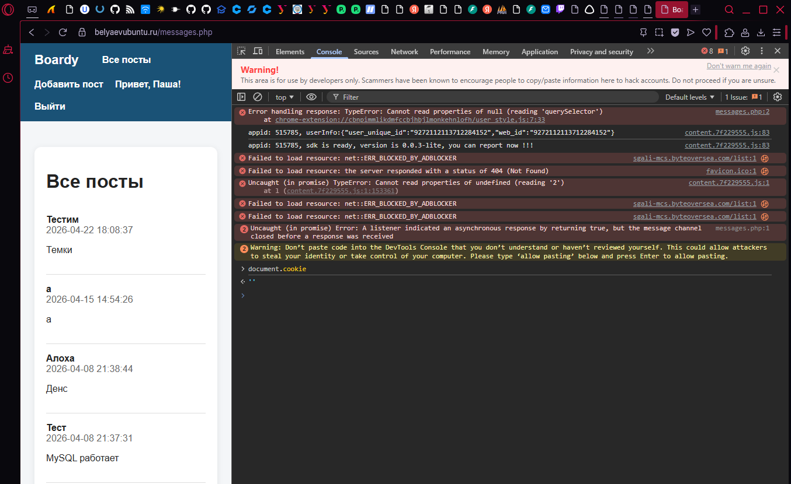

### Почему `PHPSESSID` не видна JavaScript, хотя кука существует?

Потому что у неё установлен атрибут `HttpOnly`. Такая кука отправляется браузером серверу автоматически, но недоступна для чтения из JavaScript.

---

## 12. Файл сессии на сервере

После логина по значению куки `PHPSESSID` был найден соответствующий файл сессии на сервере.

В моём случае PHP хранил сессии в каталоге:

```text
/var/lib/php/sessions/
```

Файл выглядел так:

```text
/var/lib/php/sessions/sess_aodi1oq432vrlkuv5t71bqtm34
```

А содержимое было примерно таким:

```text
user_id|i:8;user_name|s:8:"Паша";
```

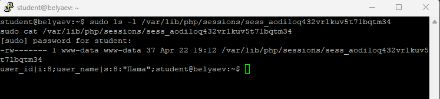

### Что хранится в файле на сервере?

Там лежат реальные данные сессии:
- `user_id`
- `user_name`

### Чем это отличается от куки?

В куке хранится только ID сессии.  
Все реальные данные лежат на сервере в файле сессии.

### Почему данные разделены именно так?

Это безопаснее: браузер хранит только случайный идентификатор, а чувствительные данные остаются на сервере.

---

## 13. Защита страницы submit.php

В начале `submit.php` была добавлена проверка авторизации:

```php
if (empty($_SESSION['user_id'])) {
    header('Location: /login.php');
    exit;
}
```

Поэтому без логина доступ к странице создания поста запрещён.

Проверка через `curl` показала `302 redirect` на `/login.php`.

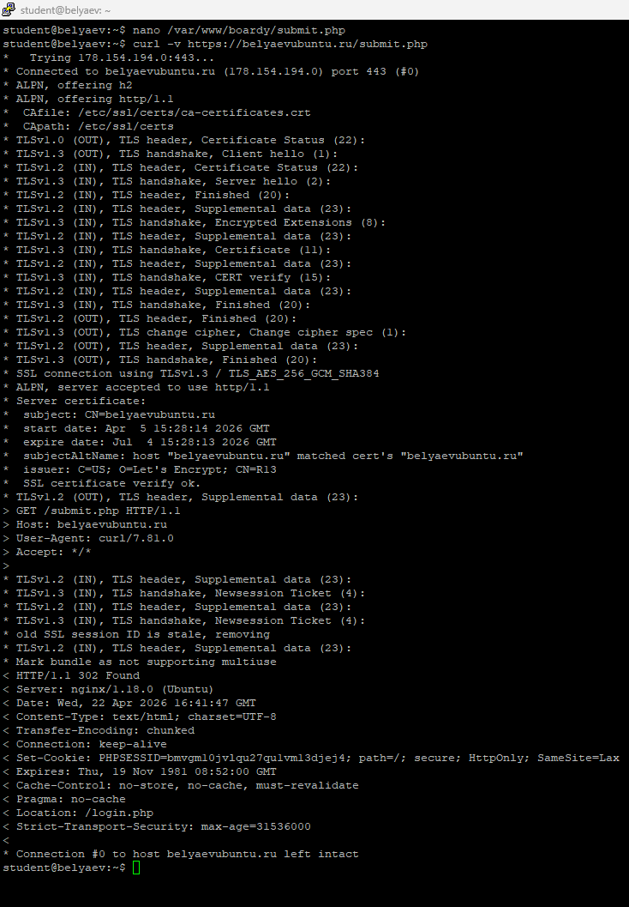

---

## 14. Посты с авторами

`messages.php` был изменён так, чтобы отображать имя автора каждого поста. Для этого использовался `JOIN` между `posts` и `users`.

SQL-запрос:

```sql
SELECT p.id, p.body, p.created_at,
       u.name AS author_name
FROM posts p
JOIN users u ON p.author_id = u.id
ORDER BY p.created_at DESC
```

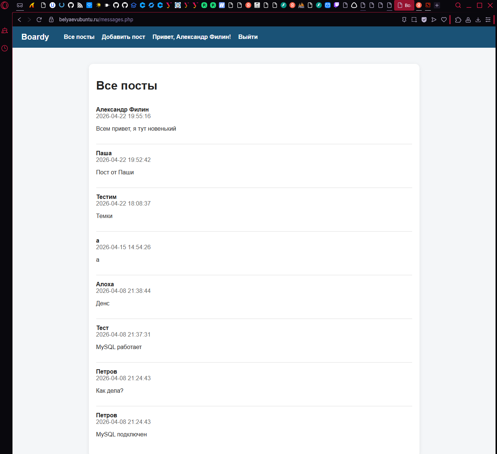

### Почему `JOIN`, а не два отдельных запроса?

`JOIN` позволяет получить данные поста и имя автора за один запрос к базе.  
Если делать два отдельных запроса, код будет сложнее, а база будет работать менее эффективно, особенно при большом количестве постов.

---

## 15. Добавление поста от имени залогиненного пользователя

`submit.php` был полностью переделан:

- страница стала доступна только залогиненным
- `author_id` теперь берётся из `$_SESSION['user_id']`
- новый пост после отправки появляется в ленте под именем текущего пользователя

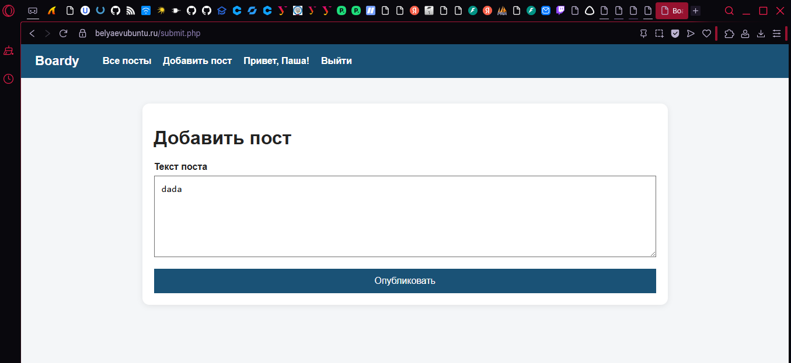

---

## 16. Logout

Был создан файл `logout.php`, который:

1. делает `session_start()`
2. вызывает `session_destroy()`
3. удаляет куку `PHPSESSID` через `setcookie()` с прошедшей датой
4. делает редирект на `messages.php`

После выхода пользователь снова видит гостевое меню.

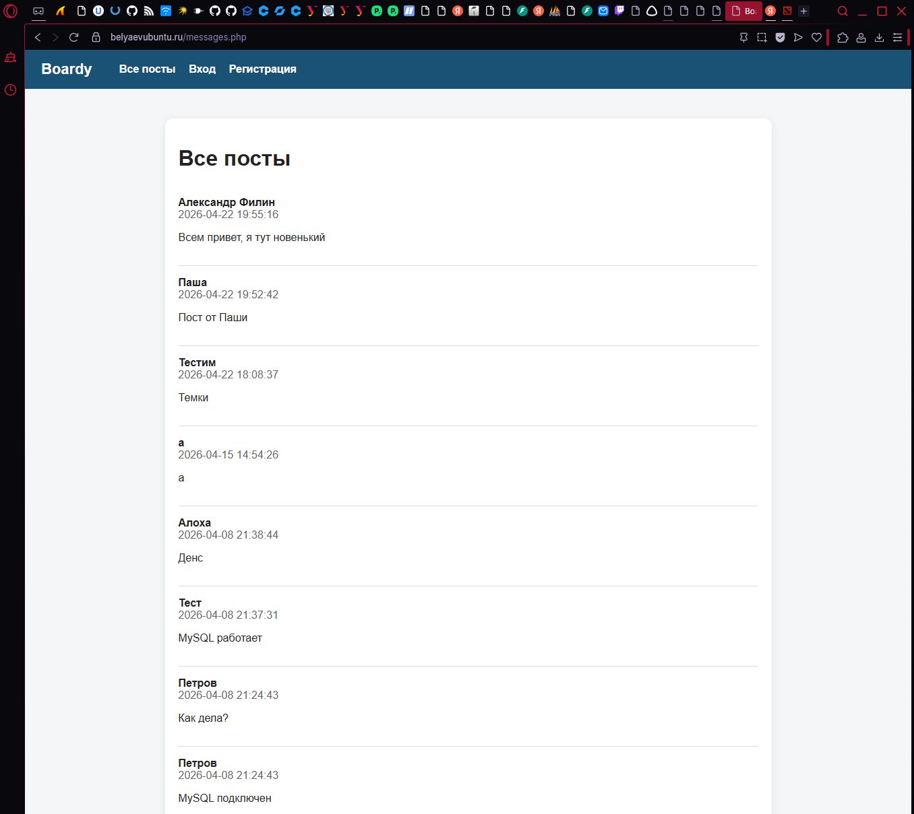

После этого в DevTools → Cookies кука `PHPSESSID` исчезла.

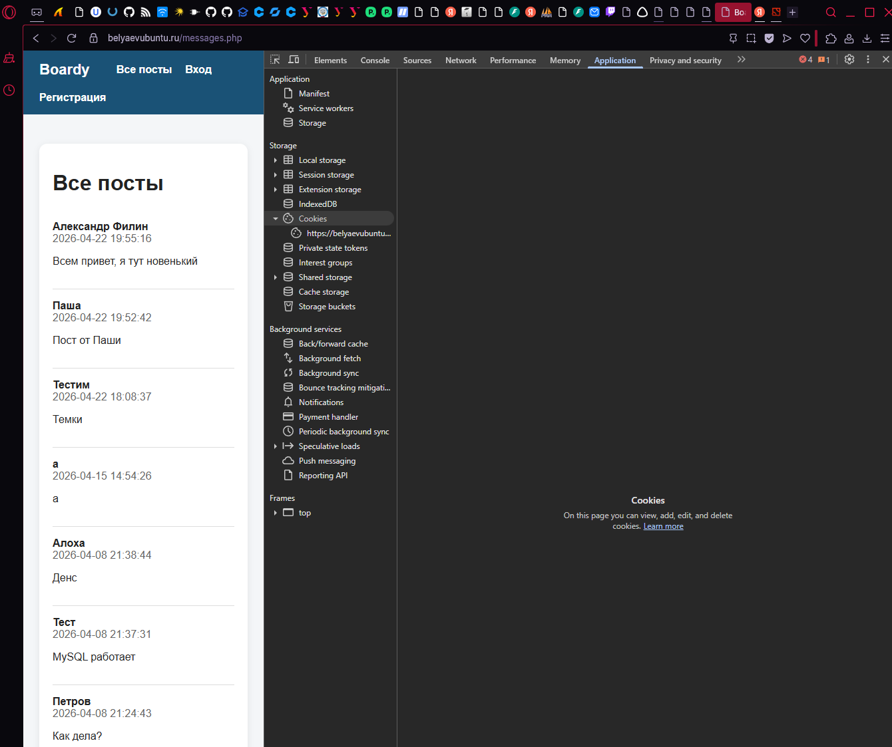

### Что делает `session_destroy()`?

`session_destroy()` удаляет данные сессии на сервере.

### Зачем ещё и `setcookie()` с прошедшей датой?

`setcookie()` заставляет браузер удалить куку `PHPSESSID`.

### Что останется, если сделать только одно из двух?

- Только `session_destroy()` → данные на сервере исчезнут, но кука у браузера останется.
- Только `setcookie()` → кука исчезнет, но файл сессии на сервере ещё какое-то время может существовать.

Поэтому для корректного logout нужны обе операции.

---

## 17. Истёкшая сессия

После логина был вручную удалён файл сессии на сервере:

```text
/var/lib/php/sessions/sess_<PHPSESSID>
```

После обновления страницы браузер всё ещё хранил куку, но сервер уже не мог восстановить данные `$_SESSION`, потому что соответствующего файла сессии больше не было.

В результате пользователь перестал считаться залогиненным.

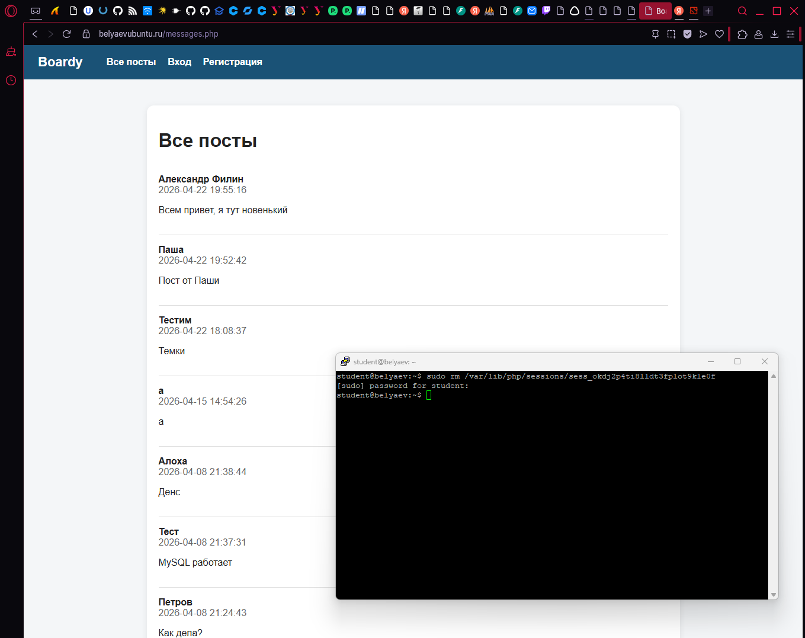

### Почему браузер считает себя залогиненным, а сервер — нет?

Потому что браузер видит только куку `PHPSESSID` и продолжает её отправлять.  
Но серверу одной куки недостаточно: ему нужен ещё и файл сессии, где лежат реальные данные пользователя. Если файла нет, сервер не может восстановить `$_SESSION`.

---

## 18. Итоговая структура проекта после практики

В результате были созданы и изменены следующие файлы:

### Новые файлы

- `partials/head.php`
- `partials/nav.php`
- `partials/foot.php`
- `register.php`
- `login.php`
- `logout.php`

### Изменённые файлы

- `messages.php`
- `submit.php`

---

## Вывод

В ходе Практики 10 для проекта Boardy была реализована классическая авторизация на PHP через куки и серверные сессии.

Удалось:

- безопасно хранить пароли в виде bcrypt-хешей
- зарегистрировать пользователя с автологином
- реализовать вход через `password_verify()`
- переключать меню по состоянию `$_SESSION`
- защитить `submit.php` от гостей
- создавать посты от имени залогиненного пользователя
- выводить имена авторов через `JOIN`
- корректно реализовать `logout`
- на практике проверить связь между `PHPSESSID` в браузере и файлом сессии на сервере

Главный итог практики: сервер теперь умеет различать пользователей между запросами, а сайт Boardy перестал быть полностью анонимным.