# Практическая работа №14

## Тема

Интеграция Laravel Passport, OAuth2 Authorization Code Flow with PKCE, FastAPI, JWT RS256, Redis Pub/Sub, WebSocket и React-комментариев в проект Boardy.

---

## Цель работы

Цель практической работы — расширить веб-приложение Boardy современным механизмом авторизации и взаимодействия между Laravel и FastAPI.

В рамках работы необходимо было:

- установить и настроить Laravel Passport;
- создать OAuth2-клиент для SPA/PKCE;
- реализовать Authorization Code Flow with PKCE;
- получить `access_token` и `refresh_token`;
- вынести `refresh_token` в HttpOnly cookie;
- реализовать silent refresh;
- настроить проверку JWT RS256-токенов в FastAPI;
- реализовать CRUD комментариев через FastAPI;
- добавить проверку владельца комментария;
- подключить React-блок комментариев на страницу поста;
- настроить Redis;
- реализовать публикацию событий из Laravel в Redis;
- реализовать Redis subscriber в FastAPI;
- реализовать WebSocket-обновления;
- проверить работу всех компонентов через браузер, curl и DevTools.

---

## Используемые технологии

В работе использовались:

- Ubuntu Server;
- Laravel 11;
- Laravel Passport;
- PHP 8.3;
- MySQL;
- FastAPI;
- Python 3.10;
- Uvicorn;
- Redis;
- JavaScript;
- React;
- WebSocket;
- Nginx;
- HTTPS;
- Git;
- GitHub.

---

## 1. Установка Laravel Passport

Для реализации OAuth2 в Laravel был установлен пакет `laravel/passport`.

Команды:

```bash
cd /var/www/boardy

composer require laravel/passport
php artisan migrate
php artisan passport:install
```

После установки были созданы OAuth-таблицы:

- `oauth_auth_codes`;
- `oauth_access_tokens`;
- `oauth_refresh_tokens`;
- `oauth_clients`;
- `oauth_device_codes`.

Также были сгенерированы ключи Passport:

```text
storage/oauth-private.key
storage/oauth-public.key
```

Эти ключи используются для подписи и проверки JWT access token.

Скриншот:

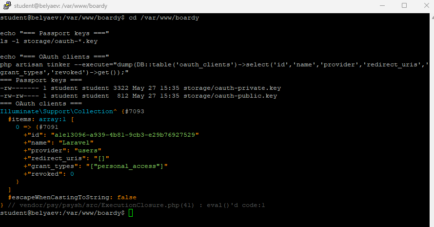

---

## 2. Создание OAuth-клиента

Для браузерного клиента был создан публичный OAuth-клиент с поддержкой PKCE.

Команда:

```bash
php artisan passport:client \
  --public \
  --name="Boardy SPA" \
  --redirect_uri="https://belyaevubuntu.ru/oauth/callback"
```

Полученный Client ID:

```text
a1e14025-d2b2-4c4b-83ac-dc4e9b908d67
```

Client ID является публичным идентификатором приложения и используется в браузерной OAuth-авторизации.

Скриншот:


---

## 3. Настройка OAuth callback

Для обработки возврата после авторизации был создан маршрут:

```php
Route::get('/oauth/callback', function () {
    return view('oauth.callback');
})->name('oauth.callback');
```

Также была создана страница:

```text
resources/views/oauth/callback.blade.php
```

Она принимает параметры:

- `code`;
- `state`.

Если авторизация была запущена через сайт, callback-страница автоматически обменивает `code` на `access_token` через JavaScript.

Если авторизация выполняется вручную, страница показывает полученный `code`, который можно обменять через `curl`.

Скриншот:


---

## 4. Проверка PKCE через curl

Для ручной проверки Authorization Code Flow with PKCE была сгенерирована пара:

- `code_verifier`;
- `code_challenge`.

После перехода по ссылке авторизации и нажатия кнопки разрешения был получен authorization code.

Далее code был обменян на токены:

```bash
curl -X POST 'https://belyaevubuntu.ru/oauth/token' \
  -H 'Content-Type: application/x-www-form-urlencoded' \
  --data-urlencode 'grant_type=authorization_code' \
  --data-urlencode 'client_id=a1e14025-d2b2-4c4b-83ac-dc4e9b908d67' \
  --data-urlencode 'redirect_uri=https://belyaevubuntu.ru/oauth/callback' \
  --data-urlencode "code=$CODE" \
  --data-urlencode "code_verifier=$VERIFIER"
```

В результате был получен ответ:

```json
{
  "token_type": "Bearer",
  "expires_in": 900,
  "access_token": "..."
}
```

Это подтвердило, что PKCE-авторизация работает корректно.

Скриншот:

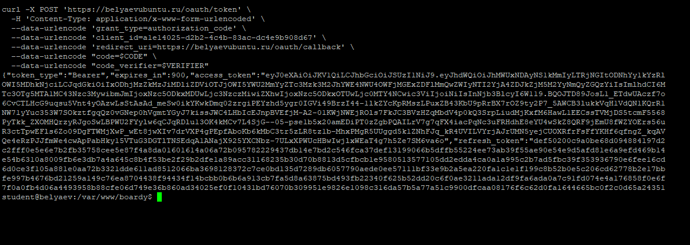

---

## 5. Копирование публичного ключа Passport в FastAPI

Для проверки JWT-токенов в FastAPI был скопирован публичный ключ Laravel Passport:

```bash
sudo cp /var/www/boardy/storage/oauth-public.key /opt/boardy-api/oauth-public.key
sudo chown student:student /opt/boardy-api/oauth-public.key
chmod 644 /opt/boardy-api/oauth-public.key
```

Проверка:

```bash
ls -l /opt/boardy-api/oauth-public.key
head -n 2 /opt/boardy-api/oauth-public.key
```

Ожидаемое начало файла:

```text
-----BEGIN PUBLIC KEY-----
```

Скриншот:


---

## 6. Проверка FastAPI

FastAPI-приложение было запущено через systemd-сервис `boardy-api`.

Проверка локального API:

```bash
curl http://127.0.0.1:8000/api/status
```

Ожидаемый ответ:

```json
{
  "status": "ok",
  "time": "..."
}
```

Скриншот:


---

## 7. Реализация проверки JWT RS256 в FastAPI

В FastAPI был создан файл:

```text
/opt/boardy-api/auth.py
```

В нём реализована проверка Bearer-токена:

- токен берётся из заголовка `Authorization`;
- проверяется подпись по публичному ключу Passport;
- используется алгоритм `RS256`;
- из payload извлекается `sub`;
- при ошибке возвращается `401`.

Проверка неправильного токена:

```bash
curl -i https://api.belyaevubuntu.ru/api/posts/1/comments \
  -H "Authorization: Bearer invalid_token"
```

Ожидаемый результат:

```text
HTTP/2 401
```

Скриншот:

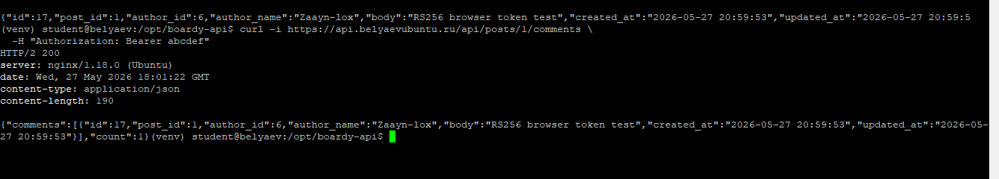

---

## 8. Успешная проверка RS256-токена

После получения актуального access token был выполнен запрос к FastAPI:

```bash
curl -i -X POST https://api.belyaevubuntu.ru/api/posts/1/comments \
  -H "Authorization: Bearer $TOKEN" \
  -H "Content-Type: application/json" \
  -d '{"body":"RS256 browser token test","author_name":"Zaayn-lox"}'
```

Ожидаемый результат:

```text
HTTP/2 200
```

или:

```text
HTTP/2 201
```

В ответе возвращается созданный комментарий.

Скриншот:

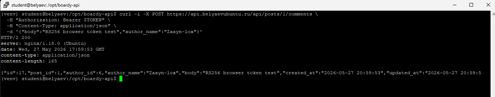

---

## 9. CRUD комментариев через FastAPI

Для комментариев был реализован CRUD через FastAPI:

- получение списка комментариев;
- создание комментария;
- обновление комментария;
- удаление комментария.

Проверка получения комментариев:

```bash
curl -i https://api.belyaevubuntu.ru/api/posts/1/comments
```

Создание комментария:

```bash
curl -i -X POST "https://api.belyaevubuntu.ru/api/posts/1/comments" \
  -H "Authorization: Bearer $TOKEN" \
  -H "Content-Type: application/json" \
  -d '{"body":"CRUD create","author_name":"Zaayn-lox"}'
```

Обновление комментария:

```bash
curl -i -X PUT "https://api.belyaevubuntu.ru/api/comments/$COMMENT_ID" \
  -H "Authorization: Bearer $TOKEN" \
  -H "Content-Type: application/json" \
  -d '{"body":"CRUD update"}'
```

Удаление комментария:

```bash
curl -i -X DELETE "https://api.belyaevubuntu.ru/api/comments/$COMMENT_ID" \
  -H "Authorization: Bearer $TOKEN"
```

Для корректных запросов были получены ответы со статусом `200`.

Скриншот:

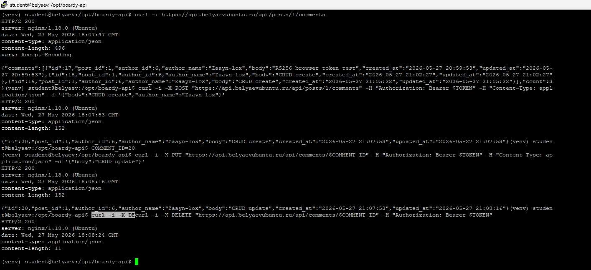

---

## 10. Проверка владельца комментария

В FastAPI была реализована проверка владельца комментария.

Если пользователь пытается изменить чужой комментарий, API возвращает:

```text
HTTP/2 403
```

и JSON:

```json
{
  "detail": "Not your comment"
}
```

Проверочный запрос:

```bash
curl -i -X PUT "https://api.belyaevubuntu.ru/api/comments/$FOREIGN_COMMENT_ID" \
  -H "Authorization: Bearer $TOKEN" \
  -H "Content-Type: application/json" \
  -d '{"body":"Trying to update foreign comment"}'
```

Скриншот:

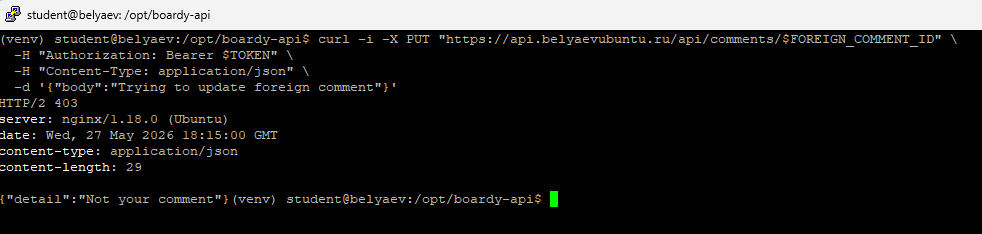

---

## 11. Хранение refresh token в HttpOnly cookie

Для повышения безопасности `refresh_token` был вынесен из JSON-ответа в HttpOnly cookie.

Был создан middleware:

```text
app/Http/Middleware/RefreshTokenCookie.php
```

Middleware выполняет две задачи:

1. при ответе `/oauth/token` извлекает `refresh_token` из JSON;
2. записывает его в cookie с параметрами:

```text
HttpOnly
Secure
SameSite=Strict
```

В DevTools Network у запроса `/oauth/token` виден заголовок:

```text
Set-Cookie: refresh_token=...
```

Скриншот:

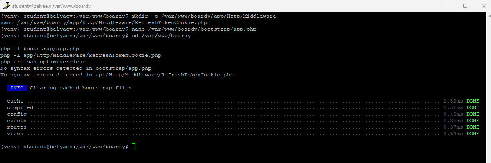

---

## 12. Silent refresh

Для обновления access token без повторного логина была реализована функция `refreshToken()` в файле:

```text
public/js/auth.js
```

Функция отправляет запрос:

```text
POST /oauth/token
```

с параметрами:

```text
grant_type=refresh_token
client_id=a1e14025-d2b2-4c4b-83ac-dc4e9b908d67
```

При этом сам `refresh_token` не читается JavaScript-кодом, потому что он находится в HttpOnly cookie. Браузер автоматически отправляет cookie вместе с запросом.

Проверка в DevTools Console:

```javascript
sessionStorage.removeItem('boardy_access_token')
await BoardyAuth.refreshToken()
sessionStorage.getItem('boardy_access_token')?.slice(0, 40)
```

В Network виден успешный запрос:

```text
POST /oauth/token
Status Code: 200 OK
```

Скриншот:


---

## 13. Генерация PKCE в браузере

Для генерации PKCE в браузере был создан файл:

```text
public/js/pkce.js
```

В нём реализованы функции:

- `generateVerifier()`;
- `generateChallenge()`;
- `generateState()`.

Проверка в DevTools Console:

```javascript
const pkce = await import('/js/pkce.js')
const v = pkce.generateVerifier()
const c = await pkce.generateChallenge(v)
const s = pkce.generateState()
console.log({v, c, s})
```

В результате в консоль выводятся:

- `v` — code verifier;
- `c` — code challenge;
- `s` — state.

Скриншот:

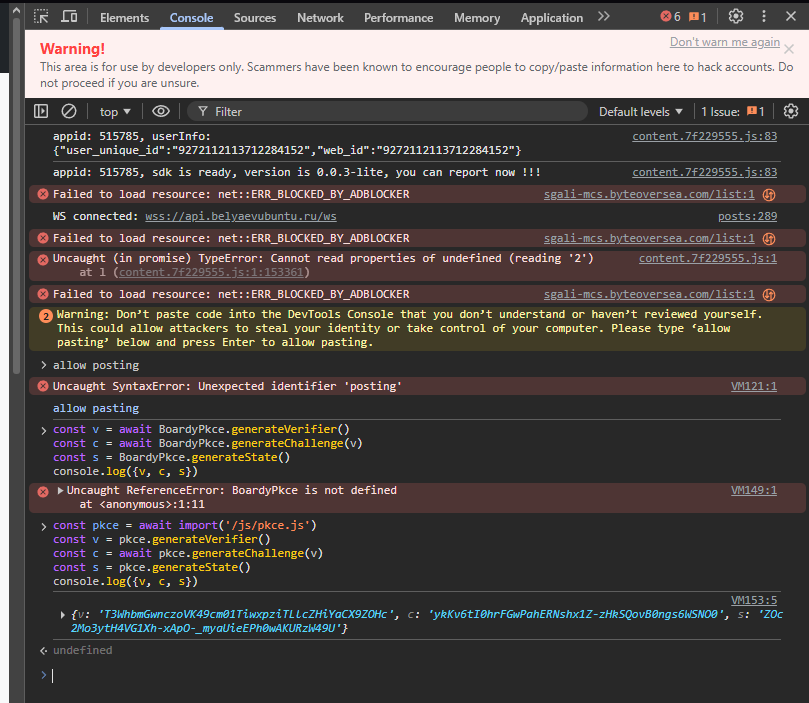

---

## 14. OAuth API login

В layout приложения была добавлена кнопка:

```text
OAuth API login
```

При нажатии запускается функция:

```javascript
BoardyAuth.startLogin()
```

Она выполняет следующие действия:

1. генерирует `code_verifier`;
2. генерирует `code_challenge`;
3. генерирует `state`;
4. сохраняет `verifier` и `state` в `sessionStorage`;
5. перенаправляет пользователя на `/oauth/authorize`.

На странице Passport отображается запрос разрешения доступа для клиента `Boardy SPA`.

Скриншот:

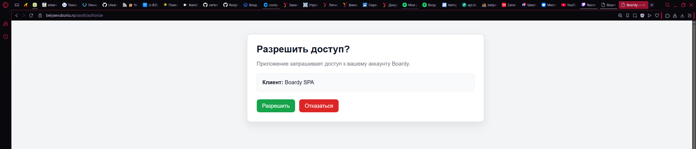

---

## 15. OAuth callback

После нажатия кнопки `Разрешить` пользователь возвращается на маршрут:

```text
/oauth/callback?code=...&state=...
```

Callback-страница получает `code` и вызывает обмен code на access token через `auth.js`.

Скриншот:

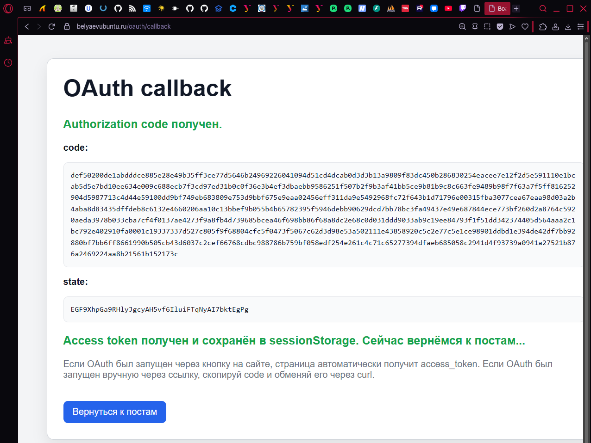

---

## 16. Обмен code на access token в браузере

В DevTools Network был зафиксирован запрос:

```text
POST https://belyaevubuntu.ru/oauth/token
```

Успешный результат:

```text
Status Code: 200 OK
Content-Type: application/json
```

Это подтверждает, что браузерный OAuth-flow успешно меняет authorization code на access token.

Скриншот:

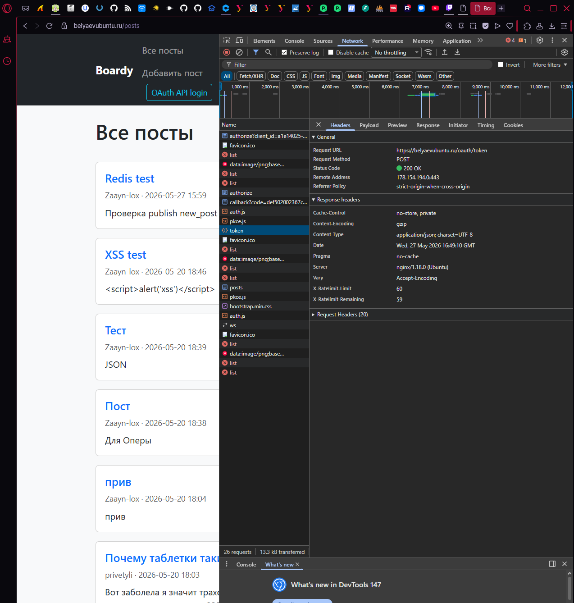

---

## 17. React-комментарии

На страницу просмотра поста был добавлен React-блок комментариев.

В файле:

```text
resources/views/posts/show.blade.php
```

был добавлен root-элемент:

```html
<div
    id="comments-root"
    data-post-id="..."
    data-user-name="..."
></div>
```

Для работы React-комментариев используется файл:

```text
public/js/comments.js
```

Он отвечает за:

- загрузку комментариев из FastAPI;
- создание комментария;
- редактирование комментария;
- удаление комментария;
- работу с Bearer-токеном;
- обновление данных через WebSocket.

На странице поста отображается блок комментариев и форма добавления комментария.

Скриншот:


---

## 18. Redis

Redis был установлен и запущен как отдельный сервис.

Проверка:

```bash
redis-cli ping
```

Ожидаемый ответ:

```text
PONG
```

Скриншот:

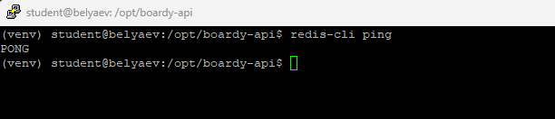

---

## 19. Публикация событий из Laravel в Redis

При создании нового поста Laravel публикует событие в Redis-канал:

```text
new_post
```

Проверка выполнялась через:

```bash
redis-cli monitor
```

После создания поста на сайте в терминале появляется команда:

```text
PUBLISH new_post ...
```

Это подтверждает, что Laravel отправляет событие в Redis.

Скриншот:

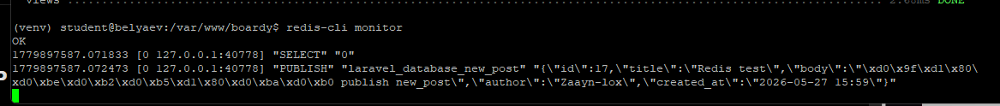

---

## 20. Redis subscriber в FastAPI

FastAPI подписывается на Redis-каналы:

```text
new_post
user.renamed
```

В логах сервиса видно сообщение:

```text
Redis subscriber started: new_post, user.renamed
```

Проверка:

```bash
sudo journalctl -u boardy-api --since "10 min ago" --no-pager | grep -i "redis"
```

Скриншот:

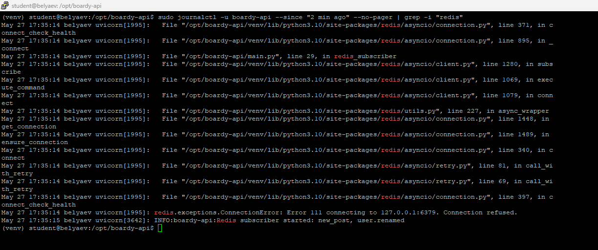

---

## 21. WebSocket для новых постов

FastAPI предоставляет WebSocket endpoint:

```text
wss://api.belyaevubuntu.ru/ws
```

В DevTools Network видно WebSocket-соединение со статусом:

```text
101 Switching Protocols
```

При создании нового поста событие проходит цепочку:

```text
Laravel → Redis new_post → FastAPI subscriber → WebSocket → браузер
```

После этого браузер получает событие `new_post`.

Скриншот:

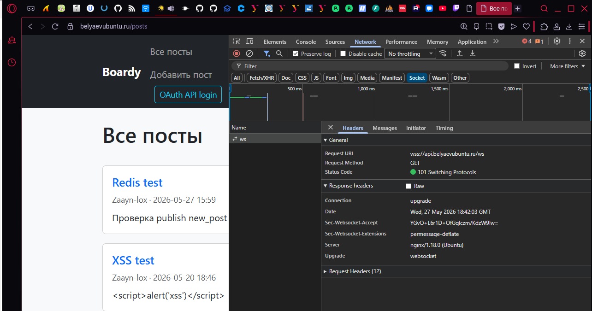

---

## 22. Событие переименования пользователя

Для отслеживания изменения имени пользователя был создан observer:

```text
app/Observers/UserObserver.php
```

При изменении имени пользователя Laravel публикует событие в Redis-канал:

```text
user.renamed
```

Проверка выполнялась через:

```bash
redis-cli subscribe user.renamed
```

В Tinker изменялось имя пользователя:

```php
$u = App\Models\User::first();
$u->name = 'Zaayn-lab14';
$u->save();
```

В Redis появлялось сообщение:

```text
1) "message"
2) "user.renamed"
3) "{\"id\":1,\"new_name\":\"Zaayn-lab14\"}"
```

Скриншот:

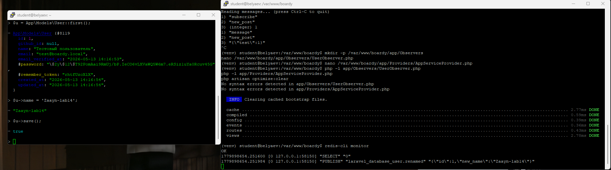

---

## 23. Финальная проверка

После выполнения всех этапов сайт работает корректно:

- открывается список постов;
- доступна кнопка `OAuth API login`;
- OAuth-flow работает через PKCE;
- access token сохраняется в `sessionStorage`;
- refresh token сохраняется в HttpOnly cookie;
- работает silent refresh;
- FastAPI проверяет JWT через RS256;
- комментарии работают через FastAPI;
- проверка владельца комментария работает;
- Redis публикует события;
- FastAPI получает события Redis;
- WebSocket-соединение работает.

Скриншот:

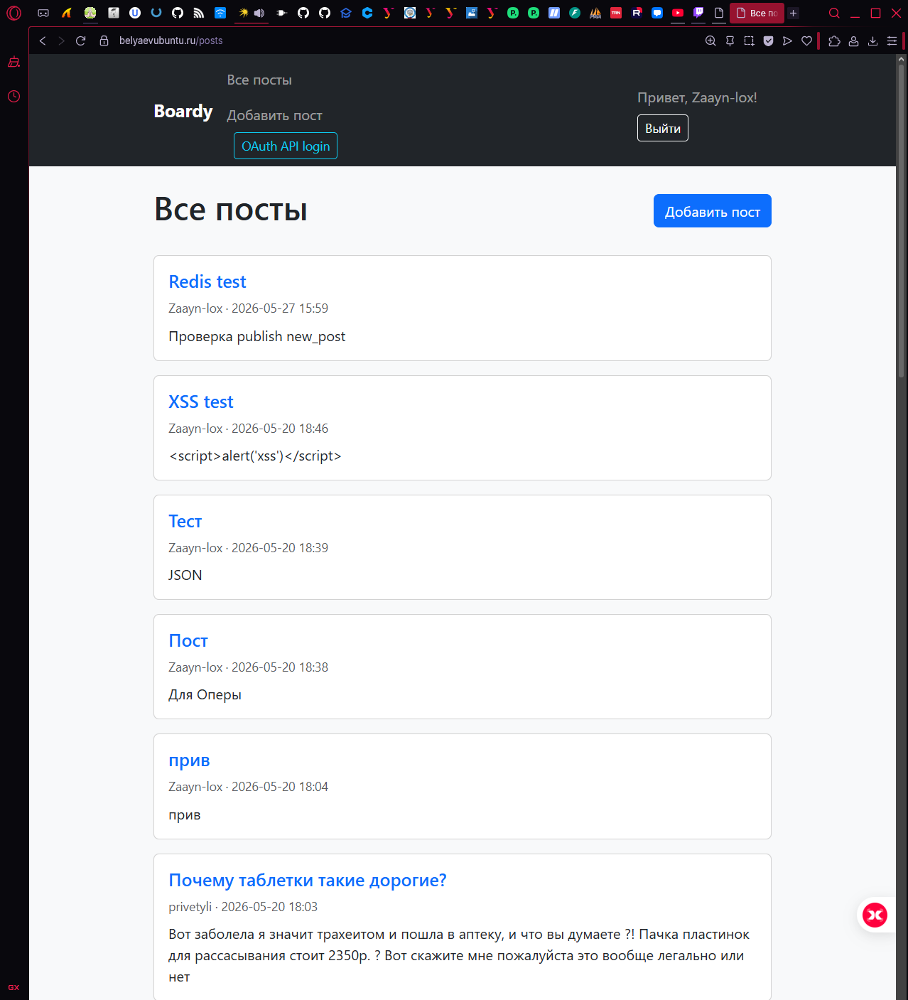

---

## Возникшие проблемы и их решение

### 1. Ошибка `invalid_client`

Причина: в Client ID был перепутан символ.

Правильный Client ID:

```text
a1e14025-d2b2-4c4b-83ac-dc4e9b908d67
```

После исправления Client ID авторизация начала работать корректно.

---

### 2. Ошибка `Failed to verify code_verifier`

Причина: `code_verifier` не соответствовал `code_challenge`.

Решение: была сгенерирована новая корректная PKCE-пара, после чего authorization code успешно обменялся на access token.

---

### 3. Ошибка `oauth-private.key does not exist or is not readable`

Причина: Laravel/PHP-FPM не имел прав на чтение ключей Passport.

Решение:

```bash
sudo chown -R www-data:www-data storage/oauth-private.key storage/oauth-public.key
sudo chmod 600 storage/oauth-private.key
sudo chmod 644 storage/oauth-public.key
php artisan optimize:clear
sudo systemctl restart php8.3-fpm
```

---

### 4. Ошибка `Unknown column updated_at`

Причина: в таблице `boardy_api.comments` отсутствовала колонка `updated_at`, а FastAPI использовал её в SQL-запросах.

Решение:

```sql
ALTER TABLE comments
ADD COLUMN updated_at TIMESTAMP NULL DEFAULT CURRENT_TIMESTAMP ON UPDATE CURRENT_TIMESTAMP
AFTER created_at;
```

---

### 5. Ошибка foreign key constraint

Причина: комментарии хранятся в отдельной базе `boardy_api`, а посты и пользователи находятся в Laravel-базе. Поэтому внешние ключи на таблицы `posts` и `users` мешали созданию комментариев.

Решение:

```sql
ALTER TABLE comments DROP FOREIGN KEY comments_ibfk_1;
ALTER TABLE comments DROP FOREIGN KEY comments_ibfk_2;
```

После удаления внешних ключей FastAPI смог создавать комментарии по `post_id` и `author_id`.

---

### 6. Ошибка `Token expired`

Причина: access token имеет ограниченное время жизни.

Решение: был получен новый access token через кнопку `OAuth API login` или через silent refresh.

---

### 7. Ошибка вечной загрузки комментариев

Причина: браузер не исполнял React-файл с расширением `.jsx`.

Решение: файл был заменён на обычный JavaScript-файл:

```text
public/js/comments.js
```

После этого React-блок комментариев начал загружаться корректно.

---

## Вывод

В результате практической работы было реализовано расширенное взаимодействие Laravel и FastAPI.

Laravel отвечает за:

- регистрацию и авторизацию пользователей;
- OAuth2 через Laravel Passport;
- выпуск JWT access token;
- хранение refresh token через HttpOnly cookie;
- создание постов;
- публикацию событий в Redis.

FastAPI отвечает за:

- проверку Bearer JWT-токенов через RS256;
- CRUD комментариев;
- проверку владельца комментария;
- Redis subscriber;
- WebSocket-соединения.

Браузерная часть отвечает за:

- PKCE-авторизацию;
- хранение access token в `sessionStorage`;
- silent refresh;
- React-комментарии;
- WebSocket-обновления.

Практическая работа выполнена успешно.