# Практическая работа №15

## Контейнеризация веб-приложения Boardy с использованием Docker Compose

---

## 1. Цель работы

Цель практической работы — перенести ранее разработанное веб-приложение Boardy в контейнерную инфраструктуру с использованием Docker Compose.

В ходе работы необходимо было:

- создать Dockerfile для Laravel-приложения;
- создать Dockerfile для FastAPI-сервиса;
- настроить Nginx как reverse proxy;
- поднять MySQL и Redis в отдельных контейнерах;
- настроить общую Docker-сеть;
- настроить persistent volumes для хранения данных;
- проверить работу Laravel Passport OAuth;
- проверить работу API комментариев;
- проверить WebSocket-уведомления;
- проверить сохранение данных после перезапуска контейнеров;
- подготовить проект к выгрузке в GitHub без секретных файлов.

---

## 2. Используемые технологии

В практической работе использовались:

- Ubuntu Server;
- Docker;
- Docker Compose;
- Laravel 11;
- PHP 8.3 FPM;
- Laravel Passport;
- FastAPI;
- Uvicorn;
- MySQL 8;
- Redis 7;
- Nginx;
- JavaScript;
- React;
- WebSocket;
- OAuth2 Authorization Code Flow with PKCE.

---

## 3. Общая архитектура проекта

Приложение было разделено на несколько контейнеров:

| Контейнер | Назначение |
|---|---|
| `boardy-nginx` | Reverse proxy, входная точка приложения |
| `boardy-laravel` | Laravel-приложение Boardy |
| `boardy-api` | FastAPI-сервис для комментариев и WebSocket |
| `boardy-mysql` | MySQL-сервер для хранения данных |
| `boardy-redis` | Redis для Pub/Sub и realtime-уведомлений |

Общая схема работы приложения:

~~~text
Browser
   |
   v
Nginx
   |-----------------> Laravel PHP-FPM
   |-----------------> FastAPI /api
   |-----------------> FastAPI WebSocket /ws
   |
MySQL + Redis
~~~

Nginx принимает все HTTP-запросы от браузера и перенаправляет их в нужный сервис:

- обычные страницы — в Laravel;
- API-запросы `/api` — в FastAPI;
- WebSocket `/ws` — в FastAPI.

---

## 4. Структура проекта

Итоговая структура проекта:

~~~text
Lab15
├── Report.md
├── screenshots
├── docker-compose.yml
├── .env.example
├── docker
│   ├── nginx
│   │   └── default.conf
│   └── mysql
│       └── init.sql
└── src
    ├── boardy-laravel
    │   ├── Dockerfile
    │   ├── app
    │   ├── bootstrap
    │   ├── config
    │   ├── database
    │   ├── public
    │   ├── resources
    │   └── routes
    └── boardy-api
        ├── Dockerfile
        ├── main.py
        ├── requirements.txt
        └── routers
~~~

В репозиторий не добавлялись секретные и генерируемые файлы:

~~~text
.env
vendor/
node_modules/
venv/
oauth-private.key
oauth-public.key
__pycache__/
~~~

---

## 5. Dockerfile для Laravel

Для Laravel-приложения был создан отдельный Dockerfile.

Основные действия в Dockerfile:

- используется PHP-FPM образ;
- устанавливаются необходимые системные пакеты;
- устанавливаются PHP-расширения;
- устанавливается Redis-расширение;
- Composer копируется из официального Composer-образа;
- устанавливаются зависимости Laravel;
- настраиваются права на `storage` и `bootstrap/cache`.

Изначально возникла проблема с PHP 8.2, так как зависимости из `composer.lock` требовали PHP 8.3. Поэтому для корректной сборки был использован образ:

~~~dockerfile
FROM php:8.3-fpm
~~~

Скриншот сборки Laravel-образа:

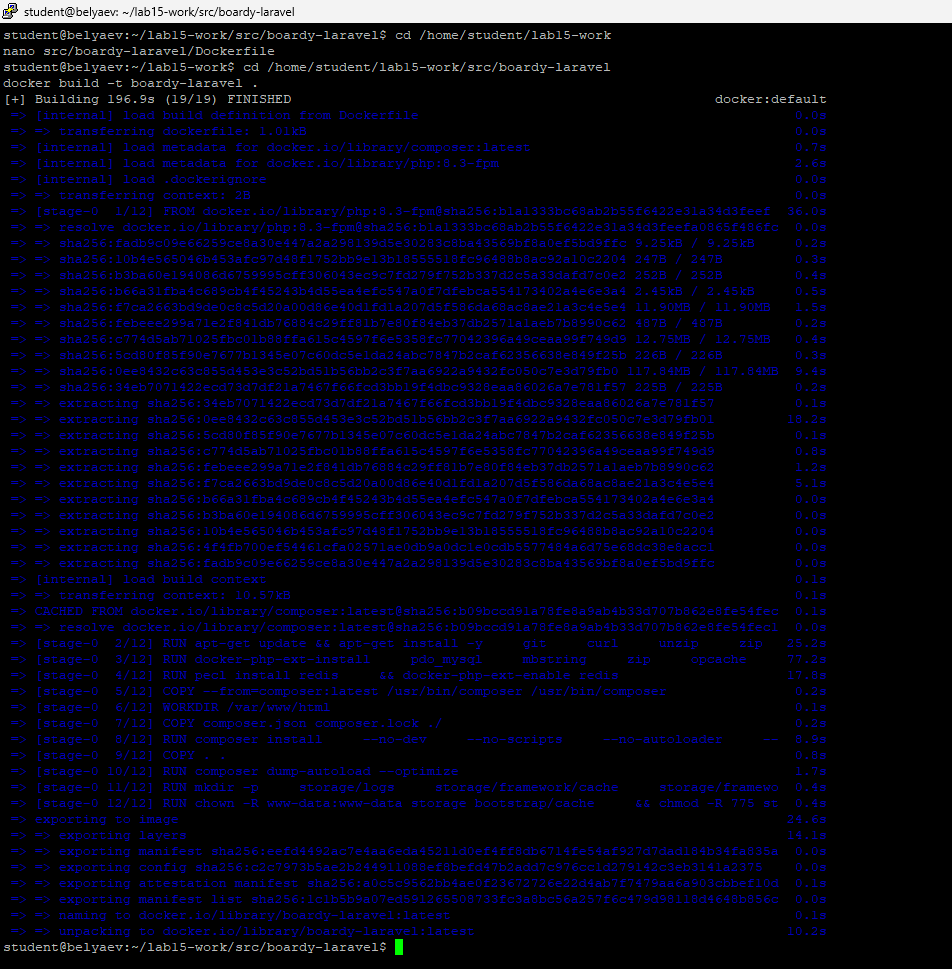

Скриншот Composer-слоя:

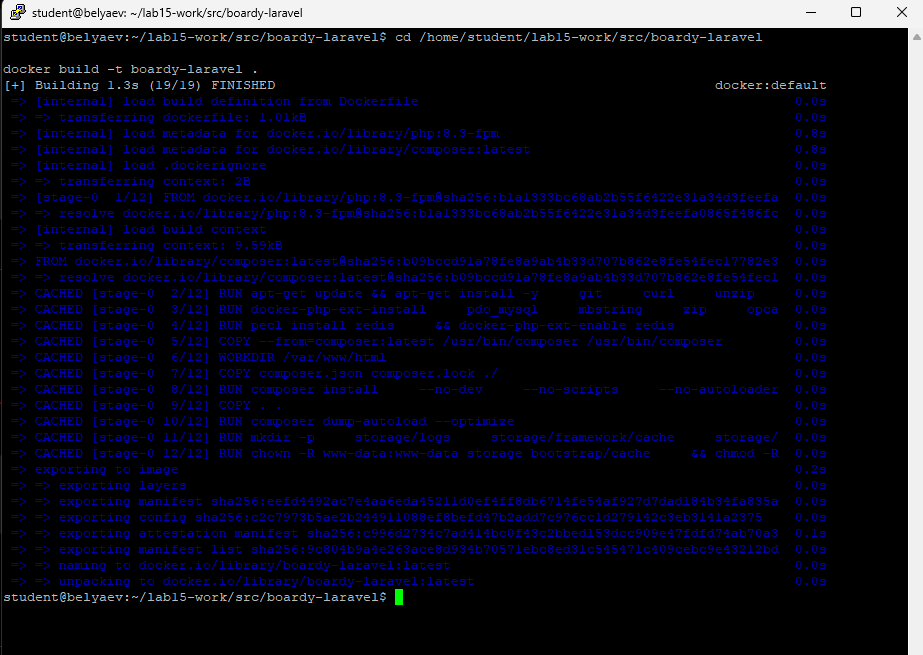

Скриншот `.dockerignore`:

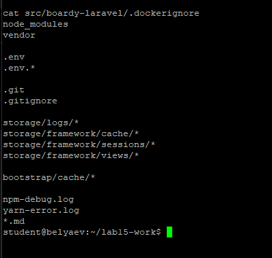

---

## 6. Dockerfile для FastAPI

Для FastAPI-сервиса был создан отдельный Dockerfile.

FastAPI-сервис отвечает за:

- работу API комментариев;
- проверку JWT-токенов;
- WebSocket-подключения;
- рассылку realtime-событий;
- подключение к MySQL;
- подключение к Redis.

Зависимости Python-приложения вынесены в файл `requirements.txt`.

Скриншот зависимостей FastAPI:

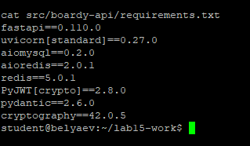

Скриншот сборки FastAPI-образа:

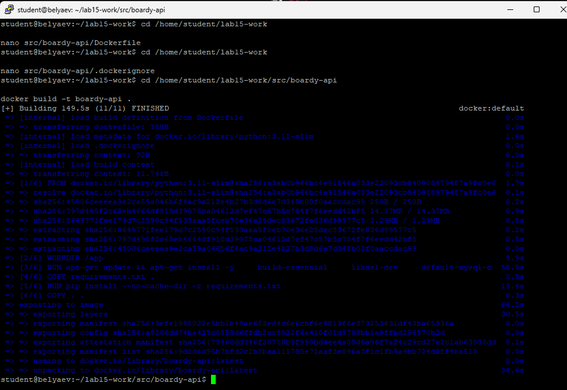

Скриншот команды запуска Uvicorn:

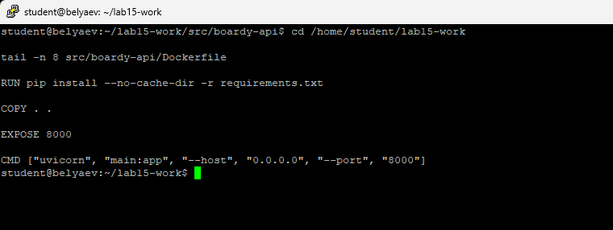

---

## 7. Конфигурация Nginx

Nginx был настроен как reverse proxy.

Он выполняет следующие задачи:

- принимает входящие HTTP-запросы;
- отдаёт статические файлы Laravel;
- проксирует PHP-запросы в Laravel FPM;
- проксирует `/api` в FastAPI;
- проксирует `/ws` в FastAPI WebSocket.

Основная логика маршрутизации:

~~~text
/       -> Laravel
/api    -> FastAPI
/ws     -> FastAPI WebSocket
~~~

Скриншот конфигурации Nginx:

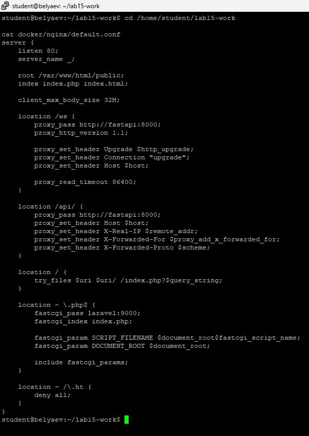

Скриншот WebSocket-настройки:

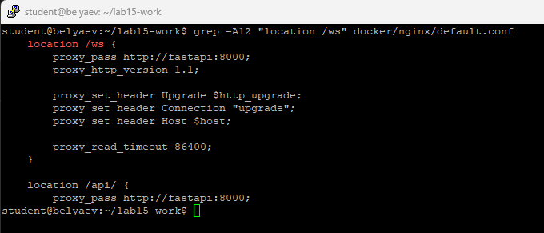

---

## 8. Docker Compose

Для запуска всех сервисов был создан файл `docker-compose.yml`.

В нём описаны сервисы:

- `nginx`;
- `laravel`;
- `fastapi`;
- `mysql`;
- `redis`.

Все контейнеры подключены к общей сети:

~~~text
boardy_net
~~~

Скриншот сервисов Docker Compose:

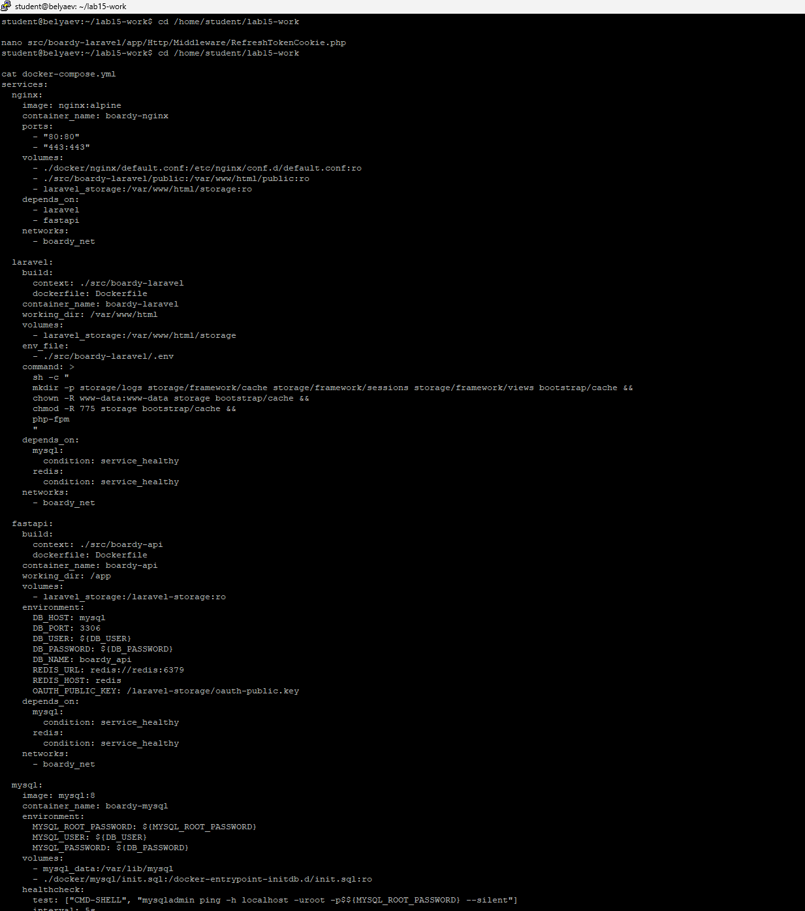

Для хранения данных были настроены volumes:

~~~text
mysql_data
redis_data
laravel_storage
~~~

Скриншот volumes:

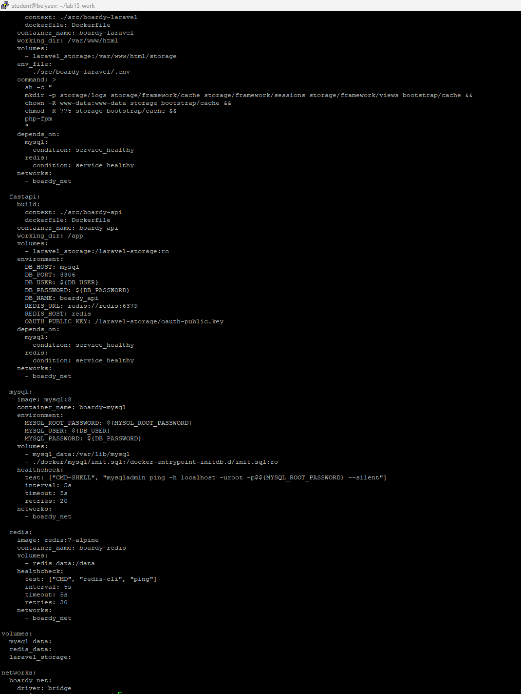

Для MySQL и Redis были добавлены healthcheck-проверки:

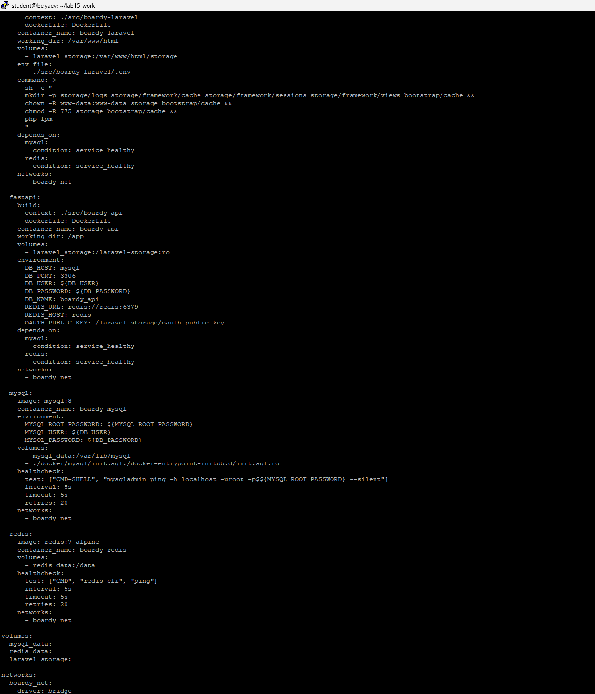

---

## 9. Инициализация MySQL

Для MySQL был создан файл:

~~~text
docker/mysql/init.sql
~~~

Он создаёт базы данных для Laravel и FastAPI:

~~~sql
CREATE DATABASE IF NOT EXISTS boardy_laravel;
CREATE DATABASE IF NOT EXISTS boardy_api;
~~~

Также в файле выдаются права пользователю приложения.

Скриншот `init.sql`:

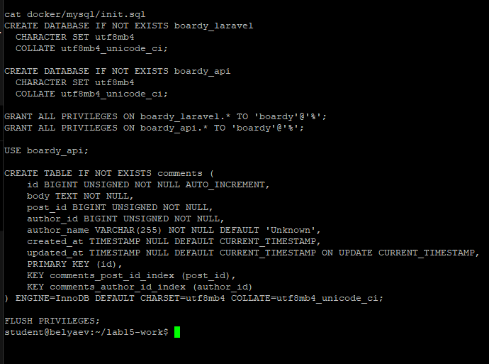

После запуска была выполнена проверка созданных баз данных:

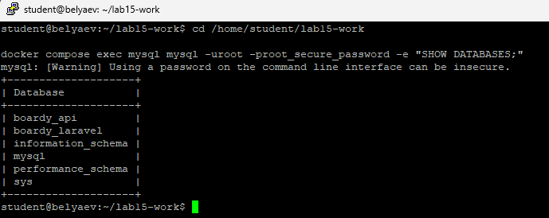

---

## 10. Переменные окружения

Для Docker Compose был подготовлен файл `.env.example`.

В нём находятся примерные переменные:

~~~env
MYSQL_ROOT_PASSWORD=
DB_USER=
DB_PASSWORD=
DB_NAME=
~~~

Скриншот env-файла Docker Compose:

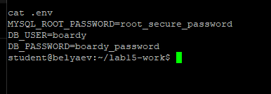

Laravel также использует `.env`, однако сам `.env` не добавлялся в репозиторий, так как содержит секретные значения.

В Laravel были настроены:

~~~env
APP_URL=http://localhost:8080
DB_HOST=mysql
DB_PORT=3306
REDIS_HOST=redis
PASSPORT_CLIENT_ID=...
~~~

Скриншот Laravel env:

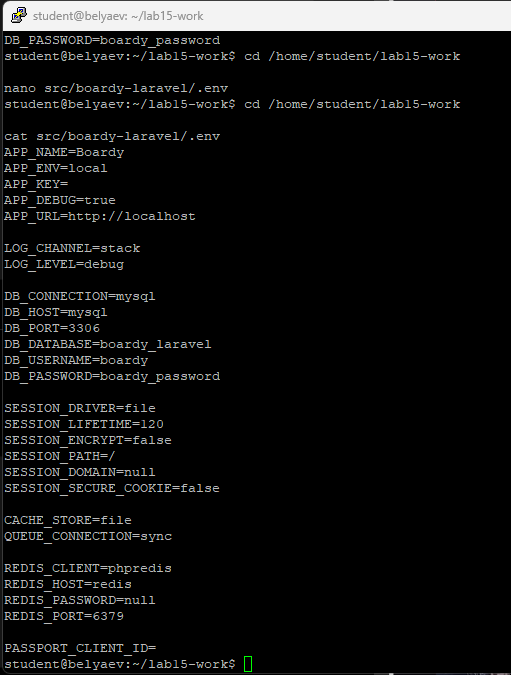

---

## 11. Запуск контейнеров

Контейнеры были собраны и запущены командами:

~~~bash
docker compose build
docker compose up -d
docker compose ps
~~~

В результате были запущены контейнеры:

~~~text
boardy-nginx
boardy-laravel
boardy-api
boardy-mysql
boardy-redis
~~~

Проверка доступности Laravel через Nginx:

~~~bash
curl -I http://localhost/posts
~~~

Результат:

~~~text
HTTP/1.1 200 OK
~~~

Скриншот успешного запуска контейнеров:

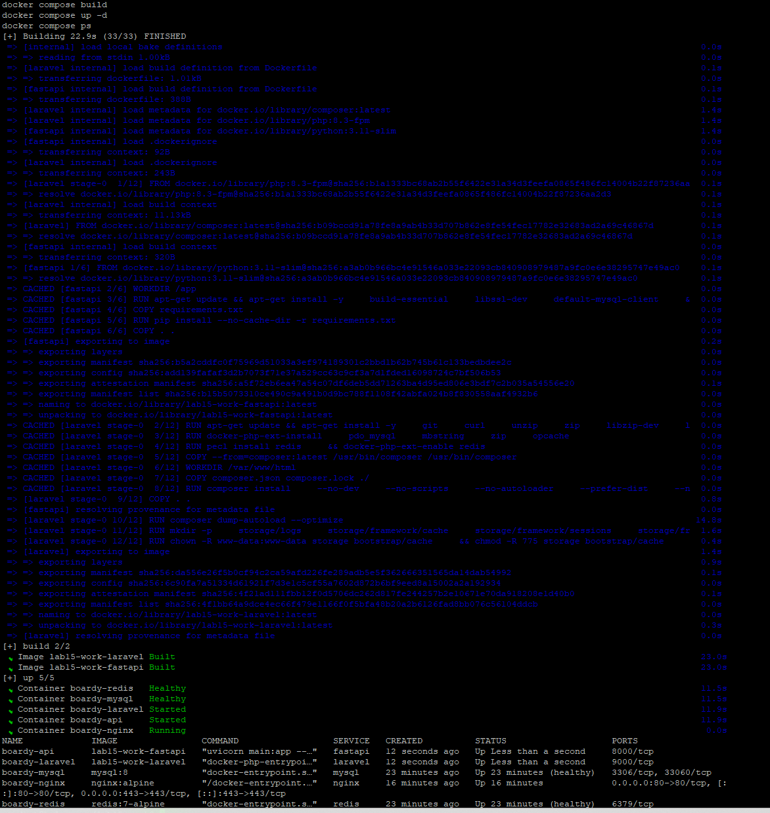

---

## 12. Миграции Laravel

После запуска Laravel были выполнены миграции:

~~~bash
docker compose exec laravel php artisan migrate
~~~

Были созданы таблицы:

~~~text
users
posts
comments
oauth_auth_codes
oauth_access_tokens
oauth_refresh_tokens
oauth_clients
oauth_device_codes
~~~

Скриншот выполнения миграций:

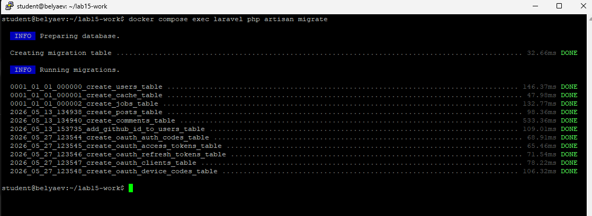

---

## 13. Настройка Laravel Passport

Для OAuth2 использовался Laravel Passport.

Были выполнены команды:

~~~bash
docker compose exec laravel php artisan passport:install
docker compose exec laravel php artisan passport:client --public --name="Boardy SPA Tunnel" --redirect_uri="http://localhost:8080/oauth/callback"
~~~

После создания клиента его `Client ID` был добавлен в `.env` Laravel:

~~~env
PASSPORT_CLIENT_ID=a1e20b09-d9e2-435d-81dc-855559999787
~~~

Чтобы контейнер Laravel подхватил новые значения из `.env`, он был пересоздан:

~~~bash
docker compose up -d --force-recreate laravel
~~~

Скриншот установки Passport и создания клиента:

---

## 14. Доступ через PuTTY tunnel

Так как Docker-приложение запускалось на виртуальной машине, а браузер использовался на Windows-хосте, был настроен SSH-туннель PuTTY.

Параметры туннеля:

~~~text
Source port: 8080
Destination: 127.0.0.1:80
~~~

После этого приложение стало доступно в браузере по адресу:

~~~text
http://localhost:8080/posts
~~~

OAuth callback также был настроен на:

~~~text
http://localhost:8080/oauth/callback
~~~

Это позволило корректно выполнить OAuth-процесс из браузера на Windows.

---

## 15. Исправление прав Passport-ключей

При проверке OAuth возникла ошибка прав доступа к приватному ключу:

~~~text
storage/oauth-private.key
~~~

Laravel Passport требует, чтобы приватный ключ имел права `600` или `660`.

Права были исправлены командами:

~~~bash
docker compose exec -u root laravel sh -c "chown www-data:www-data storage/oauth-private.key storage/oauth-public.key"
docker compose exec -u root laravel sh -c "chmod 600 storage/oauth-private.key"
docker compose exec -u root laravel sh -c "chmod 644 storage/oauth-public.key"
~~~

После этого OAuth-авторизация стала работать корректно.

---

## 16. Исправление OAuth callback

При обмене authorization code на access token возникала ошибка:

~~~text
The request is missing a required parameter...
~~~

Причина была связана с тем, что callback-страница не всегда корректно передавала `client_id` в JavaScript.

Решение:

- в `auth.js` был добавлен fallback для `CLIENT_ID`;
- callback-страница была обновлена;
- обмен `code` на `access_token` был проверен через браузер;
- access token успешно сохранился в `sessionStorage`.

Проверка токена в DevTools Console:

~~~javascript
sessionStorage.getItem('boardy_access_token')
~~~

---

## 17. Исправление WebSocket URL

Изначально фронтенд обращался к старым адресам:

~~~text
wss://api.belyaevubuntu.ru/ws
ws://127.0.0.1:8000/ws
~~~

Для Docker Compose через Nginx эти адреса были заменены на динамический адрес текущего хоста:

~~~javascript
const wsUrl = `${window.location.protocol === 'https:' ? 'wss' : 'ws'}://${window.location.host}/ws`;
const ws = new WebSocket(wsUrl);
~~~

Также API base URL был заменён на относительный:

~~~javascript
const API_BASE = '/api';
~~~

Это позволило фронтенду работать через Nginx и PuTTY tunnel.

---

## 18. Проверка работы приложения

Приложение было открыто в браузере по адресу:

~~~text
http://localhost:8080/posts
~~~

На странице отображались:

- шапка Boardy;
- список постов;
- кнопка добавления поста;
- кнопка OAuth API login;
- авторизованный пользователь.

Скриншот работающего приложения:

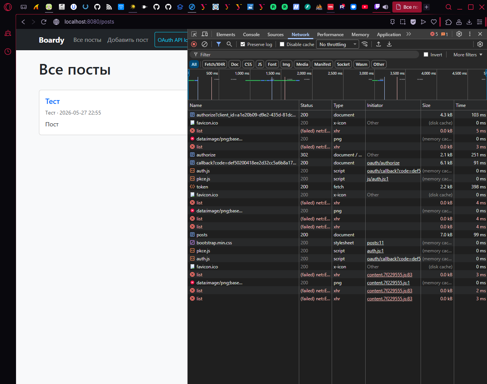

---

## 19. Проверка комментариев

После успешного OAuth-входа был получен access token.

Затем была проверена работа React-комментариев:

- открыт пост;
- загружен список комментариев через FastAPI;
- добавлен новый комментарий;
- комментарий появился на странице.

Скриншот работы комментариев:

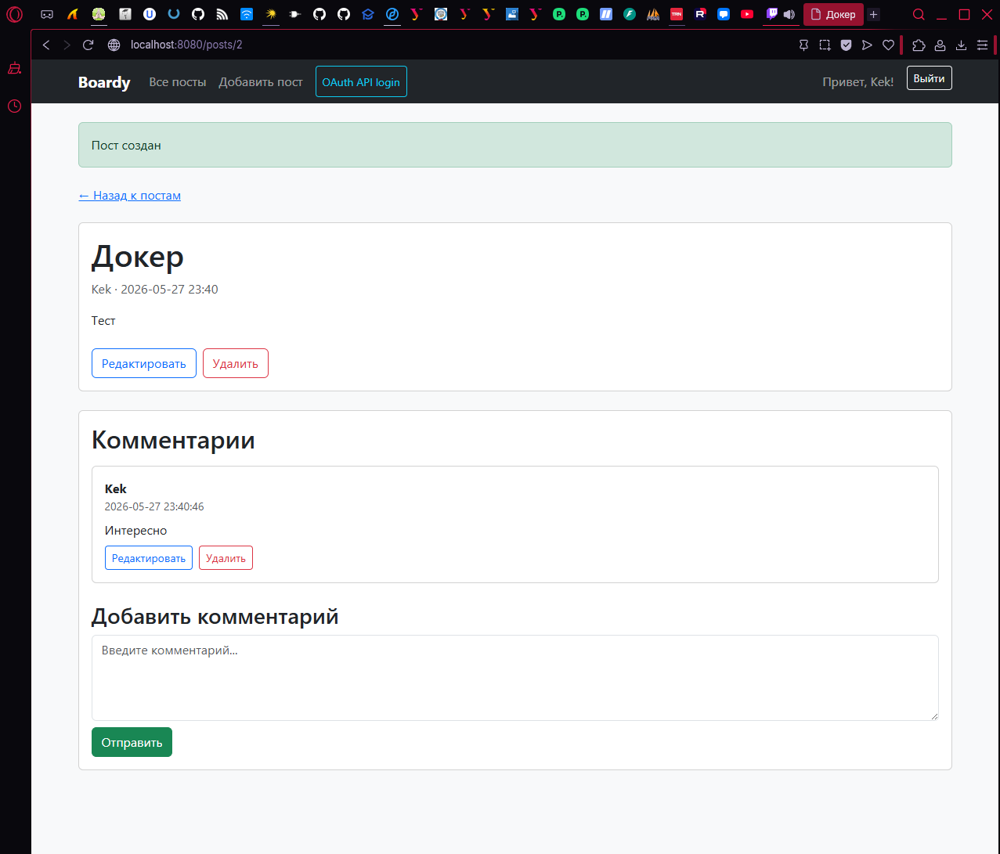

---

## 20. Проверка realtime-постов

Для проверки realtime-обновления постов были открыты два окна браузера.

В одном окне был создан новый пост. Во втором окне новый пост появился без ручного обновления страницы.

Это подтвердило работу связки:

~~~text
Laravel Observer -> Redis -> FastAPI subscriber -> WebSocket -> Browser
~~~

Скриншот realtime-постов:

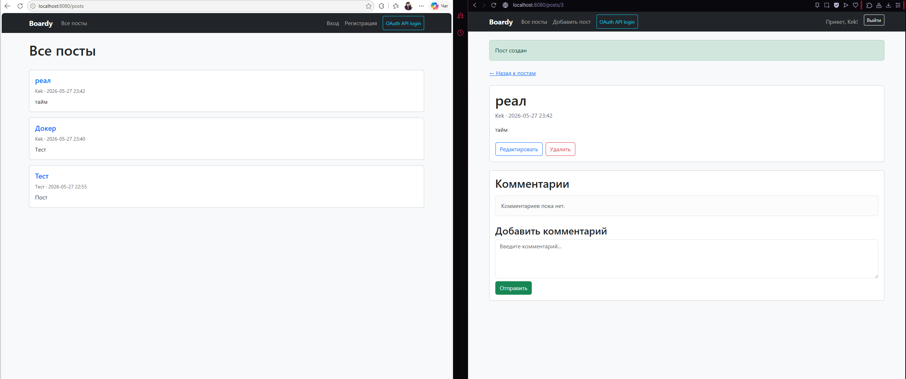

---

## 21. Проверка realtime-комментариев

Для проверки realtime-комментариев был открыт один и тот же пост в двух окнах браузера.

В первом окне был добавлен комментарий. Во втором окне комментарий появился без обновления страницы.

Скриншот realtime-комментариев:

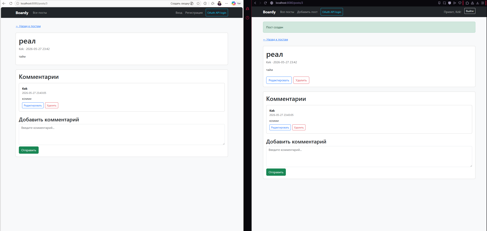

---

## 22. Проверка persistent volumes

Для проверки сохранения данных контейнеры были остановлены и запущены заново:

~~~bash
docker compose down
docker compose up -d
~~~

После повторного запуска посты и комментарии остались в приложении.

Это подтверждает, что данные MySQL и Redis сохраняются в Docker volumes.

Скриншот проверки сохранения данных:

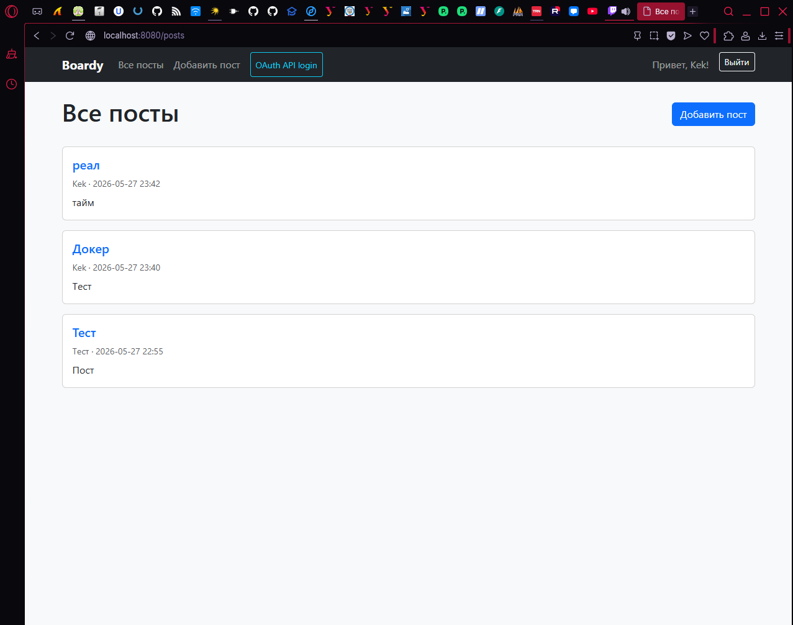

---

## 23. Проверка логов

Для проверки работы сервисов были просмотрены логи:

~~~bash
docker compose logs --tail=120
~~~

В логах отображались сообщения от:

- Nginx;
- Laravel;
- FastAPI;
- MySQL;
- Redis.

Скриншот логов:

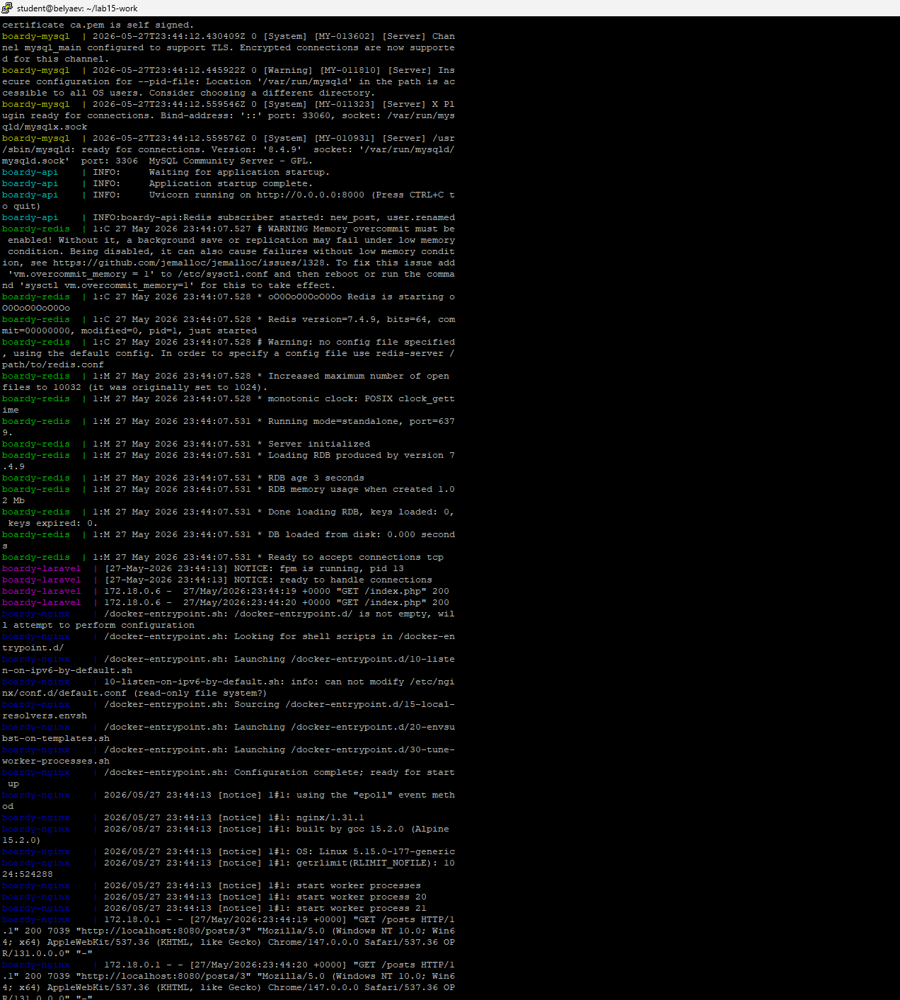

---

## 24. Проверка чистого запуска

Для финальной проверки был выполнен чистый запуск проекта:

~~~bash
docker compose down -v
docker compose build --no-cache
docker compose up -d
docker compose ps
~~~

После этого были повторно выполнены необходимые действия:

- генерация `APP_KEY`;
- миграции Laravel;
- настройка Passport;
- проверка контейнеров.

Скриншот чистого запуска:

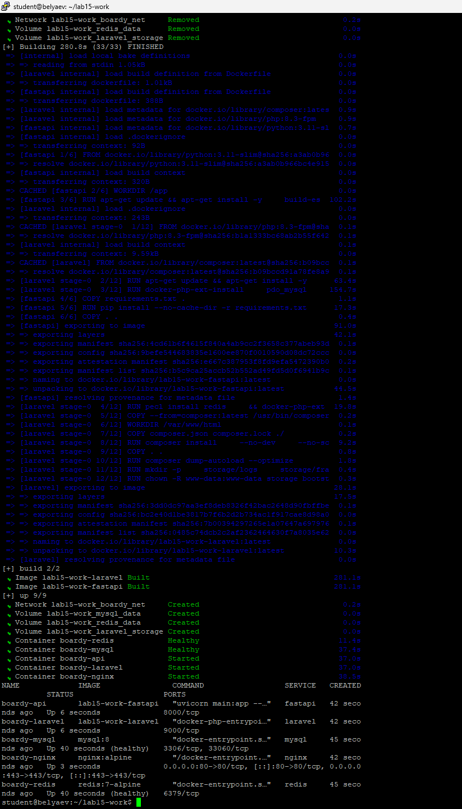

---

## 25. Основные проблемы и решения

### 25.1. Laravel-образ не собирался на PHP 8.2

Причина: зависимости проекта требовали PHP 8.3.

Решение:

~~~dockerfile
FROM php:8.3-fpm
~~~

### 25.2. Порт 80 был занят системным Nginx

Причина: на виртуальной машине уже работал Nginx.

Решение:

~~~bash
sudo systemctl stop nginx
docker compose up -d nginx
~~~

### 25.3. Браузер не открывал localhost

Причина: Docker работал на виртуальной машине, а браузер был открыт на Windows.

Решение: SSH-туннель PuTTY:

~~~text
8080 -> 127.0.0.1:80
~~~

### 25.4. OAuth callback не совпадал

Причина: callback должен совпадать с адресом, который используется в браузере.

Решение: создан Passport client с redirect URI:

~~~text
http://localhost:8080/oauth/callback
~~~

### 25.5. Неверные права на Passport private key

Причина: приватный ключ Passport имел слишком открытые права.

Решение:

~~~bash
chmod 600 storage/oauth-private.key
chmod 644 storage/oauth-public.key
~~~

### 25.6. WebSocket обращался к старому адресу

Причина: во фронтенде остались старые адреса API и WebSocket.

Решение:

~~~javascript
const API_BASE = '/api';
const wsUrl = `${window.location.protocol === 'https:' ? 'wss' : 'ws'}://${window.location.host}/ws`;
~~~

---

## 26. Безопасность

В репозиторий не были добавлены секретные файлы:

~~~text
.env
oauth-private.key
oauth-public.key
~~~

Также не были добавлены тяжёлые и генерируемые директории:

~~~text
vendor/
node_modules/
venv/
__pycache__/
~~~

Для примера настроек используется `.env.example`.

---

## 27. Подготовка проекта к переносу

Для переноса проекта с виртуальной машины был создан архив:

~~~bash
tar \
  --exclude='lab15-work/.env' \
  --exclude='lab15-work/src/boardy-laravel/.env' \
  --exclude='lab15-work/src/boardy-laravel/vendor' \
  --exclude='lab15-work/src/boardy-laravel/node_modules' \
  --exclude='lab15-work/src/boardy-laravel/storage/oauth-private.key' \
  --exclude='lab15-work/src/boardy-laravel/storage/oauth-public.key' \
  --exclude='lab15-work/src/boardy-api/venv' \
  --exclude='lab15-work/src/boardy-api/__pycache__' \
  --exclude='*.pyc' \
  -czf lab15-work.tar.gz lab15-work
~~~

После этого архив был перенесён на Windows и подготовлен к выгрузке в GitHub.

---

## 28. Итоговый результат

В результате практической работы было выполнено:

- создан Dockerfile для Laravel;
- создан Dockerfile для FastAPI;
- настроен Nginx reverse proxy;
- настроены MySQL и Redis;
- создан `docker-compose.yml`;
- настроены Docker volumes;
- настроены healthcheck-проверки;
- выполнены миграции Laravel;
- настроен Laravel Passport;
- проверен OAuth2 Authorization Code Flow with PKCE;
- проверена работа React-комментариев;
- проверена работа WebSocket realtime-уведомлений;
- проверено сохранение данных после перезапуска;
- проект подготовлен к выгрузке в GitHub без секретных файлов.

---

## 29. Вывод

В ходе практической работы приложение Boardy было успешно перенесено в Docker Compose-инфраструктуру.

Контейнеризация позволила изолировать основные части системы: Laravel, FastAPI, MySQL, Redis и Nginx. Nginx стал единой точкой входа в приложение и обеспечил проксирование запросов к Laravel, FastAPI и WebSocket.

Также была проверена работа OAuth через Laravel Passport, работа API комментариев, realtime-обновления через Redis и WebSocket, а также сохранение данных с помощью Docker volumes.

Практическая работа показала, что Docker Compose удобно использовать для локального и учебного развёртывания многокомпонентных веб-приложений.