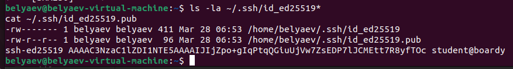
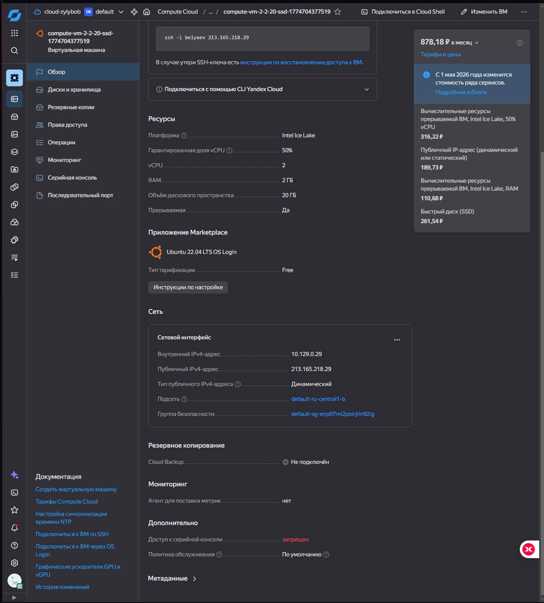
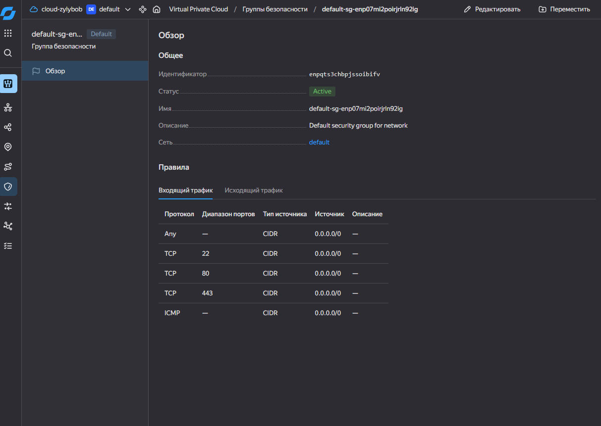
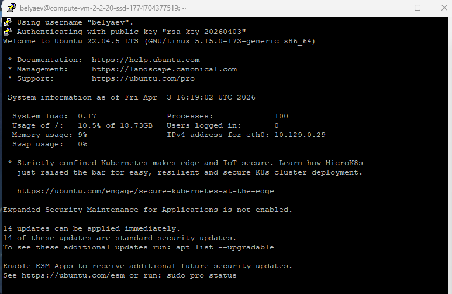
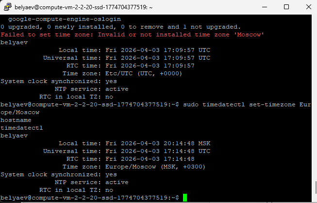
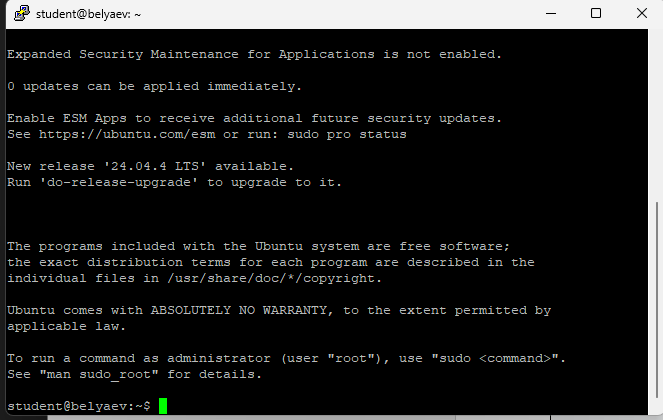
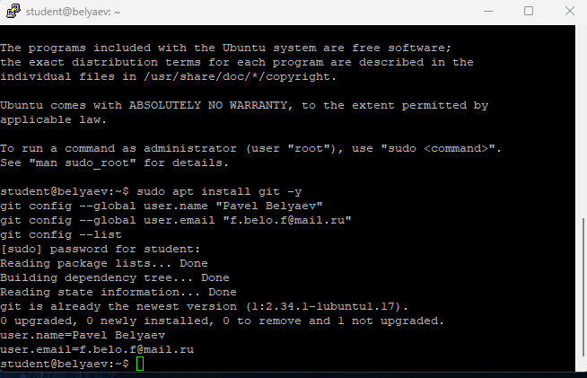
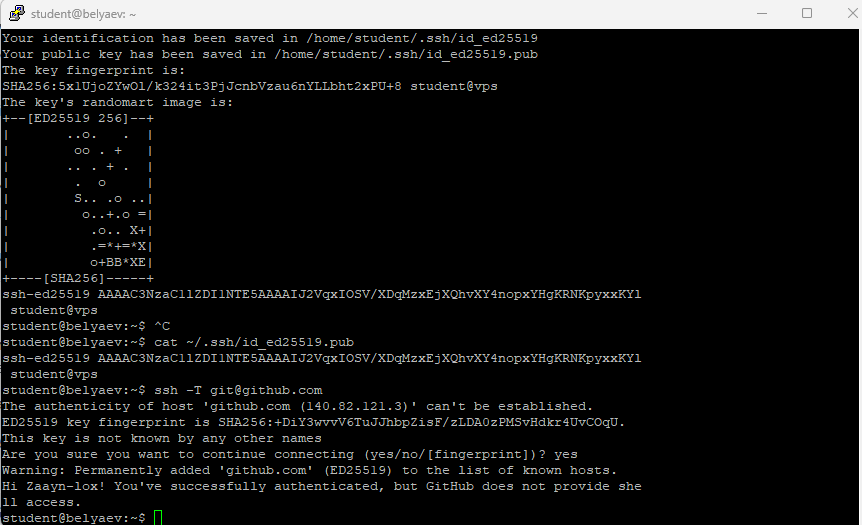
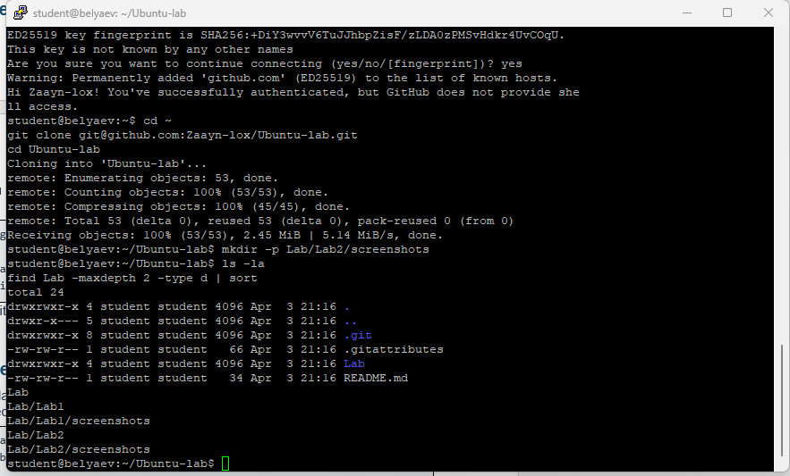
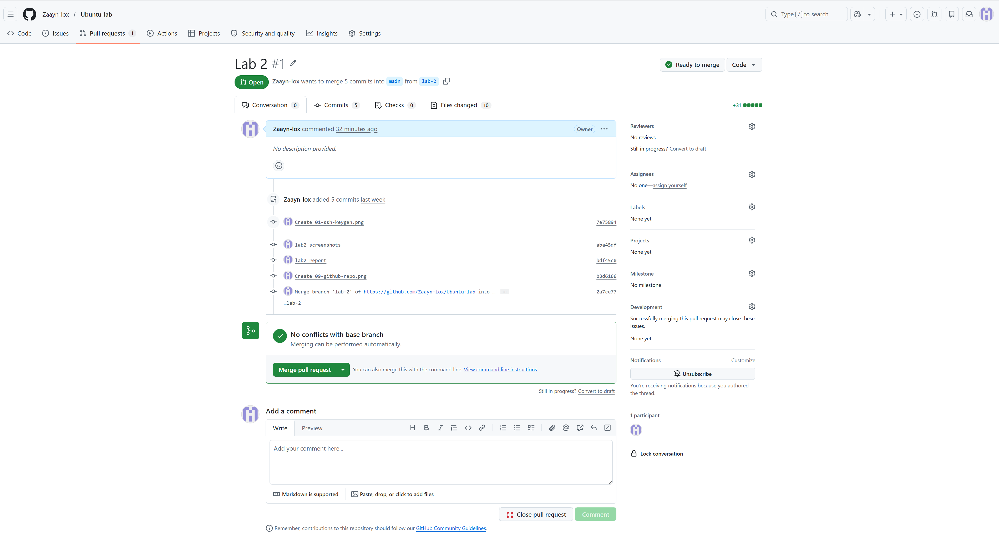

# Практика 2 — SSH, VPS, Git

## 1. SSH-ключ

## 2. Виртуальная машина в Yandex Cloud

## 3. Security group

## 4. Подключение

## 5. Настройка сервера

## 6. Пользователь student

## 7. Git

## 8. GitHub SSH

## 9. Репозиторий

## 10. Pull Request

