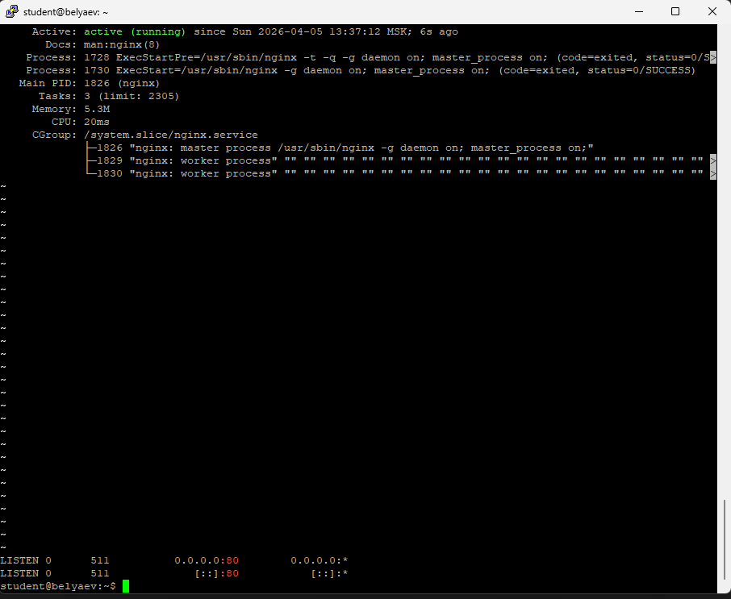
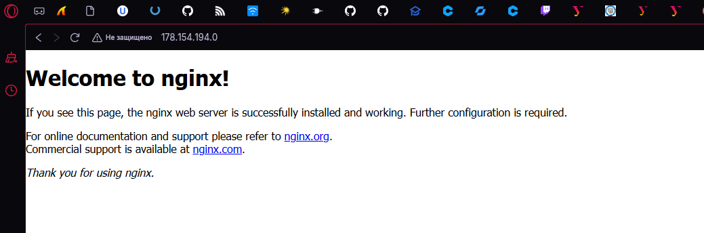
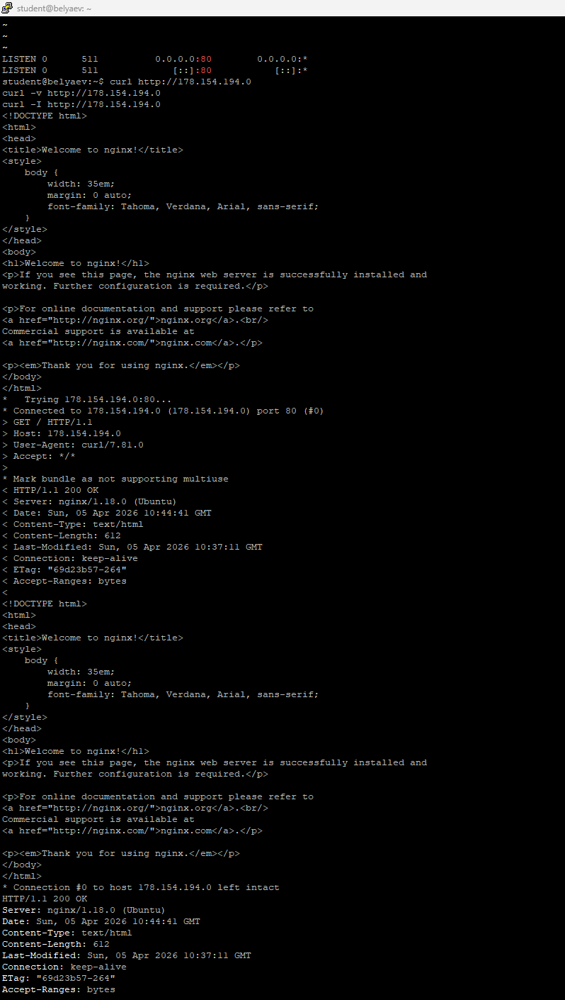
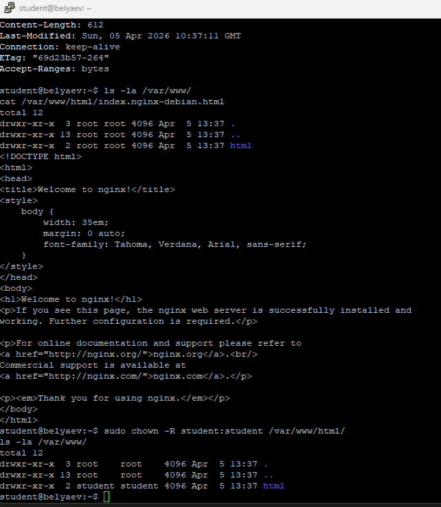
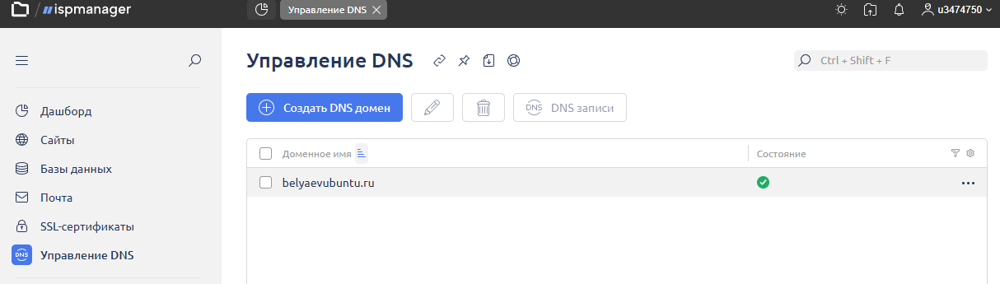
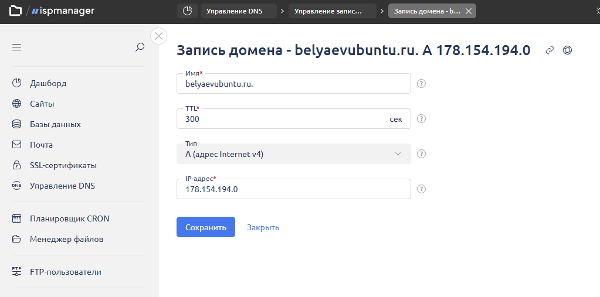
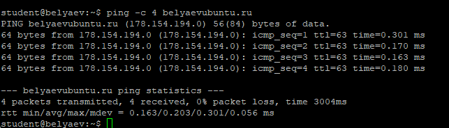
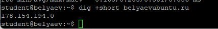
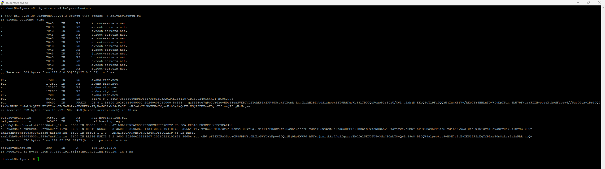
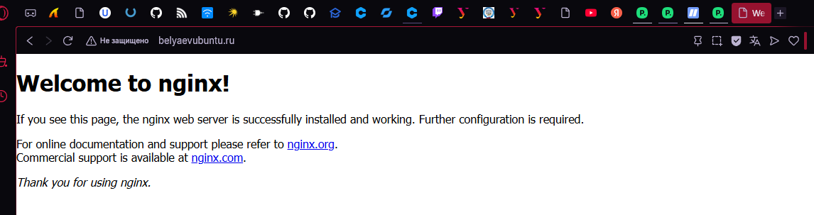

# Практика 3 — Nginx, DNS

## Цель работы

Установить и проверить веб-сервер Nginx на виртуальной машине, а также настроить доступ к сайту по доменному имени через DNS

## Исходные данные

- Облачная платформа: Yandex Cloud
- Имя виртуальной машины: `belyaev`
- Пользователь: `student`
- Публичный IP-адрес сервера: `178.154.194.0`
- Доменное имя: `belyaevubuntu.ru`
- DNS-серверы домена: `ns1.hosting.reg.ru`, `ns2.hosting.reg.ru`

---

## 1. Установка и проверка Nginx




---

## 2. Проверка страницы по IP-адресу

После установки был открыт сайт по публичному IP-адресу сервера:

`http://178.154.194.0`

В браузере отобразилась стандартная страница `Welcome to nginx!`, что подтверждает корректную работу веб-сервера по IP



---

## 3. Проверка через curl

Для проверки HTTP-ответа из терминала использовались команды:

```bash
curl http://178.154.194.0
curl -v http://178.154.194.0
```

Команда `curl -v` показывает подробный обмен между клиентом и сервером.

Ключевые строки из вывода:

- `GET / HTTP/1.1` — строка HTTP-запроса, которую отправил клиент
- `HTTP/1.1 200 OK` — код успешного ответа сервера
- `Content-Type: text/html` — сервер вернул HTML-страницу

Это означает, что сервер успешно обрабатывает запрос к корню сайта и отдаёт HTML-контент.



---

## 4. Директория сайта и права доступа

Далее был найден файл, который Nginx отдаёт по умолчанию, и изменён владелец каталога сайта, чтобы пользователь `student` мог редактировать файлы без `sudo`

По умолчанию сайт находится в директории:

```bash
/var/www/html
```

Файл стартовой страницы:

```bash
/var/www/html/index.nginx-debian.html
```

После выполнения `chown` владельцем каталога стал пользователь `student`



---

## 5. Конфигурация Nginx

Основные директивы

### listen

Значение: `listen 80 default_server;`  
Эта директива указывает, что Nginx принимает HTTP-запросы на порту `80` как сервер по умолчанию

### root

Значение: `root /var/www/html;`  
Эта директива задаёт директорию, из которой Nginx отдаёт файлы сайта

### server_name

Значение: `server_name _;`  
Эта директива определяет имя хоста для данного серверного блока. Символ `_` в дефолтном конфиге означает обработку запросов по умолчанию

### index

Значение: `index index.html index.htm index.nginx-debian.html;`  
Эта директива указывает, какие файлы Nginx должен искать как стартовую страницу каталога

Итог: Nginx получает запрос, смотрит в каталог `/var/www/html`, ищет один из index-файлов и отдаёт его клиенту

---

## 6. DNS-зона и A-запись

В данной работе DNS-часть была выполнена не через VK Cloud DNS, а через собственный домен `belyaevubuntu.ru`, зарегистрированный в REG.RU





---

## 7. Проверка ping по домену



---

## 8. Проверка через dig

Разбор полного вывода `dig`:

### QUESTION SECTION

Показывает, что именно было запрошено у DNS-сервера.  
В данном случае — A-запись для домена `belyaevubuntu.ru`

### ANSWER SECTION

Показывает ответ DNS-сервера.  
Здесь содержится A-запись домена и IP-адрес `178.154.194.0`, а также TTL — время жизни записи в кэше

### SERVER

Показывает, какой DNS-сервер ответил на запрос

Дополнительно проверка через публичный DNS Google (`8.8.8.8`) также вернула тот же IP-адрес, что подтверждает корректную публичную DNS-настройку.



---

## 9. Проверка через dig +trace

Для просмотра полного пути DNS-резолвинга была использована команда:

```bash
dig +trace -4 belyaevubuntu.ru
```

Команда `dig +trace` показывает, как DNS-система находит IP-адрес домена шаг за шагом

### Шаг 1. Корневые DNS-серверы `.`

Сначала происходит обращение к корневым DNS-серверам, которые указывают, какие серверы отвечают за доменную зону `.ru`

### Шаг 2. Серверы зоны `.ru`

После этого запрос передаётся DNS-серверам зоны `.ru`, которые сообщают, какие NS-серверы отвечают за домен `belyaevubuntu.ru`

### Шаг 3. NS-серверы домена

Затем выполняется обращение к DNS-серверам домена:

- `ns1.hosting.reg.ru`
- `ns2.hosting.reg.ru`

Именно они содержат актуальную A-запись домена

### Шаг 4. Итоговая A-запись

На последнем шаге возвращается итоговый ответ:

```bash
belyaevubuntu.ru.  IN  A  178.154.194.0
```

Это подтверждает, что DNS-цепочка работает правильно от корня DNS до конечной A-записи домена.



---

## 10. Проверка сайта по доменному имени

После завершения настройки DNS сайт был открыт по адресу:

`http://belyaevubuntu.ru`

В браузере отобразилась та же стандартная страница Nginx, что и при открытии по IP-адресу. Это означает, что:

- домен корректно резолвится в IP-адрес сервера
- Nginx принимает запросы по доменному имени
- сайт доступен по HTTP через домен

Дополнительно проверка заголовков показала успешный ответ:

```bash
curl -I http://belyaevubuntu.ru
```

Результат: `HTTP/1.1 200 OK`



---

## Вывод

В ходе выполнения практической работы был установлен и проверен веб-сервер Nginx на виртуальной машине в Yandex Cloud. Было подтверждено, что сайт открывается по публичному IP-адресу `178.154.194.0`

Далее было настроено доменное имя `belyaevubuntu.ru` через DNS REG.RU. После создания A-записи домен начал корректно резолвиться в IP-адрес сервера, что было подтверждено командами `ping`, `dig`, `dig @8.8.8.8` и `dig +trace`

Итоговый результат: веб-сервер Nginx успешно отдаёт страницу как по IP-адресу, так и по доменному имени, а DNS-настройка выполнена корректно
