# Практика 4 — HTTP, виртуальные хосты, проект Boardy

## Цель работы

Настроить два виртуальных хоста Nginx на одном сервере, создать статические страницы проекта Boardy, проверить работу HTTP-запросов и изучить раздельные логи веб-сервера

## Исходные данные

- Облачная платформа: `Yandex Cloud`
- Имя сервера: `belyaev`
- Пользователь: `student`
- Публичный IP-адрес: `178.154.194.0`
- Основной домен: `belyaevubuntu.ru`
- API-поддомен: `api.belyaevubuntu.ru`
- DNS-провайдер: `REG.RU`
- Репозиторий: `Ubuntu-lab`

---

## 1. Директория проекта

Для основного сайта была создана директория `/var/www/boardy`, после чего права на неё были переданы пользователю `student`, чтобы можно было редактировать файлы проекта без `sudo`

Использованные команды:

```bash
sudo mkdir -p /var/www/boardy
sudo chown $USER:$USER /var/www/boardy
ls -la /var/www/
```

Результат: директория `boardy` успешно создана в `/var/www/`, владельцем назначен пользователь `student`

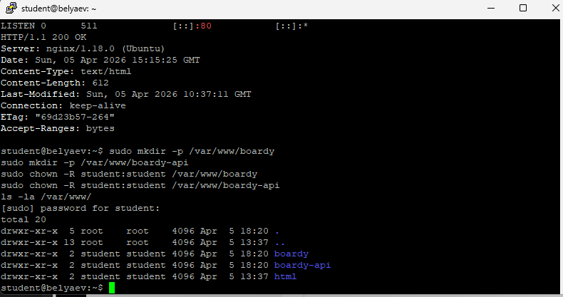

---

## 2. Конфиг виртуального хоста основного сайта

Для основного сайта был создан отдельный конфиг Nginx `/etc/nginx/sites-available/boardy`

Использованный конфиг:

```nginx
server {
    listen 80;
    server_name belyaevubuntu.ru;

    root /var/www/boardy;
    index index.html;

    access_log /var/log/nginx/boardy-access.log;
    error_log /var/log/nginx/boardy-error.log;

    location / {
        try_files $uri $uri/ =404;
    }

    error_page 404 /404.html;
}
```

После создания конфиг был активирован, дефолтный сайт отключён, а конфигурация проверена и перечитана

Использованные команды:

```bash
sudo ln -s /etc/nginx/sites-available/boardy /etc/nginx/sites-enabled/
sudo rm /etc/nginx/sites-enabled/default
sudo nginx -t
sudo systemctl reload nginx
```

### Объяснение директив

- `server_name` — указывает, для какого доменного имени применяется данный виртуальный хост
- `root` — задаёт каталог, из которого Nginx отдаёт файлы сайта
- `access_log` — определяет отдельный файл для записи всех обычных запросов к сайту
- `error_log` — определяет отдельный файл для записи ошибок сайта
- `try_files` — проверяет существование файла или каталога и, если путь не найден, возвращает ошибку `404`
- `error_page` — задаёт кастомную страницу, которая будет показана при ошибке `404`

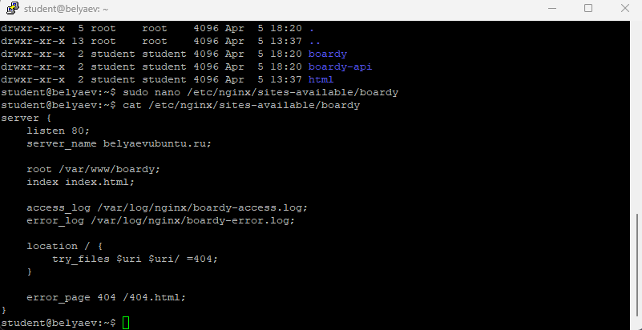

---

## 3. Лендинг проекта Boardy

Для проекта была создана главная страница `index.html`, которая содержит название проекта, краткое описание и ссылку на форму обратной связи

Основной файл сайта:

```html
<!DOCTYPE html>
<html lang="ru">
<head>
    <meta charset="utf-8">
    <meta name="viewport" content="width=device-width, initial-scale=1">
    <title>Boardy</title>
    <link rel="stylesheet" href="/css/style.css">
</head>
<body>
    <header>
        <h1>Boardy</h1>
        <p>Микро-доска объявлений</p>
    </header>

    <main>
        <section>
            <h2>О проекте</h2>
            <p>Boardy — учебный проект курса «Архитектура веб-приложений».</p>
            <p>Здесь будут посты, комментарии и уведомления в реальном времени.</p>
        </section>

        <section>
            <h2>Обратная связь</h2>
            <p><a href="/feedback.html">Перейти к форме обратной связи</a></p>
        </section>
    </main>

    <footer>
        <p>&copy; 2026 Boardy | Pavel Belyaev</p>
    </footer>
</body>
</html>
```

Результат: по адресу `http://belyaevubuntu.ru/` открывается лендинг проекта Boardy

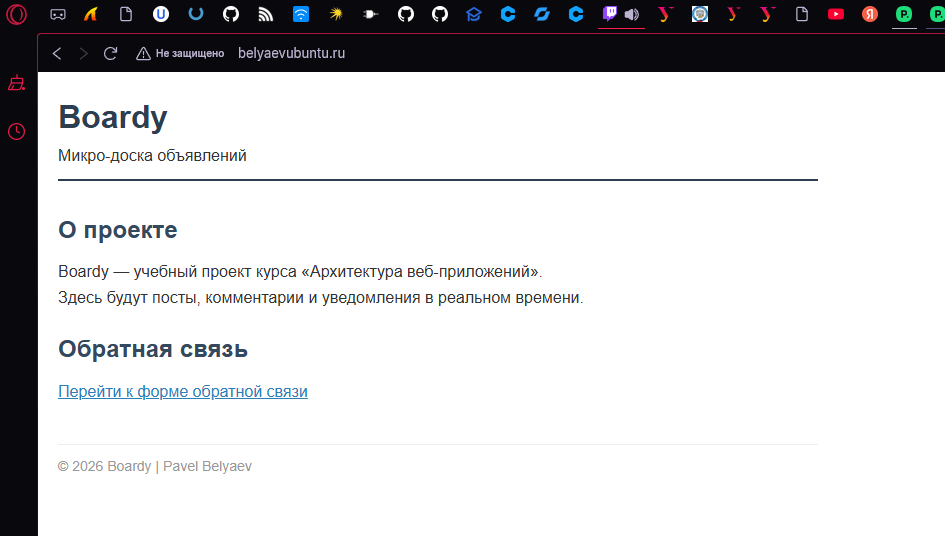

---

## 4. Форма обратной связи

Для сайта была создана страница `feedback.html` с HTML-формой обратной связи

Форма содержит:
- поле `Имя`
- поле `Сообщение`
- кнопку `Отправить`

Важные атрибуты формы:

```html
<form method="POST" action="/submit">
```

Это означает, что форма отправляет данные методом `POST` на адрес `/submit`.

Файл `feedback.html`:

```html
<!DOCTYPE html>
<html lang="ru">
<head>
    <meta charset="utf-8">
    <meta name="viewport" content="width=device-width, initial-scale=1">
    <title>Boardy — Обратная связь</title>
    <link rel="stylesheet" href="/css/style.css">
</head>
<body>
    <header>
        <h1><a href="/">Boardy</a></h1>
    </header>

    <main>
        <h2>Обратная связь</h2>
        <form method="POST" action="/submit">
            <label for="name">Имя:</label>
            <input type="text" id="name" name="name" required>

            <label for="message">Сообщение:</label>
            <textarea id="message" name="message" rows="5" required></textarea>

            <button type="submit">Отправить</button>
        </form>
    </main>

    <footer>
        <p><a href="/">На главную</a></p>
    </footer>
</body>
</html>
```

Результат: форма корректно открывается в браузере по адресу `http://belyaevubuntu.ru/feedback.html`

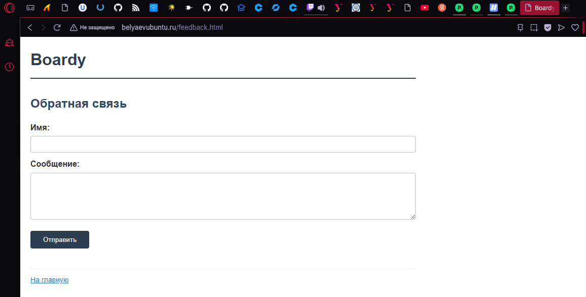

---

## 5. Стили и кастомная 404-страница

Для оформления страниц был создан файл `css/style.css`, который подключается ко всем HTML-страницам проекта

Основные задачи CSS:
- оформить шапку и основной контент
- сделать форму удобной для чтения
- добавить стили для кастомной страницы `404`

Также была создана страница `404.html`, которая отображается при запросе несуществующего адреса

Файл `404.html`:

```html
<!DOCTYPE html>
<html lang="ru">
<head>
    <meta charset="utf-8">
    <title>Boardy — 404</title>
    <link rel="stylesheet" href="/css/style.css">
</head>
<body>
    <div class="error-page">
        <h1>404</h1>
        <p>Страница не найдена</p>
        <p><a href="/">Вернуться на главную</a></p>
    </div>
</body>
</html>
```

Результат: при переходе по несуществующему адресу, например `http://belyaevubuntu.ru/nonexistent`, отображается собственная страница ошибки

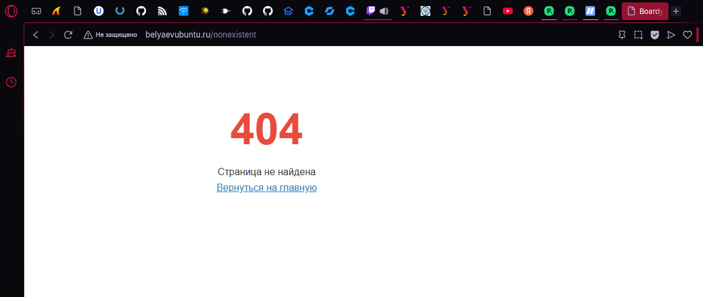

---

## 6. DNS-запись для API-поддомена

Для второго виртуального хоста был создан поддомен `api.belyaevubuntu.ru`, который указывает на тот же IP-адрес сервера, что и основной домен

В панели REG.RU была добавлена DNS-запись:
- тип: `A`
- имя: `api`
- значение: `178.154.194.0`
- TTL: `300`

Это означает, что основной сайт и API-поддомен используют один и тот же сервер, а выбор сайта выполняется уже на уровне Nginx по заголовку `Host`

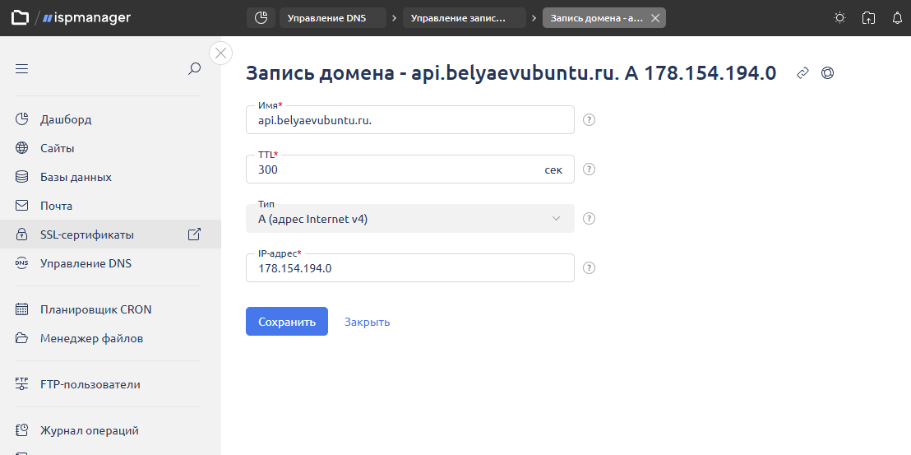

---

## 7. Проверка DNS для API-поддомена

После создания DNS-записи были выполнены проверки:

```bash
dig +short api.belyaevubuntu.ru
dig @8.8.8.8 +short api.belyaevubuntu.ru
```

В обоих случаях был получен IP-адрес:

```text
178.154.194.0
```

Это подтверждает, что поддомен `api.belyaevubuntu.ru` корректно резолвится в публичный IP сервера

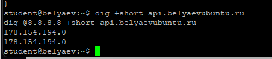

---

## 8. Конфиг и заглушка API

Для API был создан отдельный каталог:

```bash
sudo mkdir -p /var/www/boardy-api
sudo chown $USER:$USER /var/www/boardy-api
```

В каталоге была создана заглушка `index.html` с текстом:

- `Boardy API`
- `Service: OK`
- `REST API + WebSocket — coming soon`

Также был создан отдельный конфиг Nginx `/etc/nginx/sites-available/boardy-api`:

```nginx
server {
    listen 80;
    server_name api.belyaevubuntu.ru;

    root /var/www/boardy-api;
    index index.html;

    access_log /var/log/nginx/boardy-api-access.log;
    error_log /var/log/nginx/boardy-api-error.log;

    location / {
        try_files $uri $uri/ =404;
    }
}
```

После этого конфиг был активирован и применён:

```bash
sudo ln -s /etc/nginx/sites-available/boardy-api /etc/nginx/sites-enabled/
sudo nginx -t
sudo systemctl reload nginx
```

Результат: по адресу `http://api.belyaevubuntu.ru/` открывается отдельная страница API-заглушки

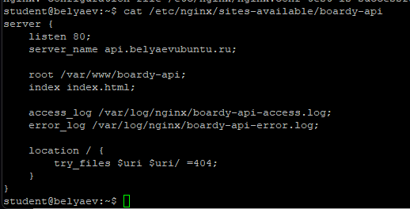

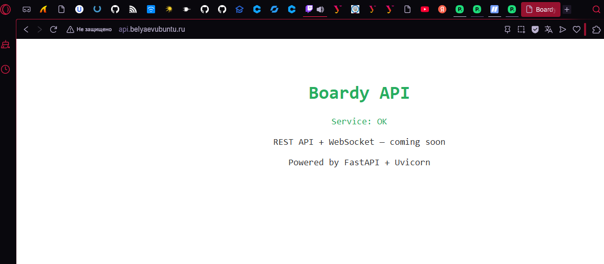

---

## 9. GET-запрос через curl -v

Для исследования HTTP был отправлен GET-запрос к основному сайту:

```bash
curl -v http://belyaevubuntu.ru/
```

### Разбор вывода

- `GET / HTTP/1.1` — стартовая строка HTTP-запроса: метод `GET`, путь `/`, версия протокола `HTTP/1.1`
- `Host: belyaevubuntu.ru` — заголовок `Host`, по которому Nginx понимает, какой виртуальный хост нужно использовать
- `HTTP/1.1 200 OK` — стартовая строка HTTP-ответа: сервер успешно обработал запрос
- `Content-Type: text/html` — тип содержимого ответа
- `Content-Length: ...` — длина ответа в байтах

Результат: сервер корректно отдаёт HTML-страницу основного сайта и возвращает код `200 OK`

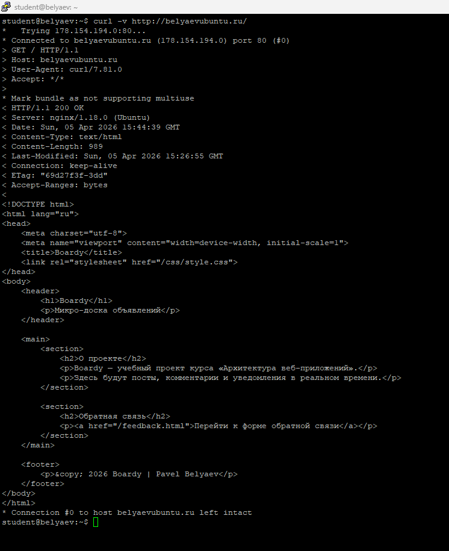

---

## 10. Виртуальные хосты в действии

Для проверки работы виртуальных хостов были отправлены запросы на один и тот же IP-адрес с разными заголовками `Host`:

```bash
curl -H "Host: belyaevubuntu.ru" http://178.154.194.0/
curl -H "Host: api.belyaevubuntu.ru" http://178.154.194.0/
curl -H "Host: unknown.ru" http://178.154.194.0/
```

### Результат

- при `Host: belyaevubuntu.ru` сервер вернул лендинг Boardy
- при `Host: api.belyaevubuntu.ru` сервер вернул заглушку API
- при `Host: unknown.ru` заголовок не совпал ни с одним настроенным `server_name`, поэтому запрос был обработан виртуальным хостом, который оказался сервером по умолчанию для данного `listen 80`

### Объяснение

Один IP-адрес может возвращать разные сайты, потому что Nginx выбирает конфигурацию не только по IP и порту, но и по заголовку `Host`. Именно поэтому основной домен и API-поддомен могут работать на одном сервере и одном порту `80`, но отдавать разный контент

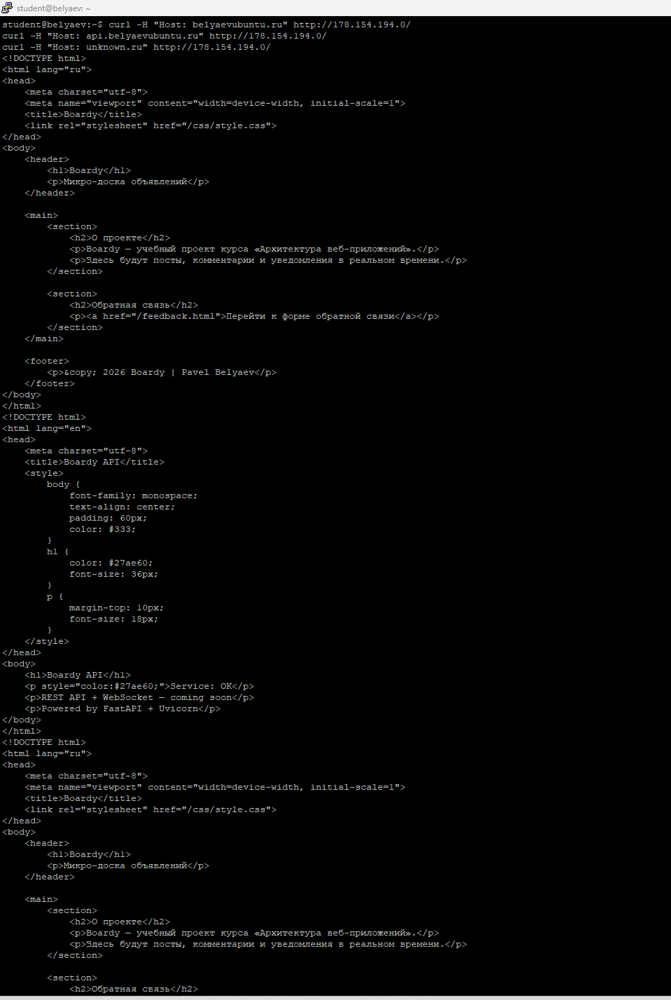

---

## 11. POST-запрос к форме

Для проверки отправки формы был выполнен запрос:

```bash
curl -v -X POST -d "name=Ivanov&message=Hello" http://belyaevubuntu.ru/submit
```

### Разбор вывода

- `POST /submit HTTP/1.1` — метод `POST`, путь `/submit`, версия `HTTP/1.1`
- `Content-Type: application/x-www-form-urlencoded` — тип данных формы
- `name=Ivanov&message=Hello` — тело запроса
- `HTTP/1.1 404 Not Found` — код ответа сервера

### Почему сервер вернул 404

В текущей конфигурации сайт является статическим, а путь `/submit` не настроен как отдельный обработчик на стороне сервера. Nginx получил `POST` на адрес `/submit`, попытался найти соответствующий путь в каталоге сайта, не нашёл его и вернул `404 Not Found`

Иными словами, форма визуально существует, но сервер пока не умеет обрабатывать отправленные данные. На текущем этапе это ожидаемое поведение статического сайта без CGI, PHP или другого backend-обработчика

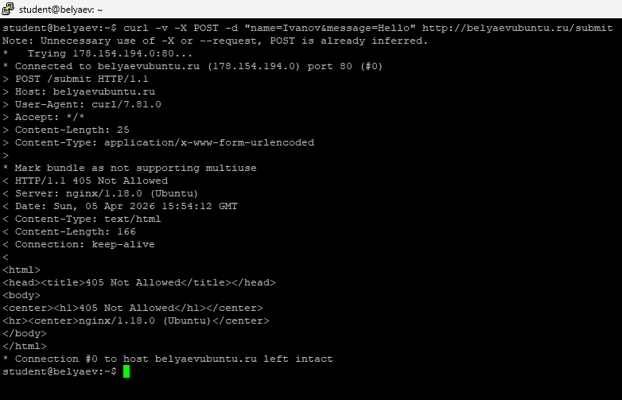

---

## 12. Сравнение GET и HEAD

Для сравнения были выполнены два запроса:

```bash
curl -v http://belyaevubuntu.ru/
curl -I http://belyaevubuntu.ru/
```

### Отличие GET от HEAD

- `GET` возвращает и заголовки, и тело ответа
- `HEAD` возвращает только заголовки, без тела

### Зачем нужен HEAD

Метод `HEAD` полезен для быстрой проверки:
- существует ли ресурс
- какой код ответа возвращает сервер
- какой тип содержимого будет отдан
- какой размер у ответа

То есть `HEAD` позволяет проверить ресурс без загрузки полного тела страницы

---

## 13. Раздельные логи

После выполнения нескольких запросов к основному сайту и API были просмотрены отдельные access-логи:

```bash
tail -5 /var/log/nginx/boardy-access.log
tail -5 /var/log/nginx/boardy-api-access.log
```

### Что видно в логе

Каждая строка access-лога содержит:
- IP-адрес клиента
- дату и время
- HTTP-метод и путь
- код ответа
- размер ответа
- User-Agent клиента

Пример разбора строки:

- IP — адрес клиента, который отправил запрос
- метод — например `GET` или `POST`
- путь — например `/`, `/feedback.html`, `/submit`
- код ответа — например `200`, `404`
- User-Agent — клиентская программа, например `curl/...` или браузер

Результат: запросы к основному сайту и к API записываются в разные log-файлы, что упрощает диагностику и анализ

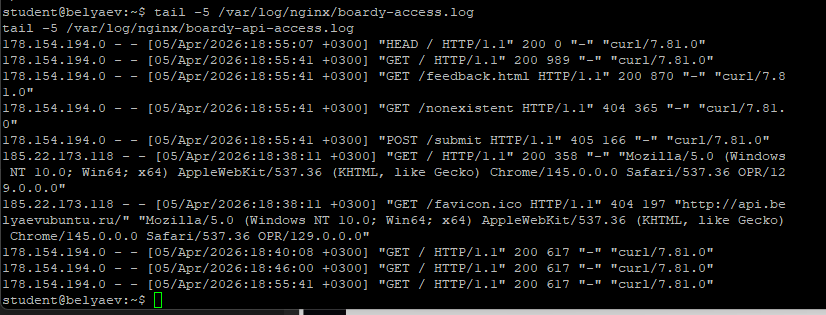

---

## 14. Фильтрация логов

Для получения статистики по кодам ответа была выполнена команда:

```bash
awk '{print $9}' /var/log/nginx/boardy-access.log | sort | uniq -c | sort -rn
```

### Разбор конвейера

- `awk '{print $9}'` — извлекает девятое поле из access-лога, то есть HTTP-код ответа
- `sort` — сортирует значения
- `uniq -c` — считает количество одинаковых кодов
- `sort -rn` — сортирует результат по убыванию количества

Результат: была получена статистика, показывающая, сколько запросов завершилось кодами `200`, `404` и другими статусами

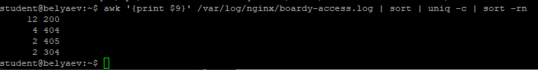

---

## 15. Структура проекта в репозитории

Для сдачи работы в репозиторий были добавлены:
- файлы основного сайта:
  - `src/boardy/index.html`
  - `src/boardy/feedback.html`
  - `src/boardy/css/style.css`
  - `src/boardy/404.html`
- файл API-заглушки:
  - `src/boardy-api/index.html`
- конфиги Nginx:
  - `config/nginx/boardy`
  - `config/nginx/boardy-api`
- отчёт:
  - `Lab/Lab4/Report.md`
- скриншоты:
  - `Lab/Lab4/screenshots/`

После этого была создана ветка `lab4`, выполнены `commit`, `push` и создан Pull Request

---

## Вывод

В ходе практической работы были настроены два виртуальных хоста Nginx на одном сервере: основной сайт `belyaevubuntu.ru` и API-поддомен `api.belyaevubuntu.ru`. Для основного сайта были созданы лендинг, форма обратной связи, стили и кастомная страница `404`. Для API был создан отдельный каталог, отдельный конфиг и HTML-заглушка

Дополнительно были исследованы HTTP-запросы `GET`, `POST` и `HEAD`, а также показано, как Nginx различает сайты по заголовку `Host`. Было подтверждено, что один IP-адрес может обслуживать несколько сайтов, если у них разные доменные имена и разные виртуальные хосты

Также были изучены раздельные access-логи и выполнена фильтрация кодов ответа через стандартные инструменты Linux. В результате была подготовлена структура проекта Boardy и создан Pull Request для сдачи работы