# Практика 5 — HTTPS для Boardy

## Цель работы

Настроить HTTPS для основного сайта Boardy и API-поддомена, проверить редирект с HTTP на HTTPS, разобрать TLS-соединение, настроить HSTS, кэширование статики и gzip, а также проверить автоматическое обновление сертификатов

---

## 1. Установка certbot

Для получения и автоматической настройки сертификатов Let's Encrypt был установлен `certbot` и плагин для Nginx.

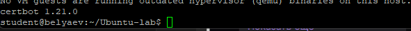

---

## 2. Получение сертификата для основного сайта

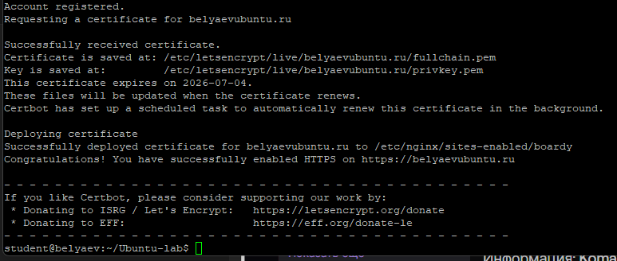

---

## 3. Проверка HTTPS в браузере

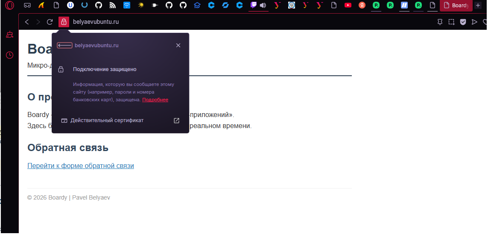

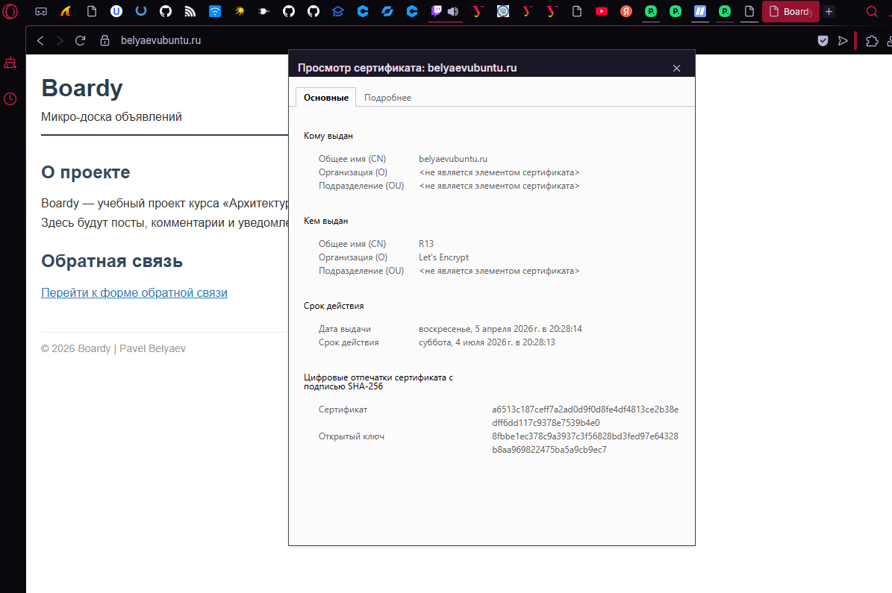

---

## 4. Проверка редиректа HTTP → HTTPS

Для проверки автоматического перенаправления был выполнен запрос:

```bash
curl -v http://belyaevubuntu.ru/
```

### Разбор вывода

- `HTTP/1.1 301 Moved Permanently` — сервер сообщает, что ресурс постоянно перенесён на другой адрес
- `Location: https://belyaevubuntu.ru/` — заголовок указывает новый адрес, на который нужно перейти

Это означает, что обращения по обычному HTTP автоматически перенаправляются на защищённую HTTPS-версию сайта

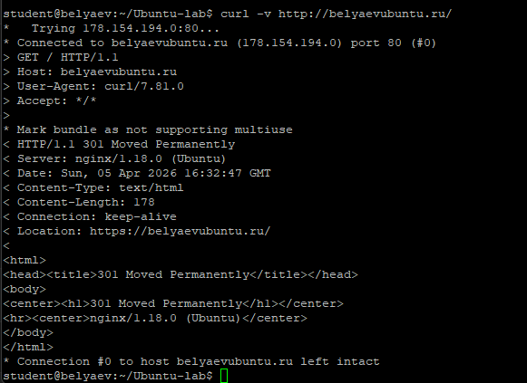

---

## 5. Конфиг Nginx после certbot

После работы certbot конфиг виртуального хоста `boardy` был дополнен SSL-настройками.

Проверка выполнялась командой:

```bash
cat /etc/nginx/sites-available/boardy
```

Ключевые строки, добавленные certbot:

- `listen 443 ssl;` — включает HTTPS на порту `443`
- `ssl_certificate ...fullchain.pem;` — путь к сертификату сайта вместе с цепочкой доверия
- `ssl_certificate_key ...privkey.pem;` — путь к приватному ключу сертификата

Результат: основной виртуальный хост начал обслуживать сайт по HTTPS

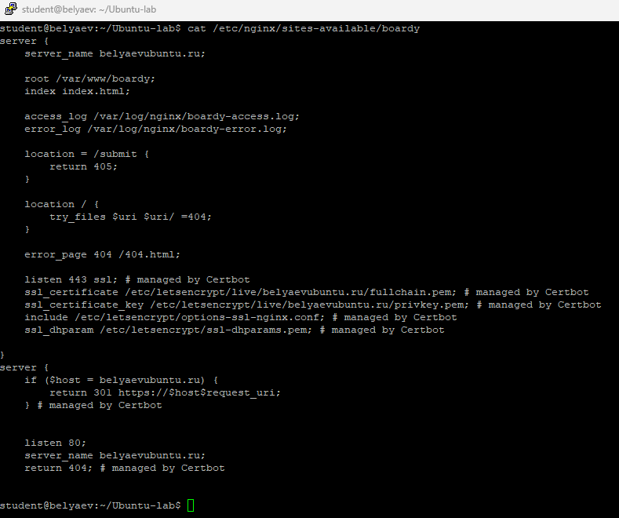

---

## 6. Сертификат для API-поддомена

После настройки основного сайта был выпущен сертификат и для API-поддомена:

```bash
sudo certbot --nginx -d api.belyaevubuntu.ru
```

Результат: для `api.belyaevubuntu.ru` также был успешно получен и установлен сертификат Let's Encrypt

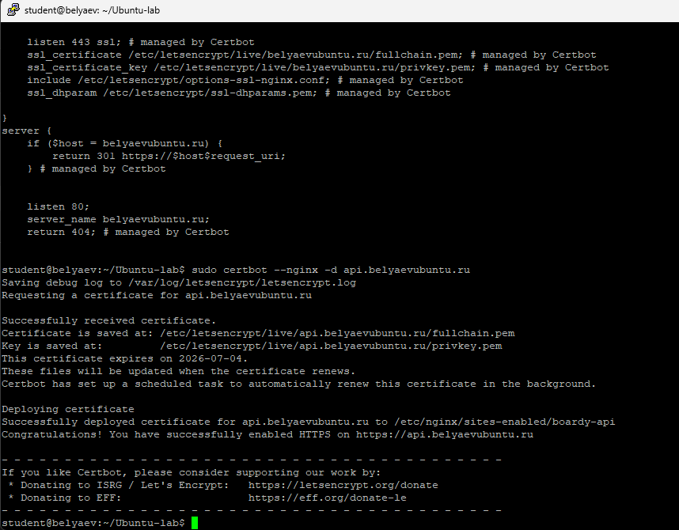

---

## 7. Проверка обоих доменов по HTTPS

Для проверки обоих защищённых доменов были выполнены команды:

```bash
curl -I https://belyaevubuntu.ru/
curl -I https://api.belyaevubuntu.ru/
```

В обоих случаях сервер вернул успешный ответ `200 OK`, что подтверждает корректную работу HTTPS и для основного сайта, и для API-поддомена

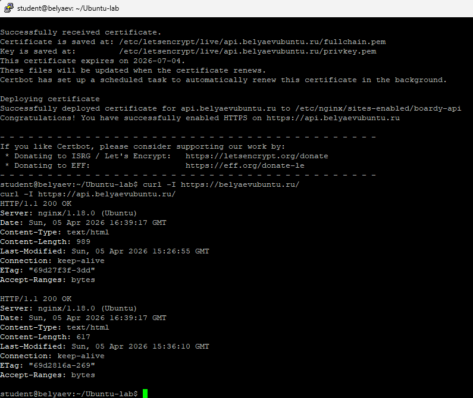

---

## 8. Разбор TLS handshake

Для анализа TLS-соединения была использована команда:

```bash
curl -v https://belyaevubuntu.ru/ 2>&1 | head -60
```

### Что удалось определить

- Версия TLS: `TLSv1.3`
- Алгоритм шифрования: `TLS_AES_256_GCM_SHA384`
- Subject сертификата: `CN=belyaevubuntu.ru`
- Issuer сертификата: `C=US; O=Let's Encrypt; CN=R13`
- Начало срока действия: `Apr 5 15:28:14 2026 GMT`
- Окончание срока действия: `Jul 4 15:28:13 2026 GMT`

### Вывод

TLS-соединение устанавливается по современной версии `TLSv1.3`, а сайт использует корректный сертификат, выданный Let's Encrypt для домена `belyaevubuntu.ru`

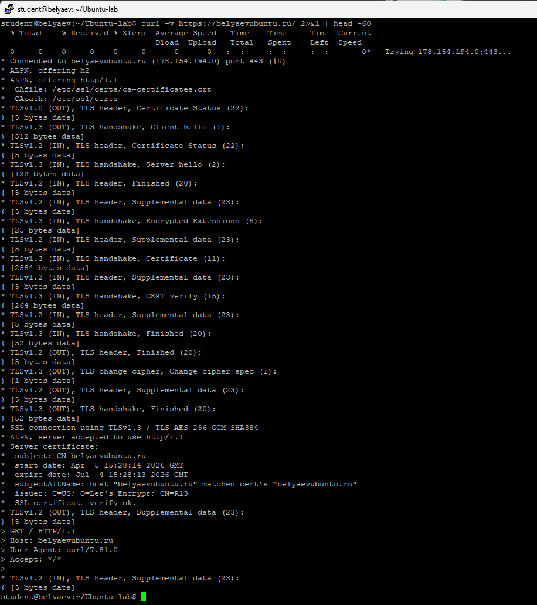

---

## 9. Цепочка доверия

Для анализа цепочки доверия сертификата была выполнена команда:

```bash
echo | openssl s_client -connect belyaevubuntu.ru:443 -showcerts 2>/dev/null | grep -E 's:|i:'
```

По выводу видно, что:
- сертификат сайта `belyaevubuntu.ru` подписан промежуточным центром `Let's Encrypt R13`
- промежуточный центр `Let's Encrypt R13` подписан корневым центром `ISRG Root X1`

### Цепочка доверия

`ISRG Root X1 → Let's Encrypt R13 → belyaevubuntu.ru`

### Как браузер проверяет цепочку

Браузер проверяет сертификат снизу вверх:
1. сначала сертификат сайта,
2. затем промежуточный удостоверяющий центр,
3. затем корневой CA, который уже находится в доверенном хранилище операционной системы или браузера

Если все звенья цепочки корректны и сертификат не истёк, браузер считает соединение безопасным и показывает замок

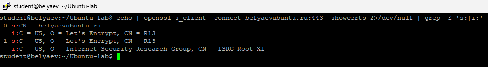

---

## 10. Сравнение сертификатов основного сайта и API

Для сравнения сертификатов использовались команды:

```bash
echo | openssl s_client -connect belyaevubuntu.ru:443 2>/dev/null | openssl x509 -noout -subject -dates
echo | openssl s_client -connect api.belyaevubuntu.ru:443 2>/dev/null | openssl x509 -noout -subject -dates
```

### Что общего

- оба сертификата выпущены для одного сервера и одного проекта;
- оба сертификата выданы одним и тем же удостоверяющим центром Let's Encrypt;
- оба сертификата используются для HTTPS-доступа и имеют одинаковый формат данных

### Чем отличаются

- у сертификатов разный `subject`, потому что один выдан для домена `belyaevubuntu.ru`, а второй — для `api.belyaevubuntu.ru`;
- даты выпуска и окончания действия могут совпадать или незначительно отличаться в зависимости от момента выдачи

### Вывод

Хотя оба сертификата относятся к одному серверу, они выпущены под разные доменные имена, поэтому каждый виртуальный хост использует свой сертификат

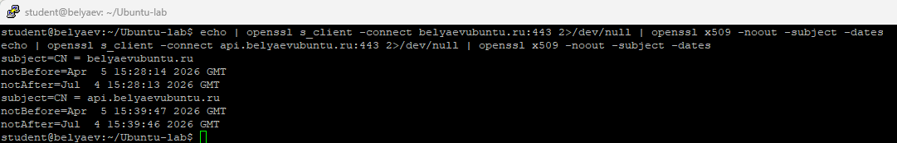

---

## 11. HSTS

Для усиления защиты в HTTPS-блок основного сайта был добавлен заголовок:

```nginx
add_header Strict-Transport-Security "max-age=31536000" always;
```

После этого была выполнена проверка:

```bash
curl -I https://belyaevubuntu.ru/ | grep Strict
```

Результат: в ответе сервера появился заголовок `Strict-Transport-Security`

### Что такое HSTS

HSTS (HTTP Strict Transport Security) — это механизм, который говорит браузеру, что данный сайт нужно открывать только по HTTPS. После получения такого заголовка браузер запоминает правило и даже при вводе `http://` будет пытаться использовать `https://` ещё до отправки запроса

### От чего защищает HSTS

HSTS защищает от downgrade-атак, когда злоумышленник пытается заставить браузер перейти на незащищённую HTTP-версию сайта вместо HTTPS

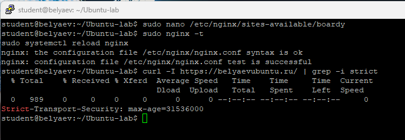

---

## 12. Кэширование и gzip

Для ускорения загрузки сайта были настроены:
- кэширование статических файлов;
- gzip-сжатие текстовых ответов

### Кэширование статики

В HTTPS-конфиг основного сайта был добавлен блок:

```nginx
location ~* \.(css|js|png|jpg|jpeg|gif|ico|svg)$ {
    expires 7d;
    add_header Cache-Control "public, no-transform";
}
```

Это позволяет браузеру кэшировать CSS, JavaScript и изображения, чтобы не запрашивать их заново при каждом открытии страницы

### gzip

В основной конфиг Nginx `/etc/nginx/nginx.conf` были добавлены настройки:

```nginx
gzip on;
gzip_types text/plain text/css application/json application/javascript text/xml;
gzip_min_length 256;
```

Это включает сжатие текстовых ответов, что уменьшает объём передаваемых данны

### Проверка

Проверка кэширования:

```bash
curl -I https://belyaevubuntu.ru/css/style.css | grep -E 'Cache|Expires'
```

Проверка gzip:

```bash
curl -H "Accept-Encoding: gzip" -I https://belyaevubuntu.ru/ | grep Content-Encoding
```

### Вывод

В ответе CSS-файла появились заголовки `Cache-Control` и `Expires`, а при запросе с `Accept-Encoding: gzip` сервер вернул заголовок `Content-Encoding: gzip`, что подтверждает корректную настройку кэширования и сжатия.

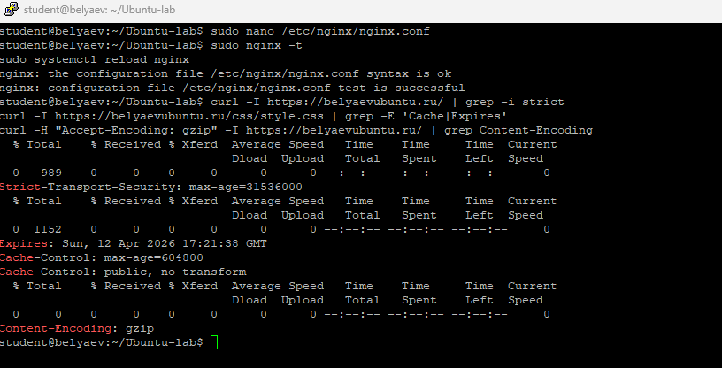

---

## 13. Проверка автообновления сертификатов

Для проверки автоматического продления сертификатов была выполнена команда:

```bash
sudo certbot renew --dry-run
```

Результат: certbot успешно выполнил симуляцию продления и сообщил, что автоматическое обновление работает корректно.

Это важно, потому что сертификаты Let's Encrypt действуют ограниченное время и должны продлеваться автоматически.

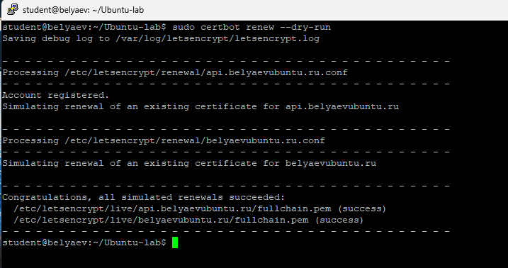

---

## Вывод

В ходе практической работы для сайта Boardy был настроен HTTPS на двух доменах: `belyaevubuntu.ru` и `api.belyaevubuntu.ru`. Для обоих виртуальных хостов были выпущены сертификаты Let's Encrypt, а обращения по HTTP были перенаправлены на HTTPS

Дополнительно были изучены параметры TLS-соединения, цепочка доверия сертификатов, настроены HSTS, кэширование статики и gzip-сжатие, а также проверено автоматическое продление сертификатов

В результате оба сайта работают по HTTPS, соединение шифруется, а конфигурация Nginx стала более безопасной и производительной