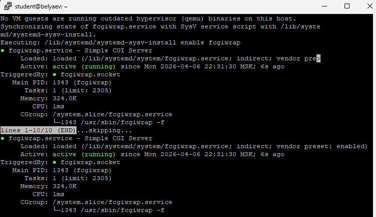
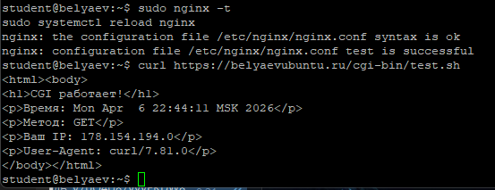
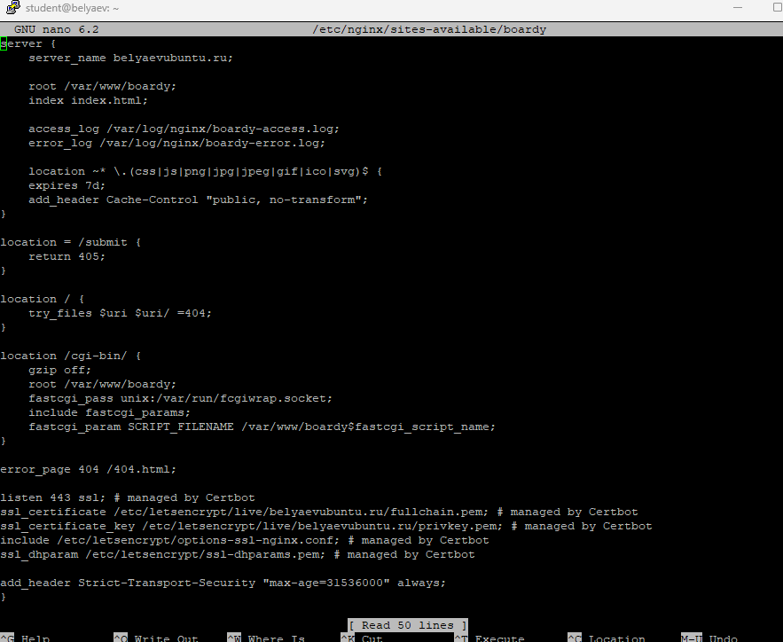
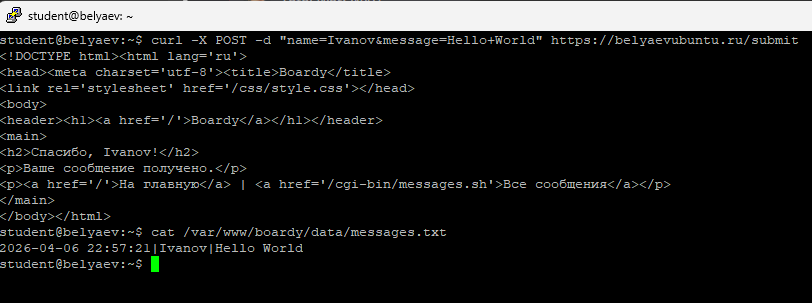
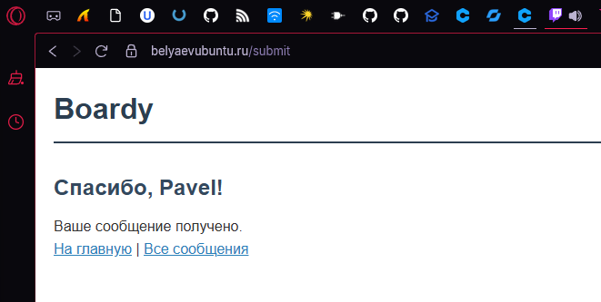
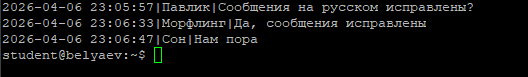
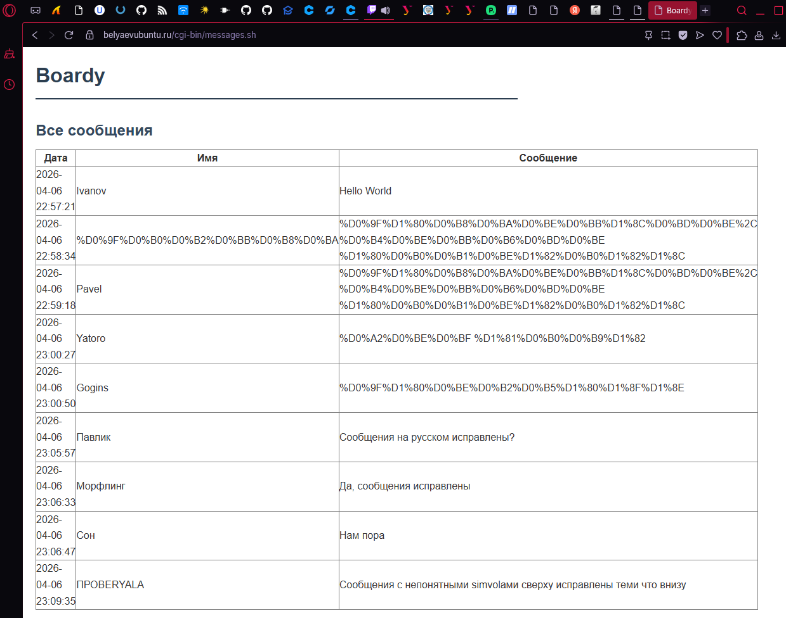
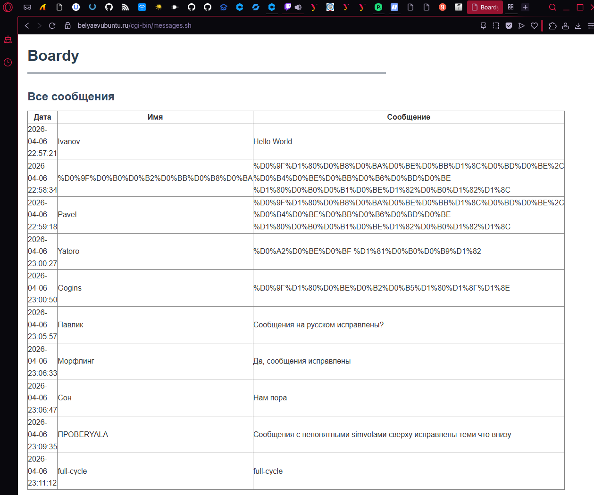

# Практика 6 — CGI: Boardy оживает

## Цель работы

Подключить CGI к сайту Boardy через `fcgiwrap`, научить форму обратной связи принимать POST-данные, сохранять сообщения в файл и выводить их на отдельной странице

## Исходные данные

- Облачная платформа: `Yandex Cloud`
- Имя сервера: `belyaev`
- Пользователь: `student`
- Публичный IP-адрес: `178.154.194.0`
- Основной домен: `belyaevubuntu.ru`
- Репозиторий: `Ubuntu-lab`
- Веб-каталог сайта: `/var/www/boardy`

---

## 1. Установка fcgiwrap

Для запуска CGI-скриптов через Nginx был установлен `fcgiwrap`

Использованные команды:

```bash
sudo apt update
sudo apt install -y fcgiwrap
sudo systemctl enable fcgiwrap
sudo systemctl start fcgiwrap
systemctl status fcgiwrap
ls -la /var/run/fcgiwrap.socket
```

### Что делает fcgiwrap

`Nginx` не умеет запускать CGI-скрипты напрямую. Для этого используется `fcgiwrap` — промежуточный обработчик, который принимает запрос от Nginx через FastCGI-сокет, запускает CGI-скрипт и возвращает результат обратно

Схема работы:

`Nginx → FastCGI → fcgiwrap → bash-скрипт`

Результат: `fcgiwrap` успешно установлен и запущен, сокет `/var/run/fcgiwrap.socket` доступен для Nginx



---

## 2. Тестовый CGI-скрипт

Для проверки работы CGI был создан тестовый скрипт:

Путь:
`/var/www/boardy/cgi-bin/test.sh`

Содержимое:

```bash
#!/bin/bash

echo "Content-Type: text/html; charset=utf-8"
echo ""

echo "<html><body>"
echo "<h1>CGI работает!</h1>"
echo "<p>Время: $(date)</p>"
echo "<p>Метод: $REQUEST_METHOD</p>"
echo "<p>Ваш IP: $REMOTE_ADDR</p>"
echo "<p>User-Agent: $HTTP_USER_AGENT</p>"
echo "</body></html>"
```

После создания скрипту были выданы права на выполнение:

```bash
chmod +x /var/www/boardy/cgi-bin/test.sh
```

### Что важно в CGI-ответе

CGI-скрипт должен вернуть:
1. заголовок `Content-Type`
2. пустую строку
3. тело ответа

Именно такой формат нужен, чтобы Nginx корректно передал HTML клиенту

При открытии `https://belyaevubuntu.ru/cgi-bin/test.sh` в браузере появилась страница с текущим временем, методом запроса, IP-адресом клиента и User-Agent



---

## 3. Настройка Nginx для CGI

В конфиг виртуального хоста `boardy` был добавлен блок для обработки CGI-скриптов:

```nginx
location /cgi-bin/ {
    gzip off;
    root /var/www/boardy;
    fastcgi_pass unix:/var/run/fcgiwrap.socket;
    include fastcgi_params;
    fastcgi_param SCRIPT_FILENAME /var/www/boardy$fastcgi_script_name;
}
```

После изменения конфигурации были выполнены команды:

```bash
sudo nginx -t
sudo systemctl reload nginx
```

### Объяснение директив

- `fastcgi_pass unix:/var/run/fcgiwrap.socket;` — передаёт запрос в `fcgiwrap` через Unix-сокет
- `include fastcgi_params;` — подключает стандартные FastCGI-параметры, которые нужны CGI-скрипту
- `fastcgi_param SCRIPT_FILENAME /var/www/boardy$fastcgi_script_name;` — передаёт полный путь к CGI-скрипту на диске, который нужно запустить

Результат: Nginx начал корректно обрабатывать запросы к `/cgi-bin/` и передавать их в `fcgiwrap`



---

## 4. Скрипт обработки формы

Для обработки формы обратной связи был создан скрипт:

Путь:
`/var/www/boardy/cgi-bin/submit.sh`

Содержимое:

```bash
#!/bin/bash

urldecode() {
    local data="${1//+/ }"
    printf '%b' "${data//%/\\x}"
}

read -n "$CONTENT_LENGTH" POST_DATA

RAW_NAME=$(echo "$POST_DATA" | sed -n 's/.*name=\([^&]*\).*/\1/p')
RAW_MESSAGE=$(echo "$POST_DATA" | sed -n 's/.*message=\([^&]*\).*/\1/p')

NAME=$(urldecode "$RAW_NAME")
MESSAGE=$(urldecode "$RAW_MESSAGE")

echo "$(date '+%Y-%m-%d %H:%M:%S')|$NAME|$MESSAGE" >> /var/www/boardy/data/messages.txt

echo "Content-Type: text/html; charset=utf-8"
echo ""

echo "<!DOCTYPE html><html lang='ru'>"
echo "<head><meta charset='utf-8'><title>Boardy</title>"
echo "<link rel='stylesheet' href='/css/style.css'></head>"
echo "<body>"
echo "<header><h1><a href='/'>Boardy</a></h1></header>"
echo "<main>"
echo "<h2>Спасибо, $NAME!</h2>"
echo "<p>Ваше сообщение получено.</p>"
echo "<p><a href='/'>На главную</a> | <a href='/cgi-bin/messages.sh'>Все сообщения</a></p>"
echo "</main>"
echo "</body></html>"
```

Скрипт:
- читает тело POST-запроса из `stdin`
- извлекает параметры `name` и `message`
- декодирует URL-encoded данные
- записывает сообщение в `messages.txt`
- возвращает HTML-страницу с подтверждением

После создания были выданы права на выполнение:

```bash
chmod +x /var/www/boardy/cgi-bin/submit.sh
```

### Настройка /submit в Nginx

В HTTPS-блок `boardy` был добавлен отдельный обработчик:

```nginx
location = /submit {
    gzip off;
    fastcgi_pass unix:/var/run/fcgiwrap.socket;
    include fastcgi_params;
    fastcgi_param SCRIPT_FILENAME /var/www/boardy/cgi-bin/submit.sh;
}
```

После этого конфигурация была проверена и перечитана:

```bash
sudo nginx -t
sudo systemctl reload nginx
```

### Проверка через curl

Для проверки был выполнен запрос:

```bash
curl -X POST -d "name=Ivanov&message=Hello+World" https://belyaevubuntu.ru/submit
```

Результат: сервер вернул страницу с сообщением:

`Спасибо, Ivanov!`



---

## 5. Форма в браузере

После настройки CGI-обработчика форма по адресу:

`https://belyaevubuntu.ru/feedback.html`

начала работать в браузере

Пользователь вводит:
- имя
- сообщение

После нажатия кнопки `Отправить` выполняется POST-запрос на `/submit`, и в ответ открывается страница с подтверждением:

`Спасибо, <имя>!`

Таким образом, форма, которая в предыдущих практиках не обрабатывалась, стала рабочей



---

## 6. Данные на диске

Все отправленные сообщения сохраняются в файле:

`/var/www/boardy/data/messages.txt`

Формат строки:

```text
дата_и_время|имя|сообщение
```

Пример содержимого файла:

```text
2026-04-06 22:57:21|Ivanov|Hello World
2026-04-06 22:59:18|Pavel|Привет мир
2026-04-06 23:00:27|Yatro|Новый текст
```

Это подтверждает, что CGI-скрипт не просто возвращает HTML, а действительно сохраняет данные на сервере



---

## 7. Страница сообщений

Для вывода всех сообщений была создана отдельная CGI-страница:

Путь:
`/var/www/boardy/cgi-bin/messages.sh`

Содержимое:

```bash
#!/bin/bash

echo "Content-Type: text/html; charset=utf-8"
echo ""

echo "<!DOCTYPE html><html lang='ru'>"
echo "<head><meta charset='utf-8'><title>Boardy — Сообщения</title>"
echo "<link rel='stylesheet' href='/css/style.css'></head>"
echo "<body>"
echo "<header><h1><a href='/'>Boardy</a></h1></header>"
echo "<main><h2>Все сообщения</h2>"

if [ -f /var/www/boardy/data/messages.txt ]; then
    echo "<table border='1' cellpadding='8' style='border-collapse:collapse;width:100%'>"
    echo "<tr><th>Дата</th><th>Имя</th><th>Сообщение</th></tr>"
    while IFS='|' read -r date name message; do
        echo "<tr><td>$date</td><td>$name</td><td>$message</td></tr>"
    done < /var/www/boardy/data/messages.txt
    echo "</table>"
else
    echo "<p>Сообщений пока нет.</p>"
fi

echo "<p style='margin-top:20px'><a href='/feedback.html'>Написать</a> | <a href='/'>На главную</a></p>"
echo "</main></body></html>"
```

После создания были выданы права:

```bash
chmod +x /var/www/boardy/cgi-bin/messages.sh
```

При открытии:

`https://belyaevubuntu.ru/cgi-bin/messages.sh`

отображается HTML-страница с таблицей, в которой выводятся все сохранённые сообщения



---

## 8. Полный цикл работы

Полный цикл работы системы выглядит так:

1. Пользователь открывает форму обратной связи
2. Вводит имя и сообщение
3. Нажимает `Отправить`
4. CGI-скрипт `submit.sh` принимает POST-данные
5. Скрипт сохраняет сообщение в `messages.txt`
6. Пользователь открывает страницу `/cgi-bin/messages.sh`
7. Новое сообщение уже отображается в таблице



---

## 9. Путь POST-запроса

Схема прохождения запроса:

`браузер → HTTPS → Nginx → FastCGI → fcgiwrap → submit.sh → stdin → messages.txt → stdout → Nginx → браузер`

### Пояснение по шагам

1. Пользователь заполняет форму `feedback.html`
2. Браузер отправляет `POST /submit` по HTTPS
3. Nginx принимает запрос на `443`
4. По правилу `location = /submit` Nginx передаёт запрос через `fastcgi_pass`
5. `fcgiwrap` запускает CGI-скрипт `submit.sh`
6. `submit.sh` читает данные из `stdin`
7. Скрипт сохраняет строку в `messages.txt`
8. Скрипт печатает HTML-ответ в `stdout`
9. Nginx возвращает результат браузеру
10. Пользователь видит страницу с подтверждением

---

## 10. Теоретические вопросы

### 1. Что такое CGI и какую проблему он решил в 1993 году?

CGI — это Common Gateway Interface, стандарт взаимодействия веб-сервера с внешней программой. Он решил главную проблему раннего веба: вместо выдачи только статических файлов сервер смог генерировать динамический ответ

### 2. Как CGI-скрипт получает данные POST-запроса?

Тело POST-запроса CGI-скрипт получает через стандартный ввод `stdin`. Длина передаваемых данных известна через переменную окружения `CONTENT_LENGTH`, поэтому скрипт знает, сколько байт нужно прочитать

### 3. Почему CGI создаёт проблемы при высокой нагрузке?

Потому что почти каждый запрос запускает отдельный процесс. При высокой нагрузке сервер начинает тратить слишком много ресурсов на постоянный запуск новых процессов, из-за чего производительность резко падает

### 4. Чем отличается `fastcgi_pass` от `proxy_pass`?

`fastcgi_pass` используется для передачи запроса FastCGI-приложению, например `fcgiwrap` или `php-fpm`. `proxy_pass` используется для передачи HTTP-запроса другому HTTP-серверу или приложению, например FastAPI или Node.js

### 5. Зачем нужен fcgiwrap, если Apache запускает CGI напрямую?

Потому что Nginx сам CGI напрямую не запускает. `fcgiwrap` нужен как адаптер между Nginx и CGI-скриптами: он принимает FastCGI-запрос от Nginx и запускает нужную программу

---

## Вывод

В ходе практической работы к сайту Boardy был подключён CGI через `fcgiwrap`, а форма обратной связи стала полностью рабочей. POST-запросы начали обрабатываться bash-скриптом `submit.sh`, сообщения стали сохраняться в файл `messages.txt`, а отдельный CGI-скрипт `messages.sh` начал выводить все сообщения в виде HTML-таблицы

Таким образом, сайт впервые начал генерировать динамический контент: сервер не просто отдаёт статические файлы, а запускает программу, обрабатывает входные данные и формирует ответ пользователю