# Практика 7 — PHP-FPM и FastAPI для Boardy

## Цель работы

Заменить старую CGI-обработку сайта Boardy на более современные серверные решения:
- для основного сайта — `PHP-FPM`
- для API-сервиса — `FastAPI + Uvicorn`

Также требуется показать различия между синхронной моделью PHP и асинхронной моделью FastAPI, настроить `systemd`-сервис и проксирование через Nginx

## Исходные данные

- Облачная платформа: `Yandex Cloud`
- Имя сервера: `belyaev`
- Пользователь: `student`
- Публичный IP-адрес: `178.154.194.0`
- Основной домен: `belyaevubuntu.ru`
- API-поддомен: `api.belyaevubuntu.ru`
- Репозиторий: `Ubuntu-lab`
- PHP-FPM сокет: `/var/run/php/php8.1-fpm.sock`

---

## 1. Установка PHP-FPM

Для обработки PHP-файлов был установлен `PHP-FPM` и дополнительные модули:

```bash
sudo apt update
sudo apt install -y php-fpm php-mysql php-mbstring php-xml
php -v
systemctl status php*-fpm
ls /var/run/php/
```

После установки было подтверждено:
- PHP установлен корректно
- служба `php-fpm` запущена
- доступен сокет `php8.1-fpm.sock`, который используется Nginx для передачи PHP-запросов

Результат: сервер готов к обработке PHP через FastCGI

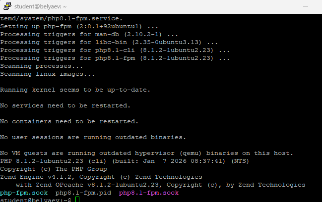

---

## 2. Обработка формы на PHP

### submit.php

Для замены CGI-скрипта был создан файл `/var/www/boardy/submit.php`

Он:
- получает имя и сообщение из `$_POST`
- формирует строку
- сохраняет её в `messages.txt`
- возвращает HTML-страницу с подтверждением

### messages.php

Также была создана страница `/var/www/boardy/messages.php`, которая:
- читает `messages.txt`
- разбивает строки по разделителю `|`
- выводит HTML-таблицу со всеми сообщениями

### Обновление формы

В `feedback.html` атрибут `action` был изменён на:

```html
<form method="POST" action="/submit.php">
```

### Результат

После этого форма начала отправлять данные уже не в CGI-скрипт, а в PHP-обработчик 
При отправке отображается страница вида:

`Спасибо, <имя>!`


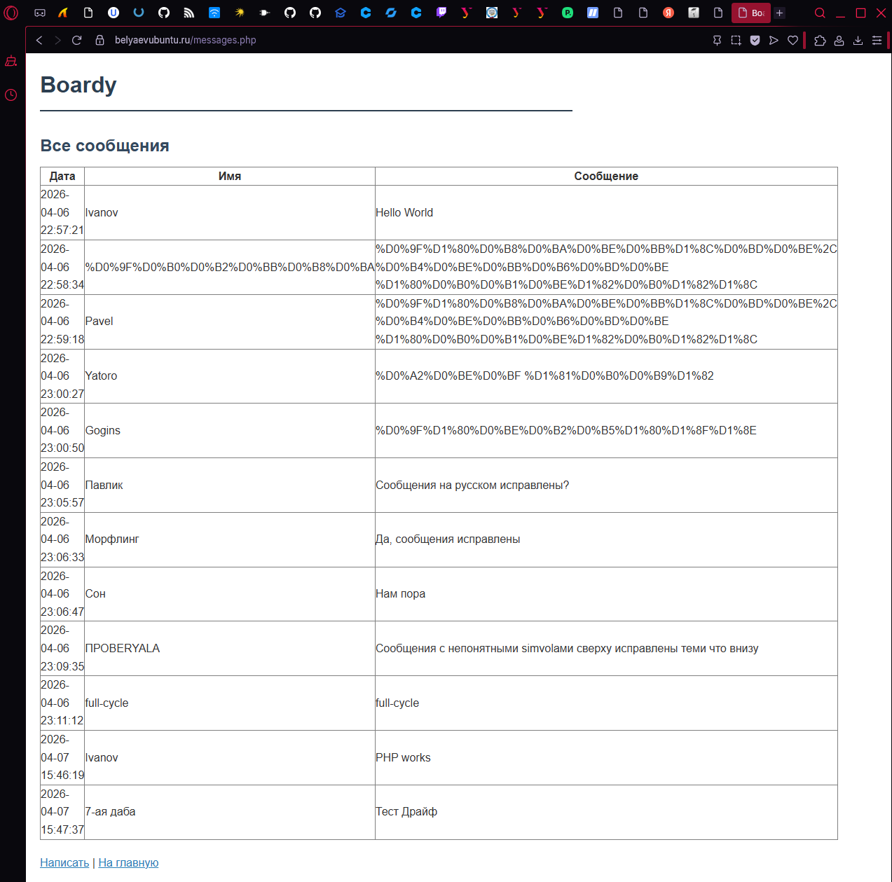

---

## 3. Конфиг Nginx для PHP

Для поддержки PHP-файлов в конфиге `boardy` был добавлен блок php:

Старые CGI-блоки из Практики 6 были закомментированы, так как форма теперь обслуживается PHP, а не `fcgiwrap`

После изменения конфигурации были выполнены команды:

### Чем `fastcgi_pass` отличается от CGI через `fcgiwrap`

`fcgiwrap` запускал отдельный CGI-скрипт на каждый запрос, то есть веб-сервер фактически вызывал внешнюю программу заново каждый раз

`fastcgi_pass` работает иначе: Nginx передаёт запросы в уже работающий пул PHP-FPM-процессов, поэтому не требуется каждый раз запускать новый интерпретатор

### Почему PHP-FPM быстрее

PHP-FPM быстрее, потому что:
- уже держит готовые воркеры
- не тратит ресурсы на постоянный запуск нового процесса на каждый запрос
- лучше подходит для большого числа обращений

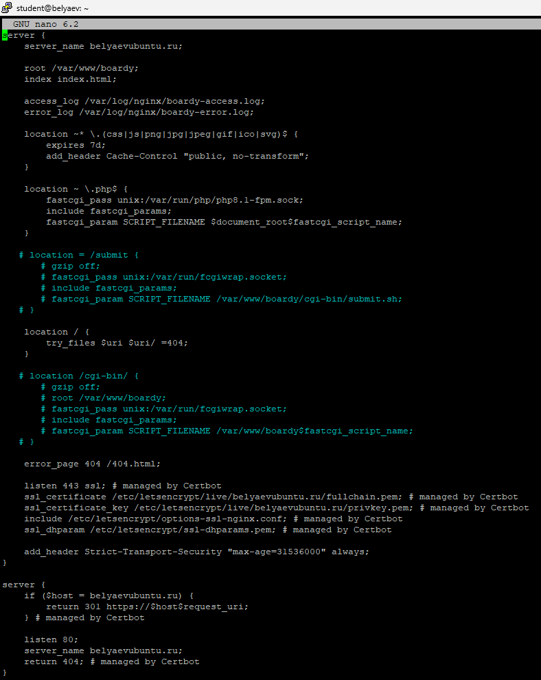

---

## 4. Демонстрация shared nothing

Для демонстрации модели PHP был создан файл `demo-shared-nothing.php`:

Файл вызывался три раза подряд

Результат: каждый раз выводилось одно и то же значение:

`Счётчик: 1`

### Почему счётчик не растёт

Потому что PHP работает по модели **shared nothing**:
- переменные не сохраняются между запросами
- каждый новый запрос начинается с чистого состояния
- память предыдущего запроса не используется повторно

### Что такое shared nothing

Shared nothing — это модель, в которой каждый запрос полностью изолирован от предыдущего 
Её плюс в простоте и предсказуемости: нет сохранённого состояния, нет утечек между запросами, меньше риск гонок данных
Минус — нельзя хранить счётчик или кэш в памяти между запросами без внешнего хранилища

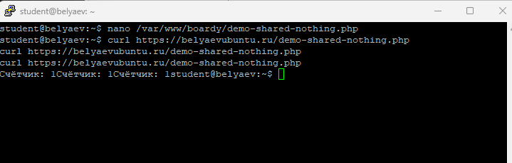

---

## 5. Блокировка PHP-FPM воркеров

Для демонстрации синхронной модели был создан файл `demo-slow.php`:

```php
<?php
sleep(2);
echo json_encode([
    'result' => 'done',
    'pid' => getmypid(),
    'time' => date('H:i:s')
]);
```

Далее был выполнен тест с 10 параллельными запросами:

```bash
time for i in $(seq 10); do
  curl -s https://belyaevubuntu.ru/demo-slow.php &
done
wait
```

Также отдельно было проверено число PHP-FPM-воркеров:

```bash
ps aux | grep php-fpm | grep -v grep | wc -l
```

### Что показывает этот эксперимент

Каждый воркер PHP-FPM обслуживает только один запрос за раз
Если запрос выполняется долго, например из-за `sleep(2)`, воркер оказывается занят на это время

### Как связаны время и число воркеров

Общее время зависит от количества воркеров:
- если воркеров достаточно, запросы идут быстрее
- если запросов больше, чем свободных воркеров, часть из них ждёт в очереди

То есть PHP-FPM масштабирует параллелизм числом процессов, а не одной асинхронной петлёй событий

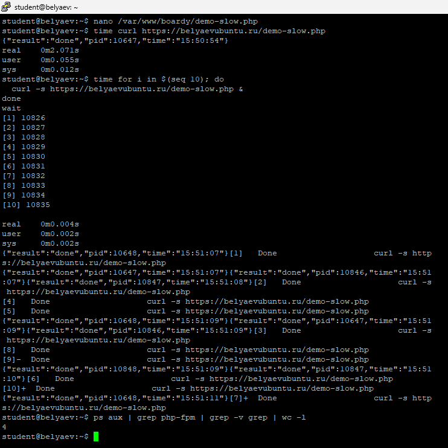

---

## 6. Установка Python, venv, FastAPI и Uvicorn

Для API-сервиса были установлены Python, `venv`, FastAPI и Uvicorn:

### Зачем нужен venv

`venv` изолирует зависимости проекта от системного Python, чтобы пакеты FastAPI и Uvicorn не конфликтовали с другими программами

---

## 7. FastAPI-приложение

Файл `/opt/boardy-api/main.py` был создан со следующими маршрутами:

- `/api/status`
- `/api/messages`
- `/api/slow`
- `/api/slow-blocking`
- `/api/counter`

Смысл маршрутов:
- `/api/status` — проверка, что сервис работает
- `/api/messages` — чтение сообщений из `messages.txt` и возврат JSON
- `/api/slow` — неблокирующая задержка через `await asyncio.sleep(2)`
- `/api/slow-blocking` — блокирующая задержка через `time.sleep(2)`
- `/api/counter` — демонстрация того, что процесс сохраняет состояние между запросами

После запуска Uvicorn были выполнены проверки:

```bash
curl http://127.0.0.1:8000/api/status
curl http://127.0.0.1:8000/api/messages
```

Результат: API локально работал и возвращал корректный JSON.

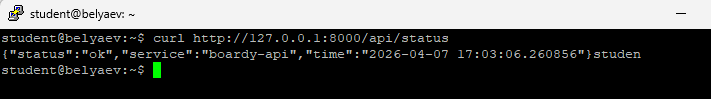

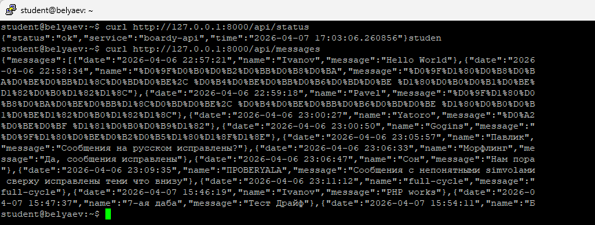

---

## 8. Живой процесс и счётчик

Для проверки того, что процесс Uvicorn живёт между запросами, был вызван маршрут `/api/counter` несколько раз:

```bash
curl https://api.belyaevubuntu.ru/api/counter
curl https://api.belyaevubuntu.ru/api/counter
curl https://api.belyaevubuntu.ru/api/counter
```

Результат: счётчик рос:

- `1`
- `2`
- `3`

### Почему здесь счётчик растёт, а в PHP не рос

Потому что Uvicorn — это постоянно работающий процесс, и состояние приложения сохраняется в памяти между запросами.  
В PHP каждый запрос обрабатывается в отдельном чистом контексте, поэтому переменные не переживают запрос.

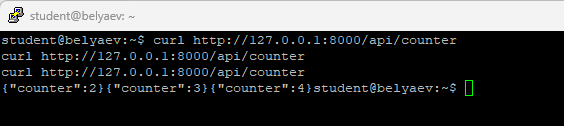

---

## 9. Async: 10 запросов за 2 секунды

Для проверки асинхронной модели был выполнен тест:

```bash
time for i in $(seq 10); do
  curl -s https://api.belyaevubuntu.ru/api/slow &
done
wait
```

Маршрут `/api/slow` использует:

```python
await asyncio.sleep(2)
```

### Почему 10 запросов по 2 секунды заняли около 2 секунд, а не 20

Потому что `asyncio.sleep(2)` не блокирует event loop 
Во время ожидания один запрос не мешает другим, и все они могут выполняться конкурентно в одном процессе

Итог: асинхронный сервер смог обработать несколько медленных запросов почти одновременно

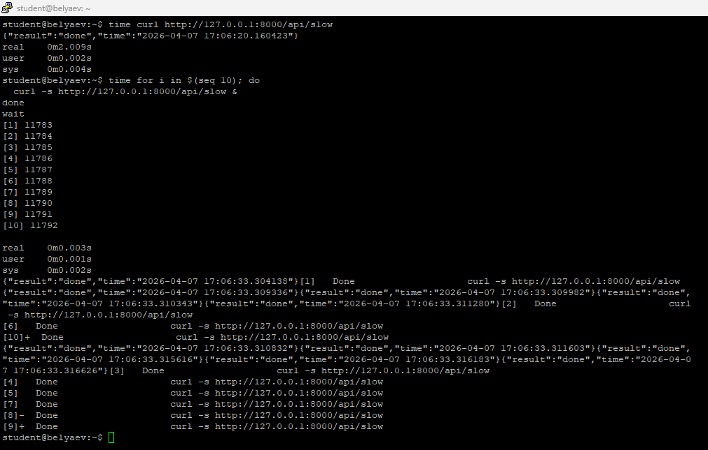

---

## 10. Блокирующий код убивает event loop

Для сравнения был выполнен тест на маршруте `/api/slow-blocking`:

```bash
time for i in $(seq 5); do
  curl -s https://api.belyaevubuntu.ru/api/slow-blocking &
done
wait
```

Маршрут использует:

```python
time.sleep(2)
```

### Чем `/api/slow` отличается от `/api/slow-blocking`

- `/api/slow` использует `await asyncio.sleep(2)` и не блокирует event loop
- `/api/slow-blocking` использует `time.sleep(2)` и останавливает весь цикл событий

### Почему время разное

Потому что блокирующая функция не отдаёт управление обратно event loop, из-за чего остальные запросы ждут завершения предыдущего  
Итог: вместо конкурентного выполнения получается последовательная очередь

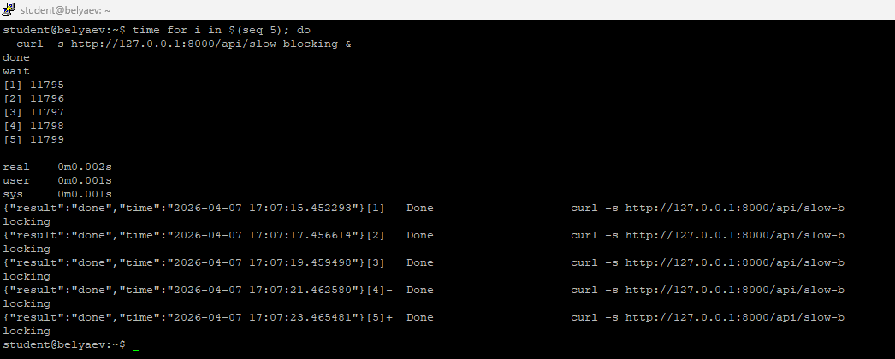

---

## 11. Swagger

После настройки API через домен была открыта встроенная документация FastAPI:

`https://api.belyaevubuntu.ru/docs`

Результат: Swagger UI доступен из браузера и автоматически показывает все маршруты приложения

Это удобно для:
- просмотра API
- тестирования запросов
- проверки структуры ответов без `curl`

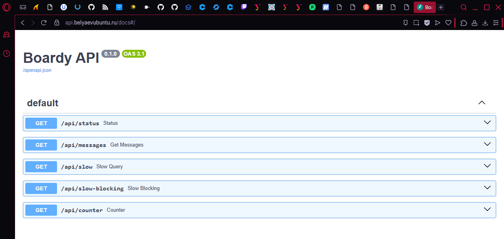

---

## 12. systemd-сервис

Чтобы Uvicorn работал постоянно, был создан файл:

`/etc/systemd/system/boardy-api.service`

Пример содержимого:

```ini
[Unit]
Description=Boardy API (FastAPI/Uvicorn)
After=network.target

[Service]
User=www-data
Group=www-data
WorkingDirectory=/opt/boardy-api
ExecStart=/opt/boardy-api/venv/bin/uvicorn main:app --host 127.0.0.1 --port 8000
Restart=always
RestartSec=3

[Install]
WantedBy=multi-user.target
```

После создания были выполнены команды:

```bash
sudo systemctl daemon-reload
sudo systemctl enable boardy-api
sudo systemctl start boardy-api
sudo systemctl status boardy-api
```

Результат: сервис `boardy-api` стал запускаться как обычная системная служба и автоматически подниматься после рестарта

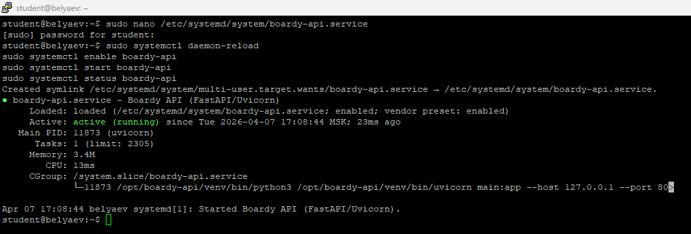

---

## 13. Конфиг Nginx для FastAPI

В конфиге `boardy-api` старая заглушка была заменена на проксирование к локальному Uvicorn:

```nginx
location / {
    proxy_pass http://127.0.0.1:8000;
    proxy_set_header Host $host;
    proxy_set_header X-Real-IP $remote_addr;
    proxy_set_header X-Forwarded-For $proxy_add_x_forwarded_for;
    proxy_set_header X-Forwarded-Proto $scheme;
}
```

После изменения были выполнены:

```bash
sudo nginx -t
sudo systemctl reload nginx
```

### Чем `proxy_pass` отличается от `fastcgi_pass`

- `fastcgi_pass` используется для передачи запроса FastCGI-приложению, например PHP-FPM
- `proxy_pass` используется для передачи HTTP-запроса другому HTTP-серверу, например Uvicorn

### Почему для PHP одно, а для Python другое

Потому что PHP-FPM говорит по протоколу FastCGI, а FastAPI/Uvicorn — это обычный HTTP upstream  
Поэтому для PHP нужен `fastcgi_pass`, а для Python API — `proxy_pass`

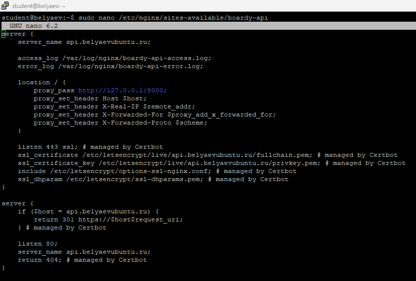

---

## 14. Одни данные — два формата

Для сравнения были выполнены два запроса:

```bash
curl https://belyaevubuntu.ru/messages.php
curl https://api.belyaevubuntu.ru/api/messages
```

### Что получилось

- `messages.php` вернул HTML-страницу с таблицей
- `/api/messages` вернул JSON

### Чем отличаются эти форматы

HTML предназначен для человека и браузера: он сразу отображается как готовая страница

JSON предназначен для программ:
- JavaScript на фронтенде
- других API-клиентов
- мобильных приложений
- интеграций между сервисами

То есть данные могут быть одни и те же, но форма их представления зависит от потребителя

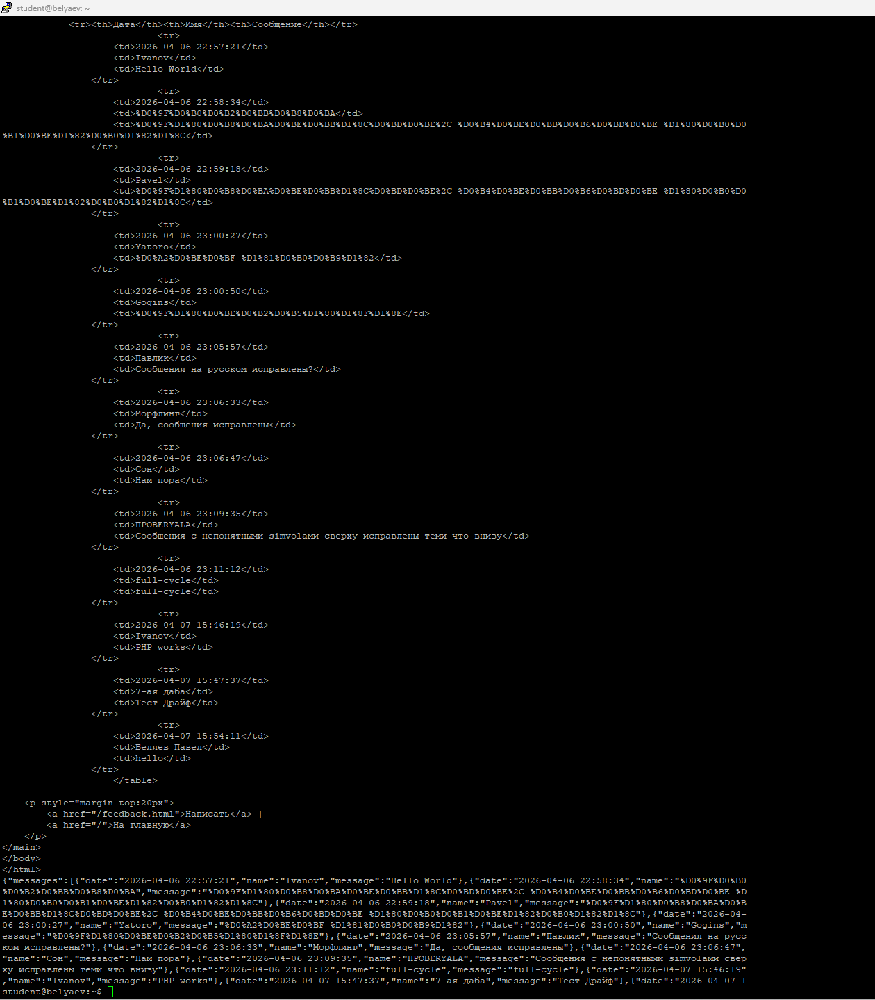

---

## 15. Процессы

Для сравнения архитектуры были показаны процессы:

```bash
ps aux | grep php-fpm | head -5
ps aux | grep uvicorn
```

### Что видно

- у PHP-FPM работает пул процессов
- у FastAPI/Uvicorn работает один основной процесс приложения

### Вывод

PHP-FPM масштабируется числом воркеров, каждый из которых обрабатывает один запрос за раз
FastAPI/Uvicorn работает как живой процесс с асинхронным event loop и лучше подходит для конкурентной обработки большого числа I/O-запросов

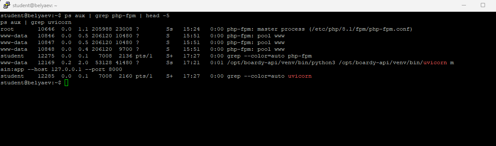

---

## Вывод

В ходе Практики 7 старый CGI-подход был заменён на более современные серверные решения.

Основной сайт `Boardy` был переведён на `PHP-FPM`, что позволило обрабатывать форму и страницу сообщений через PHP.  
API-сервис был реализован на `FastAPI + Uvicorn`, запущен как `systemd`-сервис и подключён к домену `api.belyaevubuntu.ru` через `proxy_pass`