# Практика 8 — MySQL: от файла к базе данных

## Цель работы

Перевести проект Boardy с хранения данных в текстовом файле `messages.txt` на полноценную базу данных MySQL, создать связанные таблицы `users`, `posts`, `comments`, подключить `phpMyAdmin`, переписать PHP-часть на `PDO`, а FastAPI — на `aiomysql`

## Исходные данные

- Облачная платформа: `Yandex Cloud`
- Имя сервера: `belyaev`
- Пользователь: `student`
- Основной домен: `belyaevubuntu.ru`
- API-поддомен: `api.belyaevubuntu.ru`
- Репозиторий: `Ubuntu-lab`
- PHP-FPM сокет: `/var/run/php/php8.1-fpm.sock`

---

## 1. Установка и настройка MySQL

Для работы с базой данных был установлен MySQL:

```bash
sudo apt update
sudo apt install -y mysql-server
sudo systemctl status mysql
mysql --version
```

После установки была выполнена базовая безопасная настройка:

```bash
sudo mysql_secure_installation
```

В процессе настройки были заданы стандартные параметры учебного проекта:
- `VALIDATE PASSWORD COMPONENT` — `n`
- установка пароля для `root`
- удаление анонимных пользователей
- запрет удалённого входа под `root`
- удаление тестовой базы
- перезагрузка таблиц привилегий

Результат: MySQL успешно установлен и запущен

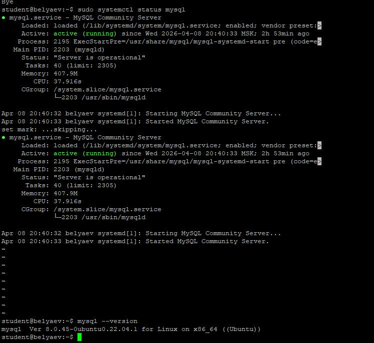

---

## 2. Кодировка базы данных и пользователь приложения

Для проекта была создана отдельная база данных `boardy` и отдельный пользователь `boardy`, а не использован пользователь `root`

```sql
CREATE DATABASE boardy
    CHARACTER SET utf8mb4
    COLLATE utf8mb4_unicode_ci;

CREATE USER 'boardy'@'localhost' IDENTIFIED BY '***';
GRANT ALL PRIVILEGES ON boardy.* TO 'boardy'@'localhost';
FLUSH PRIVILEGES;
```

Также для FastAPI-подключения был добавлен пользователь:

```sql
CREATE USER 'boardy'@'127.0.0.1' IDENTIFIED BY '***';
GRANT ALL PRIVILEGES ON boardy.* TO 'boardy'@'127.0.0.1';
FLUSH PRIVILEGES;
```

Проверка кодировки выполнялась командой:

```sql
SELECT @@character_set_database, @@collation_database;
```

### Почему `utf8mb4`, а не `utf8`

В MySQL `utf8` — это исторически урезанный вариант UTF-8, который не поддерживает все символы Unicode 
`utf8mb4` — полноценная реализация UTF-8, которая поддерживает все языки и специальные символы, включая эмодзи

### Что такое `collation`

`Collation` задаёт правила сравнения и сортировки строк  
Для проекта выбрана `utf8mb4_unicode_ci`, потому что она обеспечивает корректное Unicode-сравнение и сортировку строк, в том числе для русского текста

### Почему не `root`

Приложение не должно подключаться к БД под `root`, так как это даёт избыточные права  
Отдельный пользователь `boardy` ограничен только одной базой данных и безопаснее с точки зрения эксплуатации

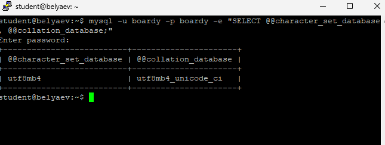

---

## 3. phpMyAdmin

Для удобной визуальной работы с базой данных был установлен `phpMyAdmin`:

```bash
sudo apt install -y phpmyadmin
```

Так как `phpMyAdmin` настраивается под Apache, для Nginx он был подключён вручную:

```bash
sudo ln -s /usr/share/phpmyadmin /var/www/boardy/phpmyadmin
```

В конфиге `boardy` был добавлен блок:

```nginx
location /phpmyadmin {
    alias /usr/share/phpmyadmin;
    index index.php;

    location ~ \.php$ {
        fastcgi_pass unix:/var/run/php/php8.1-fpm.sock;
        include fastcgi_params;
        fastcgi_param SCRIPT_FILENAME $request_filename;
    }
}
```

После этого `phpMyAdmin` стал доступен по адресу:

`https://belyaevubuntu.ru/phpmyadmin`

Через него можно:
- просматривать список баз данных
- открывать структуру таблиц
- смотреть строки данных
- выполнять SQL-запросы
- визуально контролировать связи между таблицами

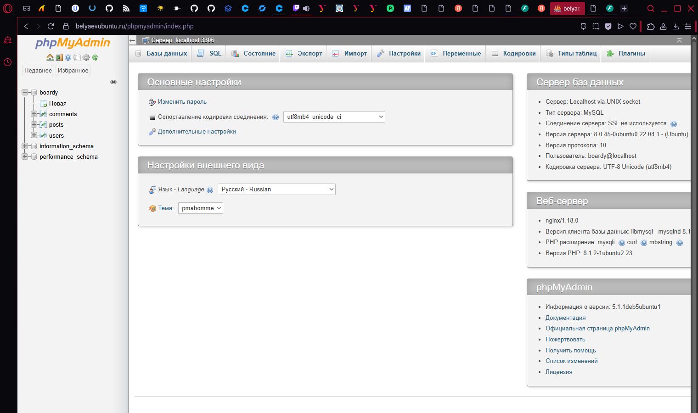

---

## 4. Таблицы и связи

В базе `boardy` были созданы три таблицы:

- `users`
- `posts`
- `comments`

### Таблица users

```sql
CREATE TABLE users (
    id          INT AUTO_INCREMENT PRIMARY KEY,
    name        VARCHAR(100) NOT NULL,
    email       VARCHAR(255) NOT NULL UNIQUE,
    password    VARCHAR(255) NOT NULL,
    created_at  TIMESTAMP DEFAULT CURRENT_TIMESTAMP
) ENGINE=InnoDB;
```

### Таблица posts

```sql
CREATE TABLE posts (
    id          INT AUTO_INCREMENT PRIMARY KEY,
    title       VARCHAR(255) NOT NULL,
    body        TEXT NOT NULL,
    author_id   INT NOT NULL,
    created_at  TIMESTAMP DEFAULT CURRENT_TIMESTAMP,

    FOREIGN KEY (author_id) REFERENCES users(id)
        ON DELETE CASCADE
) ENGINE=InnoDB;
```

### Таблица comments

```sql
CREATE TABLE comments (
    id          INT AUTO_INCREMENT PRIMARY KEY,
    body        TEXT NOT NULL,
    post_id     INT NOT NULL,
    author_id   INT NOT NULL,
    created_at  TIMESTAMP DEFAULT CURRENT_TIMESTAMP,

    FOREIGN KEY (post_id) REFERENCES posts(id)
        ON DELETE CASCADE,
    FOREIGN KEY (author_id) REFERENCES users(id)
        ON DELETE CASCADE
) ENGINE=InnoDB;
```

### Что такое `FOREIGN KEY`

`FOREIGN KEY` — это ограничение целостности, которое связывает таблицы между собой 
Например, `posts.author_id` обязан ссылаться на реально существующий `users.id`

### Что такое `ON DELETE CASCADE`

`ON DELETE CASCADE` означает, что при удалении родительской записи автоматически удаляются все зависимые дочерние записи
Например, если удалить пользователя, автоматически удалятся его посты и комментарии

### Какой движок используется и почему

Используется `InnoDB` 
Это правильный выбор для Boardy, потому что:
- он поддерживает транзакции
- поддерживает `FOREIGN KEY`
- использует строковые блокировки
- обеспечивает crash recovery

`MyISAM` для такого проекта не подходит, так как не поддерживает связи и транзакции

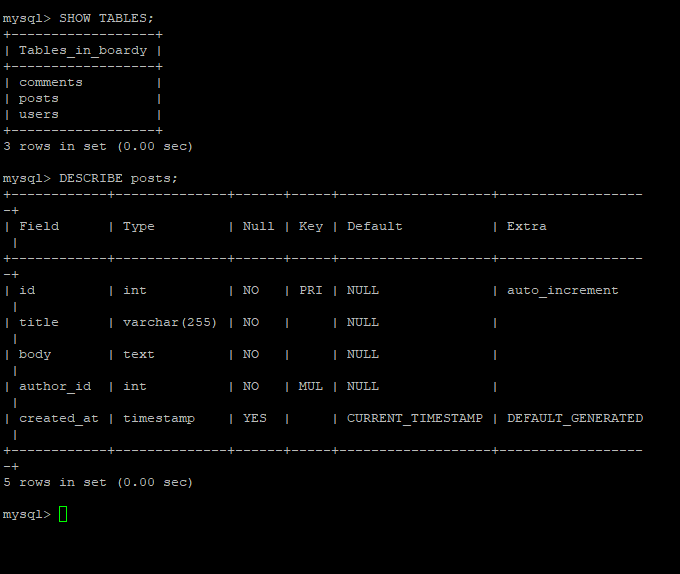

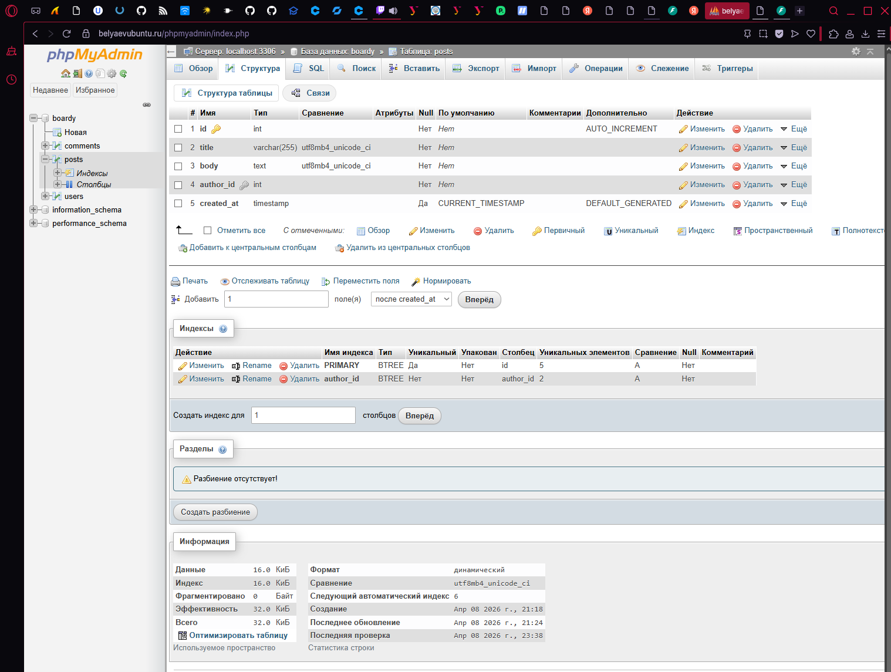

---

## 5. SQL-скрипт schema.sql

Все команды создания таблиц были сохранены в файл:

`src/boardy/sql/schema.sql`

В начале файла добавлены строки:

```sql
DROP TABLE IF EXISTS comments;
DROP TABLE IF EXISTS posts;
DROP TABLE IF EXISTS users;
```

Это позволяет запускать скрипт повторно без ошибок

Полный скрипт:

```sql
DROP TABLE IF EXISTS comments;
DROP TABLE IF EXISTS posts;
DROP TABLE IF EXISTS users;

CREATE TABLE users (
    id          INT AUTO_INCREMENT PRIMARY KEY,
    name        VARCHAR(100) NOT NULL,
    email       VARCHAR(255) NOT NULL UNIQUE,
    password    VARCHAR(255) NOT NULL,
    created_at  TIMESTAMP DEFAULT CURRENT_TIMESTAMP
) ENGINE=InnoDB DEFAULT CHARSET=utf8mb4 COLLATE=utf8mb4_unicode_ci;

CREATE TABLE posts (
    id          INT AUTO_INCREMENT PRIMARY KEY,
    title       VARCHAR(255) NOT NULL,
    body        TEXT NOT NULL,
    author_id   INT NOT NULL,
    created_at  TIMESTAMP DEFAULT CURRENT_TIMESTAMP,
    FOREIGN KEY (author_id) REFERENCES users(id)
        ON DELETE CASCADE
) ENGINE=InnoDB DEFAULT CHARSET=utf8mb4 COLLATE=utf8mb4_unicode_ci;

CREATE TABLE comments (
    id          INT AUTO_INCREMENT PRIMARY KEY,
    body        TEXT NOT NULL,
    post_id     INT NOT NULL,
    author_id   INT NOT NULL,
    created_at  TIMESTAMP DEFAULT CURRENT_TIMESTAMP,
    FOREIGN KEY (post_id) REFERENCES posts(id)
        ON DELETE CASCADE,
    FOREIGN KEY (author_id) REFERENCES users(id)
        ON DELETE CASCADE
) ENGINE=InnoDB DEFAULT CHARSET=utf8mb4 COLLATE=utf8mb4_unicode_ci;
```

Импорт выполнялся так:

```bash
mysql -u boardy -p boardy < src/boardy/sql/schema.sql
```

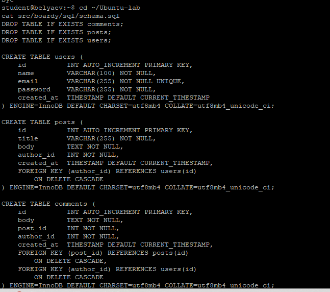

---

## 6. Добавление тестовых данных

В таблицы были добавлены данные:

### Пользователи

```sql
INSERT INTO users (name, email, password) VALUES
    ('Иванов', 'ivanov@example.com', 'hashed_password_1'),
    ('Петров', 'petrov@example.com', 'hashed_password_2'),
    ('Сидорова', 'sidorova@example.com', 'hashed_password_3');
```

### Посты

```sql
INSERT INTO posts (title, body, author_id) VALUES
    ('Первый пост', 'Привет, Boardy!', 1),
    ('Второй пост', 'Как дела?', 2),
    ('Третий пост', 'Тестируем БД', 1),
    ('Четвёртый пост', 'MySQL подключен', 2),
    ('Пятый пост', 'Boardy растёт', 1);
```

### Комментарии

```sql
INSERT INTO comments (body, post_id, author_id) VALUES
    ('Отличный пост!', 1, 2),
    ('Согласен', 1, 3),
    ('Норм', 2, 1);
```

Проверка выполнялась командами:

```sql
SELECT * FROM users;
SELECT * FROM posts;
```

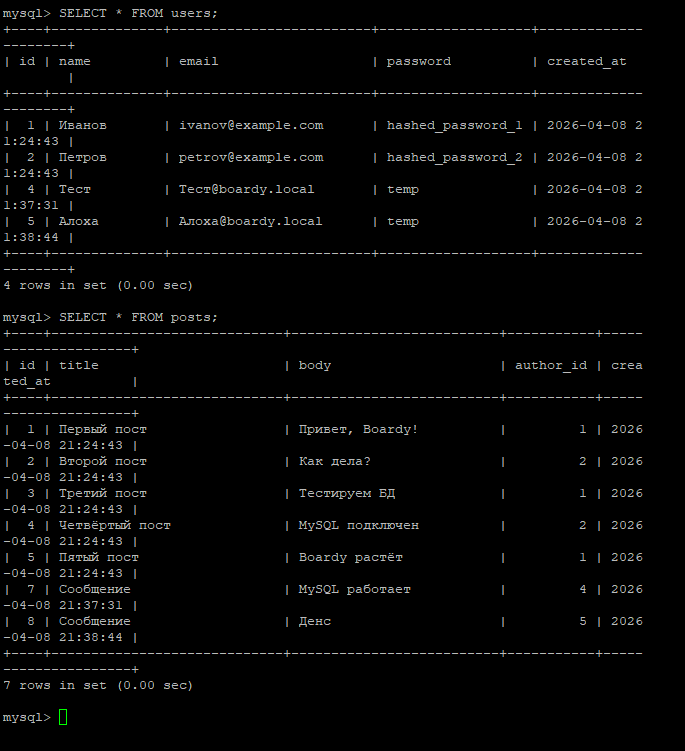

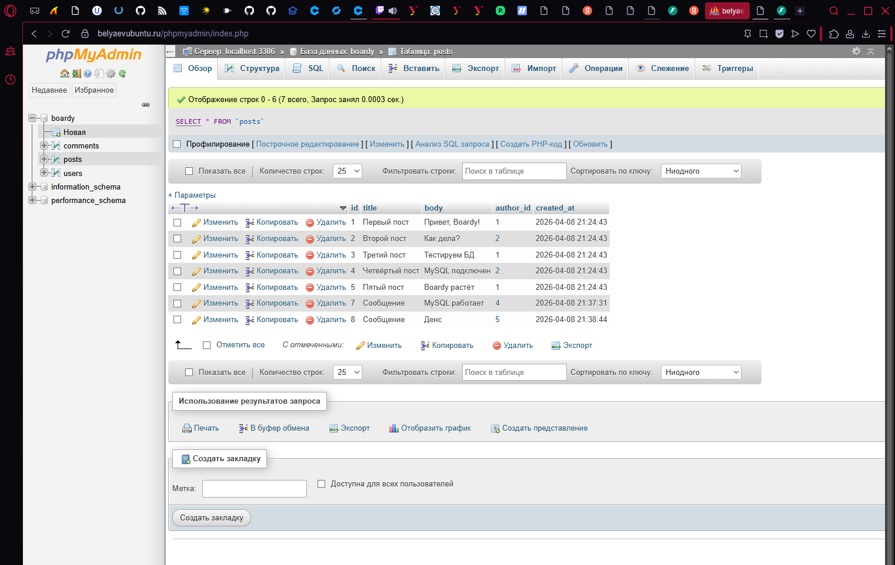

---

## 7. SELECT + JOIN

Для получения постов вместе с именем автора использовался запрос:

```sql
SELECT posts.title, posts.body, users.name AS author
FROM posts
JOIN users ON posts.author_id = users.id;
```

### Зачем нужен `JOIN`

`JOIN` нужен, чтобы объединить данные из нескольких таблиц в одном запросе.  
В данном случае посты хранятся в таблице `posts`, а имя автора — в таблице `users`

### Как получить имя автора без JOIN

Без `JOIN` пришлось бы:
1. сначала получить `author_id` из таблицы `posts`
2. затем выполнять отдельный запрос к таблице `users` для каждого поста

Это хуже по производительности и неудобнее в коде

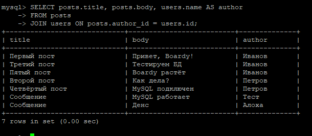

---

## 8. FOREIGN KEY — защита целостности

Для проверки целостности был выполнен запрос:

```sql
INSERT INTO posts (title, body, author_id)
VALUES ('Хак', 'Тест', 999);
```

Результат: MySQL вернул ошибку, так как автора с `id = 999` не существует.

Это доказывает, что `FOREIGN KEY` действительно защищает данные от некорректных ссылок

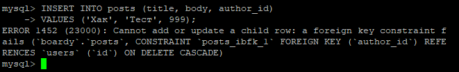

---

## 9. ON DELETE CASCADE

Для проверки каскадного удаления были выполнены подсчёты до удаления пользователя:

```sql
SELECT COUNT(*) FROM posts;
SELECT COUNT(*) FROM comments;
```

Затем был удалён пользователь:

```sql
DELETE FROM users WHERE id = 3;
```

После этого были снова выполнены подсчёты

Результат: связанные записи исчезли автоматически

Это показывает, что `ON DELETE CASCADE` работает корректно и поддерживает целостность данных на уровне самой базы данных, а не приложения

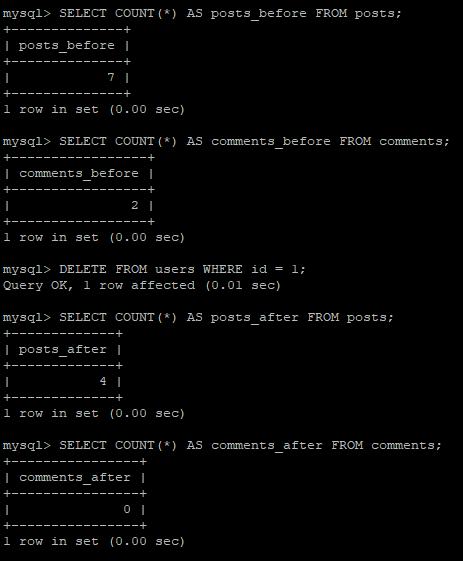

---

## 10. SQL-инъекция и prepared statements

### Демонстрация инъекции

Был выполнен запрос:

```sql
SELECT * FROM users WHERE name = '' OR '1'='1';
```

Он вернул всех пользователей

### Как работает SQL-инъекция

SQL-инъекция возникает, когда пользовательский ввод напрямую вставляется в SQL-строку и начинает менять её смысл 
Например, условие `OR '1'='1'` превращает фильтр в выражение, которое всегда истинно

### Как защищает prepared statement

`Prepared statement` отделяет SQL-шаблон от пользовательских данных
В результате введённая строка обрабатывается как данные, а не как часть SQL-кода, поэтому не может изменить структуру запроса

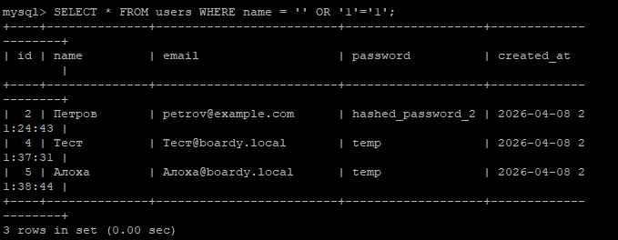

---

## 11. Подключение PHP к MySQL через PDO

Для подключения PHP к MySQL был создан файл:

`/var/www/boardy/db.php`

```php
<?php
$dsn = 'mysql:host=localhost;dbname=boardy;charset=utf8mb4';
$user = 'boardy';
$pass = '***';

try {
    $pdo = new PDO($dsn, $user, $pass, [
        PDO::ATTR_ERRMODE => PDO::ERRMODE_EXCEPTION,
        PDO::ATTR_DEFAULT_FETCH_MODE => PDO::FETCH_ASSOC,
    ]);
} catch (PDOException $e) {
    die('Ошибка подключения: ' . $e->getMessage());
}
```

### Почему важен `charset=utf8mb4`

Он гарантирует, что PHP и MySQL обмениваются данными в одной правильной кодировке 
Без этого кириллица и специальные символы могут отображаться некорректно

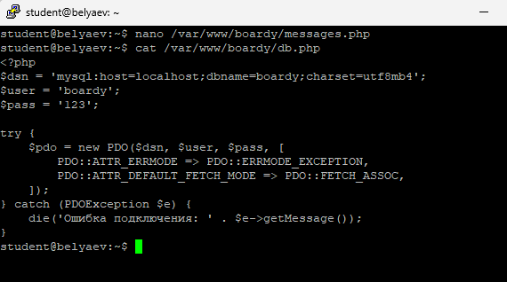

---

## 12. submit.php через MySQL

Файл `submit.php` был переписан так, чтобы:
- подключаться к MySQL через `db.php`
- искать или создавать пользователя
- создавать запись в таблице `posts`
- использовать только prepared statements

Код:

```php
<?php
require_once 'db.php';

$name = $_POST['name'] ?? '';
$message = $_POST['message'] ?? '';

if ($name && $message) {
    $stmt = $pdo->prepare('SELECT id FROM users WHERE name = ?');
    $stmt->execute([$name]);
    $user = $stmt->fetch();

    if (!$user) {
        $stmt = $pdo->prepare(
            'INSERT INTO users (name, email, password) VALUES (?, ?, ?)'
        );
        $stmt->execute([$name, $name . '@boardy.local', 'temp']);
        $user_id = $pdo->lastInsertId();
    } else {
        $user_id = $user['id'];
    }

    $stmt = $pdo->prepare(
        'INSERT INTO posts (title, body, author_id) VALUES (?, ?, ?)'
    );
    $stmt->execute(['Сообщение', $message, $user_id]);
}
?>
<!DOCTYPE html>
<html lang="ru">
<head>
    <meta charset="utf-8">
    <title>Boardy</title>
    <link rel="stylesheet" href="/css/style.css">
</head>
<body>
<header><h1><a href="/">Boardy</a></h1></header>
<main>
    <h2>Спасибо, <?= htmlspecialchars($name) ?>!</h2>
    <p><a href="/">На главную</a> | <a href="/messages.php">Все сообщения</a></p>
</main>
</body>
</html>
```

Результат: форма начала писать новые данные уже не в `messages.txt`, а в MySQL


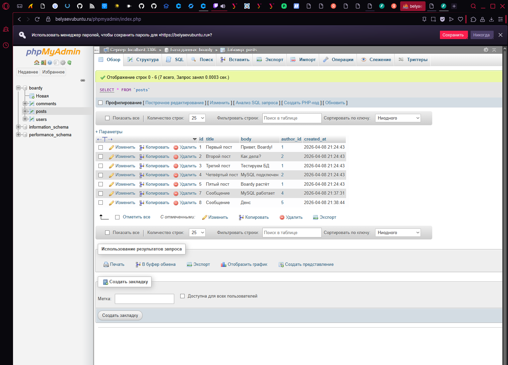

---

## 13. messages.php через MySQL

Файл `messages.php` был переписан так, чтобы получать данные из MySQL через `JOIN`, а не через `file()`:

```php
<?php
require_once 'db.php';

$stmt = $pdo->query(
    'SELECT posts.body, users.name, posts.created_at
     FROM posts
     JOIN users ON posts.author_id = users.id
     ORDER BY posts.created_at DESC'
);
$messages = $stmt->fetchAll();
?>
<!DOCTYPE html>
<html lang="ru">
<head>
    <meta charset="utf-8">
    <title>Boardy — Сообщения</title>
    <link rel="stylesheet" href="/css/style.css">
</head>
<body>
<header><h1><a href="/">Boardy</a></h1></header>
<main>
    <h2>Все сообщения</h2>

    <?php if (empty($messages)): ?>
        <p>Сообщений пока нет.</p>
    <?php else: ?>
        <table border="1" cellpadding="8" style="border-collapse:collapse;width:100%">
            <tr><th>Дата</th><th>Автор</th><th>Сообщение</th></tr>
            <?php foreach ($messages as $msg): ?>
                <tr>
                    <td><?= htmlspecialchars($msg['created_at']) ?></td>
                    <td><?= htmlspecialchars($msg['name']) ?></td>
                    <td><?= htmlspecialchars($msg['body']) ?></td>
                </tr>
            <?php endforeach; ?>
        </table>
    <?php endif; ?>

    <p style="margin-top:20px">
        <a href="/feedback.html">Написать</a> |
        <a href="/">На главную</a>
    </p>
</main>
</body>
</html>
```

Результат: страница `messages.php` теперь показывает данные из MySQL

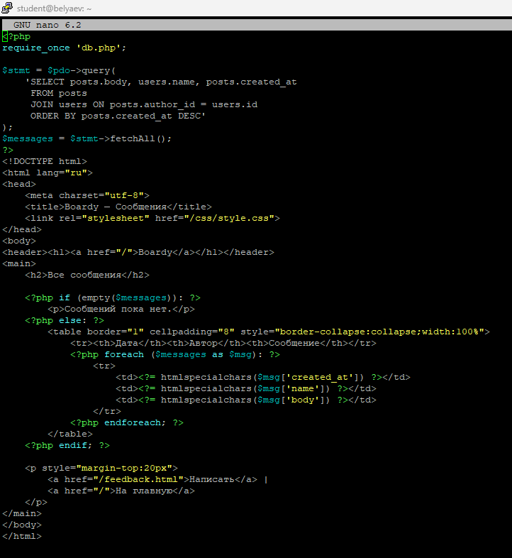

---

## 14. FastAPI + MySQL через aiomysql

Для API был установлен драйвер:

```bash
cd /opt/boardy-api
source venv/bin/activate
pip install aiomysql
```

В моём случае дополнительно понадобилось установить:

```bash
pip install cryptography
```

а пользователя MySQL `boardy` перевести на `mysql_native_password`, чтобы `aiomysql` корректно проходил аутентификацию

После этого `main.py` был переписан так, чтобы маршруты `/api/messages` и `/api/users` читали данные из MySQL:

```python
from fastapi import FastAPI
from datetime import datetime
import aiomysql

app = FastAPI(title='Boardy API', version='0.2.0')

DB_CONFIG = {
    'host': '127.0.0.1',
    'port': 3306,
    'user': 'boardy',
    'password': '***',
    'db': 'boardy',
    'charset': 'utf8mb4',
}

async def get_db():
    return await aiomysql.connect(**DB_CONFIG)

@app.get('/api/status')
async def status():
    return {'status': 'ok', 'time': str(datetime.now())}

@app.get('/api/messages')
async def get_messages():
    conn = await get_db()
    async with conn.cursor(aiomysql.DictCursor) as cur:
        await cur.execute(
            'SELECT posts.body AS message, users.name, '
            'posts.created_at FROM posts '
            'JOIN users ON posts.author_id = users.id '
            'ORDER BY posts.created_at DESC'
        )
        messages = await cur.fetchall()
    conn.close()

    for m in messages:
        m['created_at'] = str(m['created_at'])

    return {'messages': messages, 'count': len(messages)}

@app.get('/api/users')
async def get_users():
    conn = await get_db()
    async with conn.cursor(aiomysql.DictCursor) as cur:
        await cur.execute(
            'SELECT id, name, email, created_at FROM users'
        )
        users = await cur.fetchall()
    conn.close()

    for u in users:
        u['created_at'] = str(u['created_at'])

    return {'users': users, 'count': len(users)}
```

После этого сервис был перезапущен:

```bash
sudo systemctl restart boardy-api
sudo systemctl status boardy-api
```

Проверка:

```bash
curl https://api.belyaevubuntu.ru/api/messages
curl https://api.belyaevubuntu.ru/api/users
```

### Почему `aiomysql`, а не обычный `mysql-connector`

`aiomysql` — асинхронный драйвер, который работает через `await` и не блокирует event loop 
Обычный синхронный драйвер блокировал бы цикл событий FastAPI, как это делал `time.sleep()` в Практике 7

Результат: API начал читать данные из MySQL и возвращать их в формате JSON

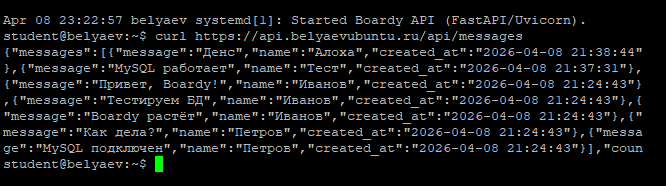

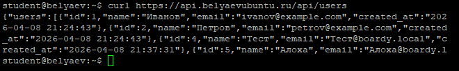

---

## Вывод

В ходе Практики 8 проект Boardy был переведён с хранения данных в `messages.txt` на MySQL. Были созданы связанные таблицы `users`, `posts`, `comments`, настроены `FOREIGN KEY` и `ON DELETE CASCADE`, подключён `phpMyAdmin`, а также продемонстрированы базовые операции SQL, защита целостности данных и принцип работы SQL-инъекции

PHP-часть была переписана на `PDO` с prepared statements, а FastAPI — на `aiomysql`, благодаря чему и основной сайт, и API начали читать и записывать данные в MySQL. В результате проект получил полноценное централизованное хранилище данных, пригодное для дальнейшего развития