# Практика 9 — REST API, SSR vs CSR, JavaScript, React

## Цель работы

Реализовать для проекта Boardy полноценный REST API комментариев на FastAPI, создать два браузерных клиента к одному API и на практике сравнить SSR и CSR.

В ходе работы нужно было:

- добавить CRUD комментариев в FastAPI
- сделать учебный клиент на vanilla JS
- сделать основной клиент на React + Bootstrap
- сравнить серверный рендеринг `messages.php` и клиентский рендеринг `comments-demo.html` / `comments.html`
- проверить XSS-защиту на обоих JS-клиентах

---

## Исходные данные

- Облачная платформа: `Yandex Cloud`
- Имя сервера: `belyaev`
- Пользователь: `student`
- Основной домен: `belyaevubuntu.ru`
- API-поддомен: `api.belyaevubuntu.ru`
- Репозиторий: `Ubuntu-lab`
- База данных: `boardy`
- Таблицы: `users`, `posts`, `comments`

До начала Практики 9 уже работали:

- `messages.php` как SSR-страница на PHP
- FastAPI с маршрутами `/api/messages` и `/api/users`
- MySQL с тестовыми данными в таблицах `users`, `posts`, `comments`

---

## 1. Структура проекта после выполнения работы

Для реализации CRUD комментариев были добавлены новые backend- и frontend-файлы.

### FastAPI

- `/opt/boardy-api/database.py`
- `/opt/boardy-api/routers/__init__.py`
- `/opt/boardy-api/routers/comments.py`
- обновлённый `/opt/boardy-api/main.py`

### Frontend

- `/var/www/boardy/comments-demo.html`
- `/var/www/boardy/comments.html`
- `/var/www/boardy/js/comments-demo.js`
- `/var/www/boardy/js/comments.jsx`

Таким образом, FastAPI получил отдельный модуль подключения к базе и отдельный роутер комментариев, а сайт — два клиента к одному API: простой на vanilla JS и основной на React. :contentReference[oaicite:0]{index=0} :contentReference[oaicite:1]{index=1}

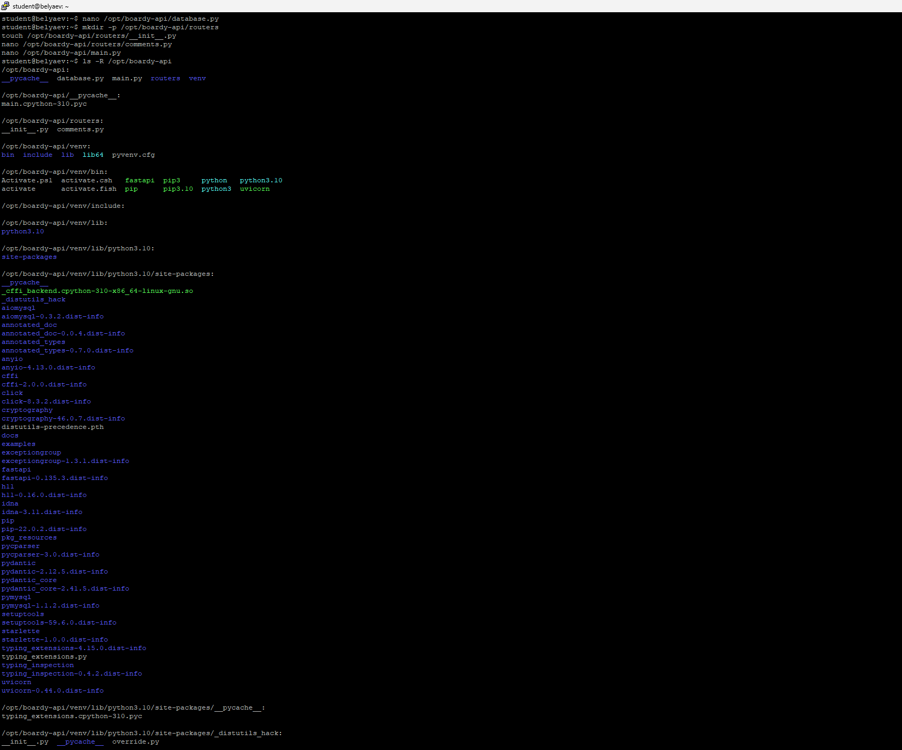

---

## 2. Подключение к базе данных

Подключение к MySQL было вынесено в отдельный файл `database.py`.

```python
import aiomysql

DB_CONFIG = {
    'host': '127.0.0.1',
    'port': 3306,
    'user': 'boardy',
    'password': '123',
    'db': 'boardy',
    'charset': 'utf8mb4',
}

async def get_db():
    return await aiomysql.connect(**DB_CONFIG)
```

### Почему подключение вынесено в отдельный модуль

Такой подход удобнее, потому что:

- код подключения не дублируется по файлам
- один и тот же `get_db()` можно использовать в нескольких роутерах
- при изменении параметров БД достаточно поменять один файл

### Почему используется `aiomysql`

`aiomysql` — асинхронный драйвер MySQL для Python.

Он работает через `await` и не блокирует event loop FastAPI.

Если бы использовался обычный синхронный драйвер, он мог бы блокировать цикл событий, как это уже демонстрировалось в прошлой практике на примере blocking-операций. Поэтому для FastAPI правильнее использовать именно `aiomysql`. :contentReference[oaicite:2]{index=2}

---

## 3. Реализация REST API комментариев

Основная логика CRUD комментариев была вынесена в `routers/comments.py`.

Были реализованы маршруты:

- `GET /api/posts/{post_id}/comments`
- `POST /api/posts/{post_id}/comments`
- `PUT /api/comments/{comment_id}`
- `DELETE /api/comments/{comment_id}`

Маршруты были подключены в `main.py` через:

```python
from routers import comments
app.include_router(comments.router)
```

Также был сохранён CORS middleware, чтобы браузерные JS-клиенты могли обращаться к API. :contentReference[oaicite:3]{index=3}

---

## 4. GET — список комментариев

Для получения списка комментариев по посту был реализован GET-маршрут:

```python
@router.get("/posts/{post_id}/comments")
async def get_comments(post_id: int):
    ...
```

Он выполняет SQL-запрос с `JOIN`:

```sql
SELECT c.id, c.body, c.created_at, u.name AS author_name
FROM comments c
JOIN users u ON c.author_id = u.id
WHERE c.post_id = %s
ORDER BY c.created_at
```

### Какой SQL-запрос выполняет этот эндпоинт

Эндпоинт получает комментарии из таблицы `comments`, но при этом дополнительно подтягивает имя автора из таблицы `users`.

Для этого используется `JOIN users u ON c.author_id = u.id`.

### Зачем нужен JOIN

`JOIN` нужен, чтобы сразу получить в одном запросе:

- текст комментария
- дату создания
- имя автора

Без `JOIN` пришлось бы:

1. сначала получить комментарии
2. затем отдельно получать автора для каждого комментария

Это хуже по производительности и делает код сложнее. :contentReference[oaicite:4]{index=4} :contentReference[oaicite:5]{index=5}

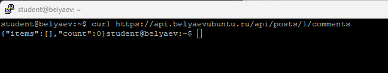

---

## 5. POST — создание комментария

Для создания комментария был реализован маршрут:

```python
@router.post("/posts/{post_id}/comments", status_code=201)
async def create_comment(post_id: int, data: CommentCreate):
    ...
```

Перед вставкой выполняются проверки:

- текст не должен быть пустым
- пост должен существовать в таблице `posts`

После этого комментарий вставляется в таблицу `comments`.

### Почему 201, а не 200

Код `201 Created` означает, что сервер не просто успешно обработал запрос, а именно **создал новый ресурс**.

Для POST это более точный и правильный ответ, чем `200 OK`.

### Что означает `Content-Type: application/json`

Этот заголовок говорит серверу, что тело запроса передано в формате JSON.

Без него FastAPI может неправильно интерпретировать тело запроса или не распознать его как JSON-объект.

### Примечание по автору комментария

На текущем этапе `author_id` задавался хардкодом, так как полноценной авторизации ещё нет.

В моём случае для вставки использовался реально существующий пользователь, чтобы не ломать `FOREIGN KEY`. На следующей практике это должно быть заменено на автора из токена или сессии. :contentReference[oaicite:6]{index=6} :contentReference[oaicite:7]{index=7}

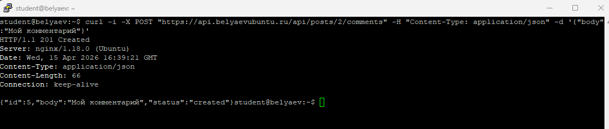

---

## 6. PUT — редактирование комментария

Для редактирования комментария был реализован маршрут:

```python
@router.put("/comments/{comment_id}")
async def update_comment(comment_id: int, data: CommentUpdate):
    ...
```

Маршрут:

- проверяет, что текст не пустой
- выполняет `UPDATE comments SET body=%s WHERE id=%s`
- если комментарий не найден, возвращает `404`

### Чем PUT отличается от POST

- `POST` создаёт новый ресурс
- `PUT` обновляет уже существующий ресурс

### Почему URL другой

Для создания комментария используется:

```text
/api/posts/{post_id}/comments
```

Потому что новый комментарий создаётся **внутри коллекции комментариев конкретного поста**.

Для обновления используется:

```text
/api/comments/{comment_id}
```

Потому что обновляется уже **конкретный комментарий по его ID**. :contentReference[oaicite:8]{index=8} :contentReference[oaicite:9]{index=9}

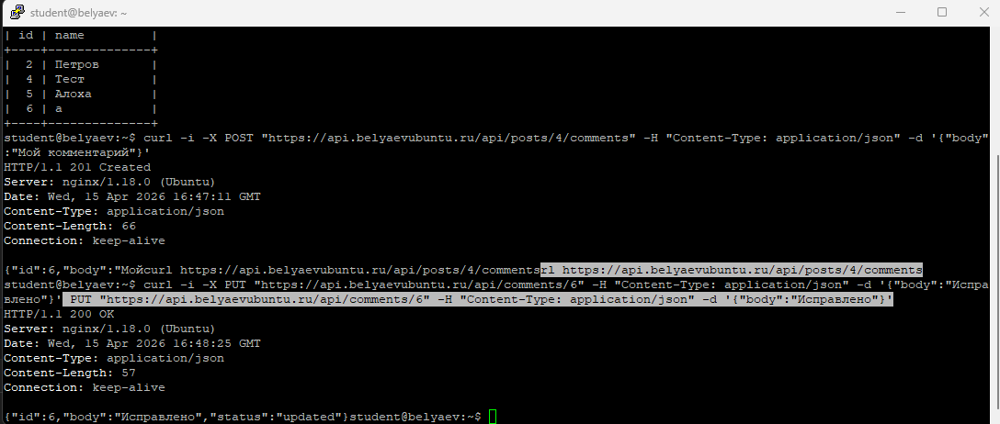

---

## 7. DELETE — удаление комментария

Для удаления был реализован маршрут:

```python
@router.delete("/comments/{comment_id}", status_code=204)
async def delete_comment(comment_id: int):
    ...
```

### Почему код ответа 204

`204 No Content` означает, что операция успешно выполнена, но сервер не возвращает тело ответа.

Для DELETE это корректный и распространённый вариант.

### 4 HTTP-глагола и их смысл

- `GET` — получить данные
- `POST` — создать новый ресурс
- `PUT` — обновить существующий ресурс
- `DELETE` — удалить ресурс

### Какой код ответа у каждого и почему

- `GET` → `200 OK`, потому что данные успешно получены
- `POST` → `201 Created`, потому что создан новый ресурс
- `PUT` → `200 OK`, потому что ресурс найден и обновлён
- `DELETE` → `204 No Content`, потому что ресурс удалён и тело ответа не требуется. :contentReference[oaicite:10]{index=10} :contentReference[oaicite:11]{index=11}

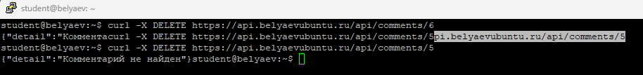

---

## 8. Ошибки 404 и 422

Для проверки обработки ошибок были специально вызваны два сценария.

### Ошибка 404

Попытка обновить несуществующий комментарий:

```text
/api/comments/999999
```

### Ошибка 422

Попытка создать комментарий с пустым текстом:

```json
{"body":"   "}
```

### Чем 404 отличается от 422

- `404 Not Found` означает, что ресурс по указанному адресу не найден
- `422 Unprocessable Entity` означает, что адрес и формат запроса корректны, но данные не проходят валидацию

Иными словами:

- при `404` проблема в том, **что объекта нет**
- при `422` проблема в том, **что данные плохие**. :contentReference[oaicite:12]{index=12}

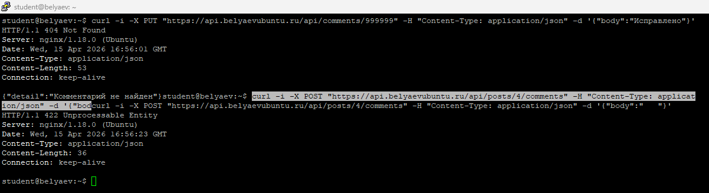

---

## 9. Swagger

После подключения роутера комментариев новый CRUD автоматически появился в Swagger по адресу:

```text
https://api.belyaevubuntu.ru/docs
```

Через Swagger был выполнен POST-запрос для создания комментария.

Это удобно, потому что позволяет:

- просматривать все маршруты API
- тестировать их прямо из браузера
- видеть структуру запросов и ответов без `curl`. :contentReference[oaicite:13]{index=13}

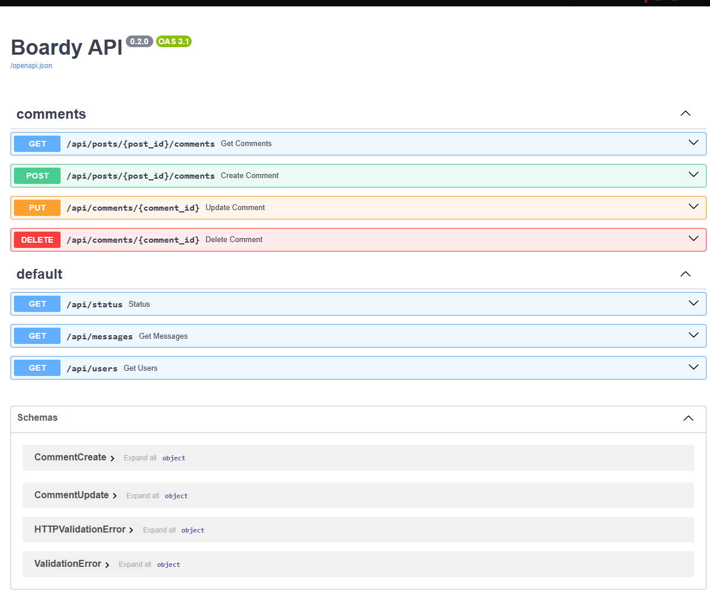

---

## 10. Vanilla JS — учебный клиент

Для демонстрации простого клиентского рендеринга была создана страница:

- `comments-demo.html`
- `comments-demo.js`

Клиент делает два основных действия:

- загружает комментарии через `fetch GET`
- создаёт комментарии через `fetch POST`

Для отрисовки список вставляется через `innerHTML`.

### Что делает функция `esc()`

```javascript
function esc(str) {
    const div = document.createElement('div');
    div.textContent = str;
    return div.innerHTML;
}
```

Функция `esc()` экранирует HTML-символы и превращает пользовательский ввод в безопасную строку.

### Что случится, если её не вызвать

Если вставить пользовательский текст напрямую в `innerHTML`, злоумышленник сможет вставить HTML или JavaScript-код, который выполнится в браузере другого пользователя.

То есть без `esc()` страница станет уязвима к XSS.

### Ограничения vanilla JS

Vanilla JS работает, но быстро становится неудобным:

- состояние не хранится централизованно
- список после создания просто загружается заново
- при росте интерфейса код становится длинным и менее удобным
- за XSS нужно следить вручную. :contentReference[oaicite:14]{index=14} :contentReference[oaicite:15]{index=15}

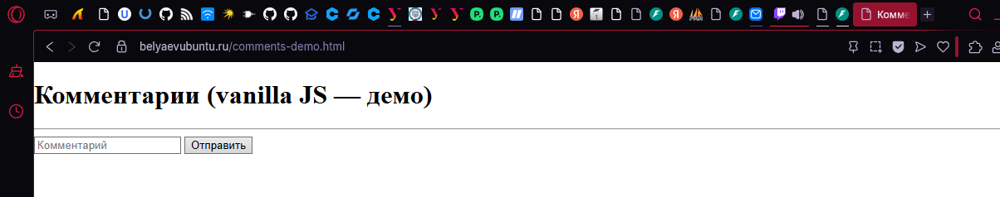

---

## 11. React + Bootstrap — основной клиент

Основной клиент был реализован на:

- React
- ReactDOM
- Babel
- Bootstrap

Все зависимости подключались через CDN в `comments.html`, а логика компонента размещалась в `comments.jsx`.

React-клиент реализует:

- загрузку списка комментариев
- создание
- редактирование
- удаление
- красивый интерфейс на Bootstrap. :contentReference[oaicite:16]{index=16}

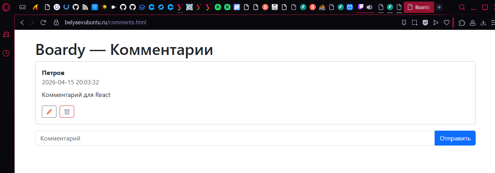

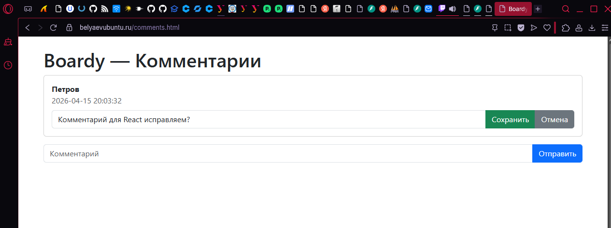

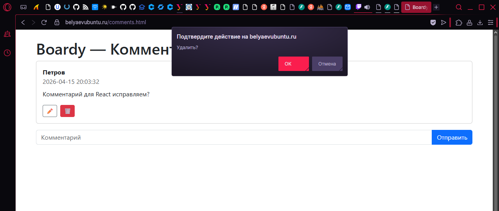

---

## 12. Сравнение vanilla JS и React

### Где хранится состояние

- **vanilla JS**: состояние хранится неявно, в DOM и в отдельных переменных
- **React**: состояние хранится явно через `useState`

### Как обновляется список после добавления

- **vanilla JS**: после POST вызывается повторная загрузка списка и перерисовка через `innerHTML`
- **React**: после POST также вызывается перезагрузка, но список хранится в состоянии и автоматически перерисовывается через `setItems`

### Как реализовано редактирование

- **vanilla JS**: пришлось бы вручную менять DOM-узлы и логику показа/скрытия элементов
- **React**: редактирование сделано через условный рендер по `editId`

### Как защищаемся от XSS

- **vanilla JS**: вручную через `esc()`
- **React**: автоматически через безопасный JSX-рендеринг

### Общий вывод

Vanilla JS хорош как учебный пример, чтобы понять принцип работы `fetch`, `innerHTML` и ручного DOM-рендеринга.

React удобнее для реального интерфейса:

- проще управлять состоянием
- проще делать редактирование и удаление
- меньше вероятность забыть защиту от XSS
- Bootstrap позволяет быстро получить аккуратный внешний вид. :contentReference[oaicite:17]{index=17}

---

## 13. DevTools → Network

При открытии `comments.html` во вкладке **Network** было видно, что браузер делает несколько запросов.

В моём случае отображались запросы к:

- `comments.html`
- `bootstrap.min.css`
- `react.production.min.js`
- `react-dom.production.min.js`
- `babel.min.js`
- `comments.jsx`
- `/api/posts/4/comments`

### Сколько запросов

На странице было видно несколько отдельных запросов: HTML, стили, библиотеки React, JSX-файл и отдельный запрос к API.

Это наглядно показывает принцип CSR: страница сначала загружается как оболочка, а данные подтягиваются потом.

### Какой из них — к API

Запрос к API — это:

```text
/api/posts/4/comments
```

Именно он возвращал JSON со списком комментариев. :contentReference[oaicite:18]{index=18} :contentReference[oaicite:19]{index=19}

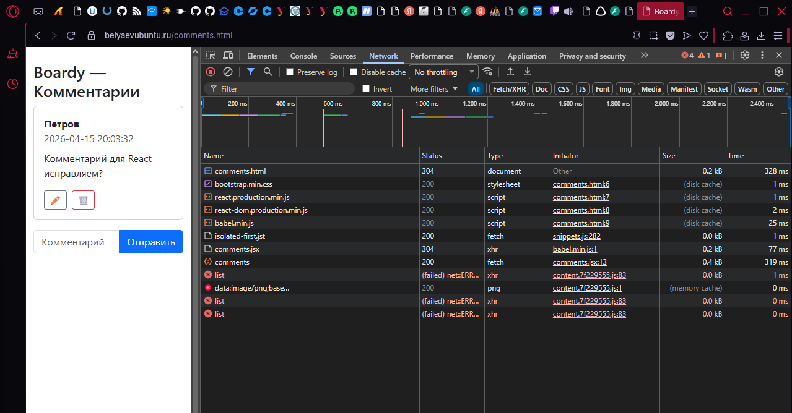

---

## 14. SSR vs CSR — View Source

### SSR: `messages.php`

Для страницы `messages.php` в исходном коде (`View Source`) были видны реальные данные:

- даты
- авторы
- сообщения

Это потому, что сервер на PHP уже заранее собрал готовый HTML.

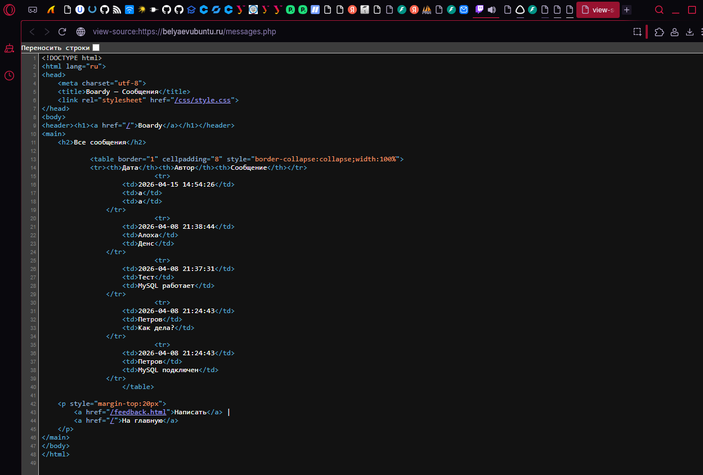

### CSR: `comments.html`

Для страницы `comments.html` в `View Source` был виден почти пустой HTML, содержащий только оболочку страницы и контейнер вида:

```html
<div id="app"></div>
```

Данных комментариев в исходнике не было, потому что они загружаются уже после открытия страницы через JavaScript.

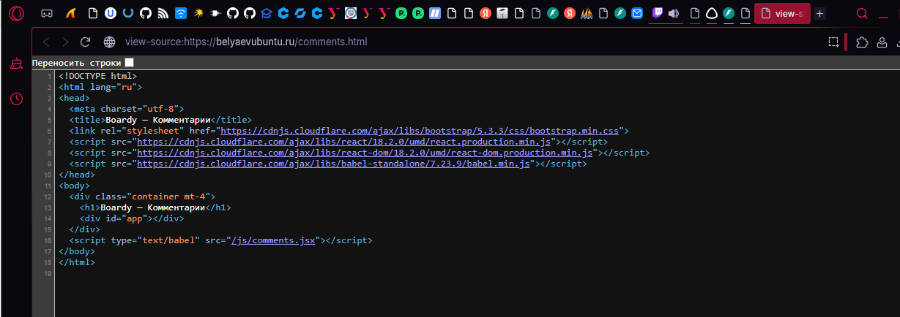

### Почему в CSR нет данных в исходнике

Потому что сервер отдаёт только HTML-шаблон и подключение скриптов, а сами данные подтягиваются позже отдельным API-запросом.

### Что увидит поисковый бот

Если бот читает только исходный HTML без выполнения JavaScript, он увидит почти пустую страницу.

Именно поэтому SSR лучше подходит для SEO и контентных страниц. :contentReference[oaicite:20]{index=20} :contentReference[oaicite:21]{index=21}

---

## 15. XSS-проверка

Для проверки XSS был создан комментарий с текстом:

```html

```

Проверка проводилась на:

- `comments-demo.html`
- `comments.html`

### Результат

На обеих страницах эта строка отобразилась как обычный текст.

`alert('XSS')` не сработал.

### Как vanilla JS защищается от XSS

В `comments-demo.js` защита реализована вручную через `esc()`.

### Как React защищается от XSS

В `comments.jsx` вывод пользовательского текста идёт через JSX, который экранирует опасные символы автоматически.

### Какой способ надёжнее

Надёжнее React, потому что защита встроена в сам способ рендеринга.

В vanilla JS можно случайно забыть вызвать `esc()` и получить уязвимость. :contentReference[oaicite:22]{index=22} :contentReference[oaicite:23]{index=23}

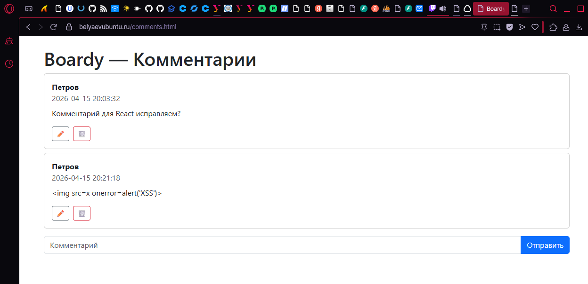

---

## 16. Итоговая таблица: SSR vs vanilla JS vs React

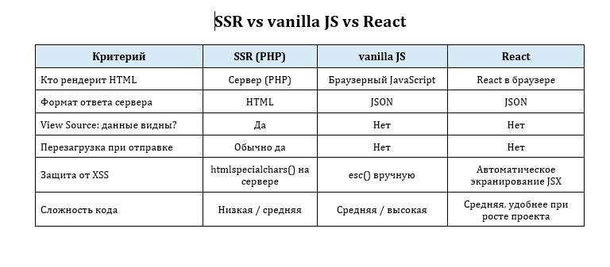

---

## 17. Что было добавлено в репозиторий

В репозиторий `Ubuntu-lab` были добавлены:

### Backend

- `src/boardy-api/database.py`
- `src/boardy-api/main.py`
- `src/boardy-api/routers/__init__.py`
- `src/boardy-api/routers/comments.py`

### Frontend

- `src/boardy/comments-demo.html`
- `src/boardy/comments.html`
- `src/boardy/js/comments-demo.js`
- `src/boardy/js/comments.jsx`

### Отчёт и скриншоты

- `Lab/Lab9/Report.md`
- `Lab/Lab9/screenshots/`


---

## Вывод

В ходе Практики 9 для проекта Boardy был реализован полноценный REST API комментариев на FastAPI.

API теперь поддерживает все основные операции CRUD:

- получение списка комментариев
- создание
- редактирование
- удаление

На основе одного и того же API были построены два клиентских интерфейса:

- учебный клиент на vanilla JS
- основной клиент на React + Bootstrap

Практика наглядно показала различие между SSR и CSR:

- `messages.php` как SSR сразу отдаёт готовый HTML с данными
- `comments-demo.html` и `comments.html` как CSR получают пустую HTML-оболочку и затем отдельно загружают данные через API

Также была проведена проверка XSS, которая показала, что:

- в vanilla JS защита зависит от ручного экранирования через `esc()`
- в React защита встроена в механизм рендеринга

Итог работы: проект Boardy получил полноценный API комментариев и два современных клиента к нему, а различия между серверным и клиентским рендерингом были подтверждены на практике.